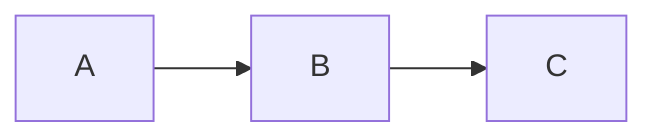

# MkDocs Documentation - AI Interview Assessment System

Dokumentasi lengkap telah dibuat menggunakan **MkDocs dengan Material Theme**.

## 📚 Struktur Dokumentasi

```
docs/
├── index.md                      # Homepage dengan overview
├── getting-started/              # Panduan memulai
│   ├── introduction.md          # Pengenalan sistem
│   ├── installation.md          # Panduan instalasi lengkap
│   ├── quickstart.md            # Quick start tutorial
│   └── configuration.md         # Konfigurasi dasar
├── features/                     # Detail fitur
│   ├── overview.md              # Overview semua fitur
│   ├── transcription.md         # Whisper transcription
│   ├── llm-assessment.md        # LLM evaluation
│   ├── cheating-detection.md    # Cheating detection
│   ├── non-verbal-analysis.md   # Non-verbal analysis
│   └── dashboard.md             # Dashboard features
├── api/                         # API documentation
│   ├── endpoints.md             # API endpoints
│   ├── request-response.md      # Format request/response
│   └── errors.md                # Error handling
├── config/                      # Konfigurasi
│   ├── models.md                # Model settings
│   ├── api-keys.md              # API key setup
│   └── advanced.md              # Advanced options
├── troubleshooting/             # Troubleshooting
│   ├── common-issues.md         # Masalah umum
│   ├── performance.md           # Performance tuning
│   └── faq.md                   # FAQ
├── development/                 # Development guide
│   ├── architecture.md          # Arsitektur sistem
│   ├── contributing.md          # Panduan kontribusi
│   ├── testing.md               # Testing guide
│   └── roadmap.md               # Roadmap
└── about/                       # Tentang project
    ├── license.md               # MIT License
    └── changelog.md             # Changelog

```

## 🚀 Cara Menggunakan

### 1. Install Dependencies

```bash
pip install -r docs-requirements.txt
```

Packages yang diinstall:

- mkdocs (core)
- mkdocs-material (theme)
- mkdocs-minify-plugin
- pymdown-extensions

### 2. Preview Dokumentasi Lokal

```bash
mkdocs serve
```

Buka browser di: `http://127.0.0.1:8000`

**Features:**

- Live reload saat edit file
- Search functionality
- Dark/light mode toggle
- Responsive design
- Code copy buttons

### 3. Build Static Site

```bash
mkdocs build
```

Hasilnya di folder `site/` - siap deploy ke hosting.

### 4. Deploy ke GitHub Pages

```bash
mkdocs gh-deploy
```

Dokumentasi akan tersedia di:

```
https://yourusername.github.io/Interview_Assesment_System-main/
```

## ✨ Fitur Material Theme

### 🎨 Visual Features

- **Navigation Tabs** - Top-level section tabs
- **Search** - Built-in instant search
- **Dark Mode** - Auto dark/light theme
- **Code Highlighting** - Syntax highlighting untuk 100+ languages
- **Mermaid Diagrams** - Flowcharts, sequence diagrams
- **Admonitions** - Note, warning, tip boxes
- **Tabs** - Tabbed content blocks
- **Icons** - Material Design icons
- **Grid Cards** - Responsive card layouts

### 🔧 Interactive Features

- **Copy Code Buttons** - One-click code copying
- **Keyboard Shortcuts** - Ctrl+K untuk search
- **Anchor Links** - Deep linking ke sections
- **Table of Contents** - Auto-generated sidebar TOC
- **Smooth Scrolling** - Smooth anchor navigation

## 📝 Markdown Extensions

Dokumentasi support:

### Code Blocks

````markdown
```python
def hello():
    print("Hello, World!")
```
````

### Admonitions

```markdown
!!! note "Catatan Penting"
Ini adalah catatan.

!!! warning "Peringatan"
Ini adalah peringatan.

!!! tip "Tips"
Ini adalah tips.
```

### Tabbed Content

```markdown
=== "Tab 1"
Content tab 1

=== "Tab 2"
Content tab 2
```

### Mermaid Diagrams

````markdown

````

### Custom Cards

```markdown
<div class="grid cards" markdown>

- :material-icon:{ .lg .middle } **Title**

  ***

  Description text

  [:octicons-arrow-right-24: Link](page.md)

</div>
```

## 🎯 Customization

### Theme Colors

Edit `mkdocs.yml`:

```yaml
theme:
  palette:
    primary: indigo # Ganti warna utama
    accent: blue # Ganti warna aksen
```

### Logo & Favicon

Tambahkan file di `docs/assets/`:

```yaml
theme:
  logo: assets/logo.png
  favicon: assets/favicon.ico
```

### Custom CSS/JS

File sudah tersedia:

- `docs/stylesheets/extra.css` - Custom styles
- `docs/javascripts/extra.js` - Custom scripts

## 📦 File Penting

### `mkdocs.yml`

Konfigurasi utama:

- Site metadata
- Theme settings
- Navigation structure
- Plugins & extensions
- Custom CSS/JS

### `docs-requirements.txt`

Dependencies untuk MkDocs:

```
mkdocs>=1.5.3
mkdocs-material>=9.5.0
mkdocs-minify-plugin>=0.7.1
pymdown-extensions>=10.5
```

### `docs/README.md`

Panduan lengkap untuk:

- Writing documentation
- Markdown syntax
- Deployment options
- Maintenance

## 🌐 Deployment Options

### GitHub Pages (Recommended)

```bash
mkdocs gh-deploy
```

### Netlify

1. Connect repository
2. Build command: `mkdocs build`
3. Publish directory: `site`

### Vercel

1. Import project
2. Build command: `mkdocs build`
3. Output directory: `site`

### Custom Server

```bash
mkdocs build
# Upload folder site/ ke web server
```

## 📊 Analytics

Untuk enable analytics, edit `mkdocs.yml`:

```yaml
extra:
  analytics:
    provider: google
    property: G-XXXXXXXXXX
```

## 🔍 Search Configuration

Search sudah dikonfigurasi untuk:

- English & Indonesian
- Smart separators
- Real-time suggestions
- Highlight results

## 🛠️ Maintenance

### Update Dependencies

```bash
pip install --upgrade -r docs-requirements.txt
```

### Check for Issues

```bash
mkdocs build --strict
```

### Validate Links

```bash
mkdocs build --verbose
```

## 📖 Dokumentasi yang Sudah Dibuat

✅ **Getting Started**

- Introduction dengan overview sistem
- Installation guide lengkap (Windows/Mac/Linux)
- Quick start tutorial step-by-step

✅ **Features**

- Overview semua fitur dengan matrix
- Performance characteristics
- Feature configuration examples

✅ **Core Files**

- index.md (homepage dengan badges & cards)
- Custom CSS untuk styling
- Custom JS untuk interactivity
- Navigation structure di mkdocs.yml

## 🎓 Next Steps

Untuk melengkapi dokumentasi:

1. **Tambahkan konten untuk file yang belum dibuat:**

   - `features/transcription.md`
   - `features/llm-assessment.md`
   - `features/cheating-detection.md`
   - `api/endpoints.md`
   - `config/models.md`
   - dll.

2. **Tambahkan screenshot/images:**

   - Buat folder `docs/assets/`
   - Tambahkan screenshot UI
   - Update references di markdown

3. **Customize branding:**

   - Ganti logo di theme settings
   - Update repository URL
   - Customize colors

4. **Setup CI/CD:**
   - GitHub Actions untuk auto-deploy
   - Automated testing
   - Link checking

## 💡 Tips

- Use `mkdocs serve` untuk live preview saat edit
- Struktur navigation di `mkdocs.yml` bisa disesuaikan
- Material theme punya 100+ configuration options
- Check [Material for MkDocs docs](https://squidfunk.github.io/mkdocs-material/) untuk fitur advanced

## 📞 Support

Jika ada pertanyaan tentang dokumentasi:

1. Check `docs/README.md` untuk panduan lengkap
2. Visit MkDocs documentation
3. Check Material for MkDocs docs

---

**Dokumentasi siap digunakan!** 🎉

Run `mkdocs serve` untuk mulai explore! 🚀
