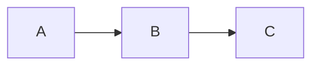

# Documentation Guide

This folder contains the MkDocs documentation for the AI Interview Assessment System.

## Quick Start

### 1. Install MkDocs and dependencies

```bash
pip install -r docs-requirements.txt
```

### 2. Preview documentation locally

```bash
mkdocs serve
```

Then open your browser to `http://127.0.0.1:8000`

### 3. Build documentation

```bash
mkdocs build
```

This creates a `site/` directory with static HTML files.

## Documentation Structure

```
docs/
├── index.md                    # Homepage
├── getting-started/
│   ├── introduction.md         # What is the system
│   ├── installation.md         # Installation guide
│   ├── quickstart.md          # Quick start tutorial
│   └── configuration.md       # Configuration guide
├── features/
│   ├── overview.md            # Features overview
│   ├── transcription.md       # Whisper transcription
│   ├── llm-assessment.md      # LLM evaluation
│   ├── cheating-detection.md  # Cheating detection
│   ├── non-verbal-analysis.md # Non-verbal analysis
│   └── dashboard.md           # Dashboard features
├── api/
│   ├── endpoints.md           # API endpoints
│   ├── request-response.md    # Request/response formats
│   └── errors.md              # Error handling
├── config/
│   ├── models.md              # Model configuration
│   ├── api-keys.md            # API key setup
│   └── advanced.md            # Advanced options
├── troubleshooting/
│   ├── common-issues.md       # Common problems
│   ├── performance.md         # Performance tuning
│   └── faq.md                 # FAQ
├── development/
│   ├── architecture.md        # System architecture
│   ├── contributing.md        # Contribution guide
│   ├── testing.md             # Testing guide
│   └── roadmap.md             # Future plans
├── about/
│   ├── license.md             # MIT License
│   └── changelog.md           # Version history
├── stylesheets/
│   └── extra.css              # Custom styles
└── javascripts/
    └── extra.js               # Custom scripts
```

## Writing Documentation

### Markdown Syntax

MkDocs uses standard Markdown with extensions:

#### Admonitions

```markdown
!!! note
This is a note.

!!! warning
This is a warning.

!!! tip
This is a tip.
```

#### Code Blocks

````markdown
```python
def hello_world():
    print("Hello, World!")
```
````

#### Tabbed Content

```markdown
=== "Tab 1"
Content for tab 1

=== "Tab 2"
Content for tab 2
```

#### Mermaid Diagrams

````markdown

````

### Material for MkDocs Features

- **Navigation tabs** - Top-level sections
- **Search** - Built-in search functionality
- **Dark mode** - Automatic dark/light theme
- **Code copy** - Copy button on code blocks
- **Icons** - Material Design icons
- **Grid cards** - Responsive card layouts

## Deployment

### GitHub Pages

1. Build the documentation:

   ```bash
   mkdocs gh-deploy
   ```

2. Documentation will be available at:
   ```
   https://yourusername.github.io/Interview_Assesment_System-main/
   ```

### Custom Domain

Add a `CNAME` file in `docs/` with your domain:

```
docs.yourdomain.com
```

### Continuous Deployment

Create `.github/workflows/docs.yml`:

```yaml
name: Deploy Documentation
on:
  push:
    branches:
      - main
jobs:
  deploy:
    runs-on: ubuntu-latest
    steps:
      - uses: actions/checkout@v3
      - uses: actions/setup-python@v4
        with:
          python-version: 3.11
      - run: pip install -r docs-requirements.txt
      - run: mkdocs gh-deploy --force
```

## Customization

### Theme Colors

Edit `mkdocs.yml`:

```yaml
theme:
  palette:
    primary: indigo
    accent: blue
```

### Logo

Add logo image to `docs/assets/logo.png` and update `mkdocs.yml`:

```yaml
theme:
  logo: assets/logo.png
```

### Custom CSS

Add styles to `docs/stylesheets/extra.css`

### Custom JavaScript

Add scripts to `docs/javascripts/extra.js`

## Maintenance

### Update Dependencies

```bash
pip install --upgrade -r docs-requirements.txt
```

### Check for Broken Links

```bash
mkdocs build --strict
```

### Validate Configuration

```bash
mkdocs build --verbose
```

## Contributing to Documentation

1. Fork the repository
2. Create a feature branch
3. Make your changes in `docs/`
4. Test locally with `mkdocs serve`
5. Submit a pull request

## Resources

- [MkDocs Documentation](https://www.mkdocs.org/)
- [Material for MkDocs](https://squidfunk.github.io/mkdocs-material/)
- [PyMdown Extensions](https://facelessuser.github.io/pymdown-extensions/)
- [Markdown Guide](https://www.markdownguide.org/)

## Support

For documentation issues:

- Open an issue on GitHub
- Contact the documentation team
- Check the MkDocs community forum

---

**Happy documenting!** 📚✨
