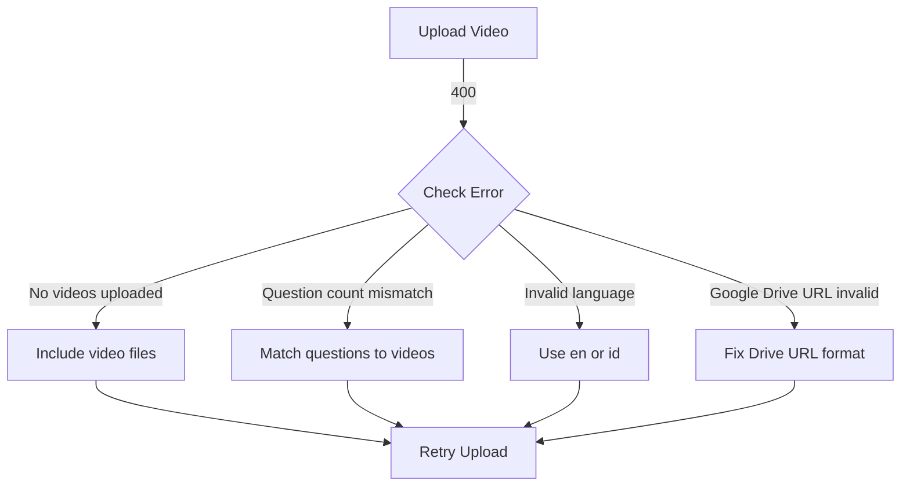
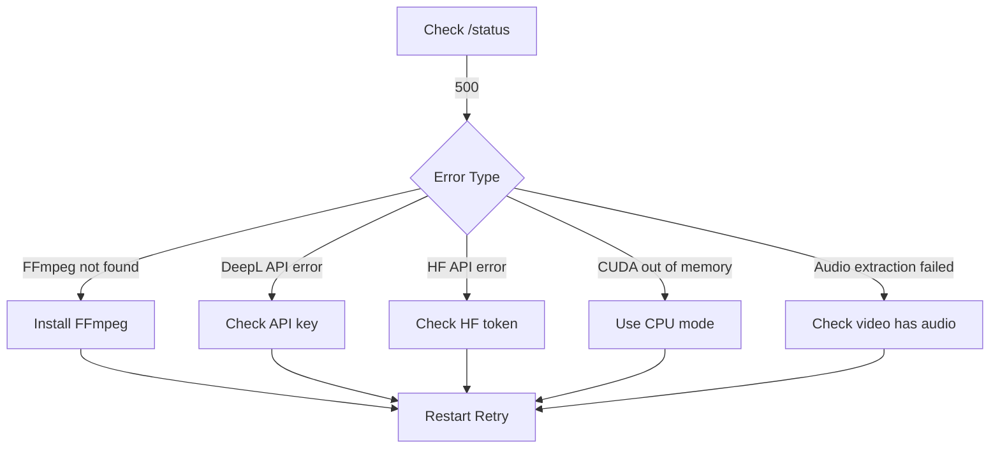
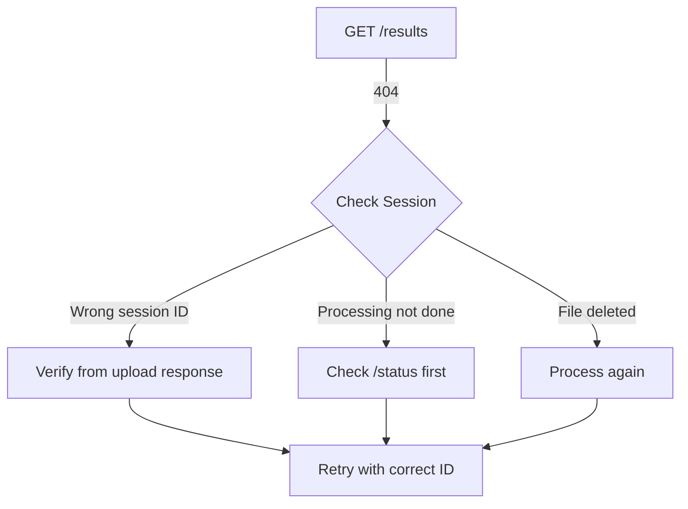

# Error Handling

Dokumentasi lengkap error codes dan cara mengatasinya.

---

## 📋 Error Response Format

Semua error mengikuti format FastAPI standard:

```json
{
  "detail": "Error message describing what went wrong"
}
```

**Example Error Responses:**

```json
{
  "detail": "No videos uploaded"
}
```

```json
{
  "detail": "Number of questions (2) does not match number of videos (3)"
}
```

```json
{
  "detail": "Error processing videos: FFmpeg not found. Please install FFmpeg"
}
```

---

## 🚨 HTTP Status Codes

| Status Code | Meaning             | Description                          |
| ----------- | ------------------- | ------------------------------------ |
| 200         | OK                  | Request successful                   |
| 400         | Bad Request         | Invalid request parameters           |
| 404         | Not Found           | Session/resource not found           |
| 500         | Internal Error      | Server processing error              |
| 503         | Service Unavailable | External API unavailable (DeepL, HF) |

---

## ❌ Error Codes

### File Upload Errors

#### `NO_VIDEOS_UPLOADED`

**Status Code:** 400

```json
{
  "detail": "No videos uploaded"
}
```

**Cause:** Request tidak include video files

**Solution:** Pastikan upload minimal 1 video file.

---

#### `QUESTION_COUNT_MISMATCH`

**Status Code:** 400

```json
{
  "detail": "Number of questions (2) does not match number of videos (3)"
}
```

**Cause:** Jumlah questions tidak sama dengan jumlah videos

**Solution:** Pastikan setiap video punya 1 question yang corresponding.

---

#### `INVALID_LANGUAGE`

**Status Code:** 400

```json
{
  "detail": "Invalid language code. Use 'en' or 'id'"
}
```

**Cause:** Language parameter bukan `en` atau `id`

**Solution:** Gunakan `"language": "en"` atau `"language": "id"`

---

#### `GOOGLE_DRIVE_URL_INVALID`

**Status Code:** 400

```json
{
  "detail": "Failed to extract file ID from URL: https://example.com/file"
}
```

**Cause:** Google Drive URL format tidak valid

**Solution:** Gunakan format yang supported:

- `https://drive.google.com/file/d/FILE_ID/view`
- `https://drive.google.com/open?id=FILE_ID`
- `https://drive.google.com/uc?id=FILE_ID`
- Direct file ID (33+ characters)

**Tip:** Set sharing permission ke "Anyone with the link can view"

---

#### `GOOGLE_DRIVE_DOWNLOAD_FAILED`

**Status Code:** 500

```json
{
  "detail": "Google Drive download failed: Access denied"
}
```

**Cause:** Video tidak bisa didownload (permission issue atau file tidak exist)

**Solution:**

1. Verify Google Drive link accessible
2. Set sharing ke "Anyone with the link can view"
3. Check file masih exist di Drive

---

### Session Errors

#### `SESSION_NOT_FOUND`

**Status Code:** 404

```json
{
  "detail": "Session not found"
}
```

**Cause:** Session ID tidak exist di sistem

**Solution:**

1. Verify session ID correct (32 hex characters)
2. Check `localStorage` di browser untuk session ID
3. Upload video baru untuk generate session baru

**Debug:**

```javascript
// Check saved session in browser
const session = localStorage.getItem("video_processing_session");
console.log("Session:", JSON.parse(session));
```

---

#### `RESULTS_NOT_FOUND`

**Status Code:** 404

```json
{
  "detail": "Results not found for session: abc123def456..."
}
```

**Cause:**

- Processing belum selesai
- Session ID salah
- Results file terhapus

**Solution:**

1. Check `/status/{session_id}` untuk verify processing completed
2. Wait hingga status = "completed"
3. Verify session ID dari upload response

---

### Processing Errors

#### `FFMPEG_NOT_FOUND`

**Status Code:** 500

```json
{
  "detail": "Error processing videos: FFmpeg not found. Please install FFmpeg"
}
```

**Cause:** FFmpeg tidak terinstall atau tidak ada di PATH

**Solution:**

**Windows:**

```bash
# Download: https://github.com/GyanD/codexffmpeg/releases
# Extract ke C:\ffmpeg
# Add C:\ffmpeg\bin to System PATH

# Verify:
ffmpeg -version
```

**macOS:**

```bash
brew install ffmpeg
```

**Linux:**

```bash
sudo apt install ffmpeg
```

**In Notebook:**

```python
import os
os.environ["PATH"] += os.pathsep + r"C:\ffmpeg\bin"
```

---

#### `AUDIO_EXTRACTION_FAILED`

**Status Code:** 500

```json
{
  "detail": "Error processing videos: Audio extraction failed"
}
```

**Cause:**

- Video tidak memiliki audio track
- Codec tidak supported
- File corrupted

**Solution:**

1. Check video has audio: `ffmpeg -i video.mp4 2>&1 | grep Audio`
2. Convert to supported format:
   ```bash
   ffmpeg -i input.webm -vn -acodec pcm_s16le -ar 16000 -ac 1 output.wav
   ```
3. Use video dengan audio track yang clear

**System Fallback:** System tries 2 methods automatically:

- Method 1: MoviePy (for MP4, AVI, MOV)
- Method 2: FFmpeg direct (for WebM, Opus)

---

#### `TRANSCRIPTION_FAILED`

**Status Code:** 500

```json
{
  "detail": "Error processing videos: Transcription failed - audio quality too low"
}
```

**Cause:** Whisper model gagal transcribe (audio quality rendah, terlalu banyak noise)

**Solution:**

1. Use video dengan audio quality lebih baik
2. Reduce background noise
3. Ensure clear speech
4. Use external microphone jika possible

**Model:** faster-whisper large-v3 (98% accuracy on clear audio)

---

#### `DEEPL_API_ERROR`

**Status Code:** 503

```json
{
  "detail": "Error processing videos: DeepL API error - Invalid authentication"
}
```

**Cause:**

- DeepL API key invalid
- Quota exceeded (500k chars/month free)
- Network issue

**Solution:**

1. Verify API key di `.env` file:
   ```bash
   DEEPL_API_KEY=your_key_here:fx
   ```
2. Get FREE API key: https://www.deepl.com/
3. Check quota: https://www.deepl.com/account/usage

**Fallback:** System akan skip translation jika DeepL unavailable (transcription tetap jalan)

---

#### `HF_API_ERROR`

**Status Code:** 503

```json
{
  "detail": "Error processing videos: Hugging Face API error - Rate limit exceeded"
}
```

**Cause:**

- Hugging Face API key invalid
- Rate limit exceeded (~30 req/min)
- Model unavailable

**Solution:**

1. Get FREE API token: https://huggingface.co/settings/tokens
2. Update di `.env`:
   ```bash
   HF_TOKEN=hf_xxxxxxxxxxxxxxxxxxxx
   ```
3. Wait beberapa menit jika rate limited
4. Use READ-only token (sudah cukup)

**Model:** meta-llama/Llama-3.1-8B-Instruct

**Fallback:** System auto-fallback ke rule-based scoring jika LLM unavailable

---

#### `GPU_OUT_OF_MEMORY`

**Status Code:** 500

```json
{
  "detail": "Error processing videos: CUDA out of memory"
}
```

**Cause:** GPU VRAM insufficient untuk process video

**Solution:**

1. **Force CPU mode:**
   ```python
   device = "cpu"  # Instead of auto-detect
   compute_type = "int8"
   ```
2. **Restart Jupyter kernel** untuk clear GPU cache
3. **Use smaller model:**
   ```python
   whisper_model = WhisperModel("medium")  # Instead of large-v3
   ```
4. **Process fewer videos** at once (max 2-3)
5. **Reduce frame processing:**
   ```python
   FRAME_SKIP = 10  # Process every 10 frames
   MAX_FRAMES = 150  # Reduce from 300
   ```

---

#### `MEDIAPIPE_INITIALIZATION_FAILED`

**Status Code:** 500

```json
{
  "detail": "Error processing videos: MediaPipe failed to initialize"
}
```

**Cause:** MediaPipe library issue atau video quality terlalu rendah

**Solution:**

1. Lower confidence thresholds:
   ```python
   face_mesh = mp_face_mesh.FaceMesh(
       min_detection_confidence=0.5,
       min_tracking_confidence=0.5
   )
   ```
2. Use video dengan:
   - Face clearly visible
   - Good lighting
   - Resolution ≥ 480p

---

#### `SPEAKER_DIARIZATION_FAILED`

**Status Code:** 500

```json
{
  "detail": "Error processing videos: Speaker diarization failed"
}
```

**Cause:**

- Resemblyzer model error
- Audio segment terlalu pendek
- Voice quality rendah

**Solution:**

1. System sudah force CPU mode untuk Resemblyzer:
   ```python
   voice_encoder = VoiceEncoder(device='cpu')
   ```
2. Ensure audio duration ≥ 5 seconds
3. Reduce background noise

**Note:** Diarization safe to fail - system tetap lanjut dengan verdict "Safe" for audio

---

### Configuration Errors

### Configuration Errors

#### `DEEPL_API_KEY_MISSING`

**Status Code:** 500 (Warning - system continues without translation)

```json
{
  "detail": "DeepL API key not configured. Translation skipped."
}
```

**Cause:** `DEEPL_API_KEY` tidak di-set di `.env`

**Solution:**

1. Sign up FREE: https://www.deepl.com/
2. Get API key (500k chars/month free)
3. Add to `.env`:
   ```bash
   DEEPL_API_KEY=your_key_here:fx
   ```

**Note:** System tetap jalan - hanya skip translation

---

#### `HF_TOKEN_MISSING`

**Status Code:** 500 (Warning - system uses fallback scoring)

```json
{
  "detail": "Hugging Face token not configured. Using rule-based scoring."
}
```

**Cause:** `HF_TOKEN` tidak di-set

**Solution:**

1. Sign up: https://huggingface.co/join
2. Generate token: https://huggingface.co/settings/tokens (READ access)
3. Add to `.env`:
   ```bash
   HF_TOKEN=hf_xxxxxxxxxxxxxxxxxxxx
   ```

**Note:** System auto-fallback ke rule-based scoring

---

#### `INVALID_ENV_FILE`

**Status Code:** 500

```json
{
  "detail": "Error processing videos: Failed to load .env file"
}
```

**Cause:** `.env` file format salah atau tidak readable

**Solution:**

1. Copy dari `env.example`:
   ```bash
   cp env.example .env
   ```
2. Edit dengan format:
   ```bash
   DEEPL_API_KEY=your_key:fx
   HF_TOKEN=hf_xxxxxxxxx
   ```
3. No spaces around `=`
4. No quotes around values

---

## 🔧 Error Handling Best Practices

### 1. Retry Logic

```python
import time
import requests
from requests.adapters import HTTPAdapter
from urllib3.util.retry import Retry

def create_session_with_retries():
    """Create requests session with automatic retries."""
    session = requests.Session()
    retry = Retry(
        total=3,
        backoff_factor=1,
        status_forcelist=[429, 500, 502, 503, 504],
        allowed_methods=["GET", "POST"]
    )
    adapter = HTTPAdapter(max_retries=retry)
    session.mount('http://', adapter)
    session.mount('https://', adapter)
    return session

# Usage
session = create_session_with_retries()
response = session.post(
    "http://localhost:8888/upload_json",
    json=payload
)
```

---

### 2. Graceful Error Handling

```python
import requests
from requests.exceptions import HTTPError, ConnectionError, Timeout

def upload_videos(candidate_name, videos_data, language="en"):
    """Upload with comprehensive error handling."""
    try:
        payload = {
            "candidate_name": candidate_name,
            "interviews": videos_data,
            "language": language
        }

        response = requests.post(
            'http://localhost:8888/upload_json',
            json=payload,
            timeout=60
        )

        response.raise_for_status()
        return response.json()

    except Timeout:
        print("⏱️ Request timeout - server might be busy")
        print("💡 Try again in a few moments")
        return None

    except HTTPError as e:
        error_msg = e.response.json().get('detail', str(e))
        print(f"❌ HTTP {e.response.status_code}: {error_msg}")

        # Handle specific errors
        if "No videos uploaded" in error_msg:
            print("💡 Ensure you're providing video data")
        elif "does not match" in error_msg:
            print("💡 Number of questions must equal number of videos")
        elif "Invalid language" in error_msg:
            print("💡 Use 'en' or 'id' for language parameter")
        elif "Failed to extract file ID" in error_msg:
            print("💡 Check Google Drive URL format")
        elif "FFmpeg not found" in error_msg:
            print("💡 Install FFmpeg: https://ffmpeg.org/download.html")

        return None

    except ConnectionError:
        print("🔴 Cannot connect to server")
        print("💡 Check if server is running on port 8888")
        return None

    except Exception as e:
        print(f"🔴 Unexpected error: {e}")
        return None

# Usage
videos = [
    {
        "positionId": 1,
        "question": "Tell me about yourself",
        "isVideoExist": True,
        "recordedVideoUrl": "https://drive.google.com/file/d/FILE_ID/view"
    }
]

result = upload_videos("John Doe", videos, "en")
if result:
    print(f"✅ Uploaded! Session: {result['session_id']}")
```

---

### 3. Status Polling with Error Handling

```python
import time
import requests

def wait_for_results(session_id, port=8888, timeout=600):
    """
    Poll for results with timeout and error handling.

    Args:
        session_id: Session UUID from upload response
        port: Server port (8888 for Jupyter, 7860 for Python script)
        timeout: Max wait time in seconds (default 10 min)
    """
    start_time = time.time()
    poll_interval = 5  # Poll every 5 seconds

    while time.time() - start_time < timeout:
        try:
            response = requests.get(
                f'http://localhost:{port}/status/{session_id}',
                timeout=10
            )
            response.raise_for_status()

            data = response.json()
            status = data['status']

            if status == 'completed':
                print("✅ Processing completed!")
                print(f"Redirect: {data['redirect']}")
                return get_results(session_id, port)

            elif status == 'error':
                error = data.get('error', 'Unknown error')
                print(f"❌ Processing failed: {error}")

                # Specific error guidance
                if "FFmpeg" in error:
                    print("💡 Install FFmpeg and restart server")
                elif "DeepL" in error:
                    print("💡 Check DeepL API key in .env")
                elif "Hugging Face" in error:
                    print("💡 Check HF token or wait for rate limit reset")
                elif "CUDA" in error:
                    print("💡 Use CPU mode or reduce video count")

                return None

            else:  # status == 'processing'
                progress = data.get('progress', '?/?')
                message = data.get('message', 'Processing...')
                print(f"⏳ [{progress}] {message}")

        except requests.exceptions.HTTPError as e:
            if e.response.status_code == 404:
                print("❌ Session not found - check session ID")
                return None
            print(f"⚠️ Poll error: HTTP {e.response.status_code}")

        except requests.exceptions.RequestException as e:
            print(f"⚠️ Network error: {e}")

        time.sleep(poll_interval)

    print("⏱️ Timeout waiting for results (10 min)")
    print("💡 Check server logs or try processing fewer/shorter videos")
    return None

def get_results(session_id, port=8888):
    """Retrieve final results."""
    try:
        response = requests.get(
            f'http://localhost:{port}/results/{session_id}',
            timeout=30
        )
        response.raise_for_status()
        return response.json()
    except requests.exceptions.HTTPError as e:
        if e.response.status_code == 404:
            print("❌ Results not found")
        return None

# Usage
session_id = "abc123def456..."
results = wait_for_results(session_id)

if results:
    print(f"\nCandidate: {results['name']}")
    print(f"LLM Score: {results['llm_results']['final_score_llm']:.1f}")
    print(f"Cheating: {results['aggregate_cheating_detection']['final_aggregate_verdict']}")
```

---

## 📊 Common Error Scenarios

### Scenario 1: Upload Fails



### Scenario 2: Processing Fails



### Scenario 3: Session Not Found



---

## 🔍 Debugging Tips

### 1. Enable Verbose Logging

**In Jupyter Notebook:**

```python
import logging
logging.basicConfig(
    level=logging.DEBUG,
    format='%(asctime)s - %(name)s - %(levelname)s - %(message)s'
)
```

**Check FastAPI Logs:**

- Server logs ditampilkan di Jupyter cell output
- Look for red error messages

---

### 2. Check Server Status

```python
import requests

# Health check
response = requests.get("http://localhost:8888/")
print(response.json())
# Expected: {"status": "ok", "message": "FastAPI server is running"}
```

---

### 3. Validate Video Before Upload

```python
import os
from pathlib import Path

def validate_video(file_path):
    """Pre-upload validation."""
    path = Path(file_path)

    # Check exists
    if not path.exists():
        return False, "File not found"

    # Check format
    if path.suffix.lower() not in ['.mp4', '.webm', '.avi', '.mov']:
        return False, f"Format {path.suffix} might not be supported"

    # Check size (recommended < 100MB)
    size_mb = os.path.getsize(file_path) / (1024 * 1024)
    if size_mb > 500:
        return False, f"File very large: {size_mb:.1f} MB (may timeout)"
    elif size_mb > 100:
        print(f"⚠️ Warning: Large file ({size_mb:.1f} MB) - may take longer")

    return True, "Valid"

# Usage
is_valid, message = validate_video('interview.mp4')
if not is_valid:
    print(f"❌ {message}")
```

---

### 4. Test Google Drive URL

```python
import re

def extract_drive_file_id(url):
    """Test if Drive URL is valid."""
    patterns = [
        r'/file/d/([a-zA-Z0-9_-]+)',
        r'id=([a-zA-Z0-9_-]+)',
        r'uc\?id=([a-zA-Z0-9_-]+)',
    ]

    for pattern in patterns:
        match = re.search(pattern, url)
        if match:
            return match.group(1)

    # Check if it's already a file ID
    if len(url) >= 33 and re.match(r'^[a-zA-Z0-9_-]+$', url):
        return url

    return None

# Usage
url = "https://drive.google.com/file/d/1ABC123XYZ/view"
file_id = extract_drive_file_id(url)
if file_id:
    print(f"✅ Valid! File ID: {file_id}")
else:
    print("❌ Invalid Google Drive URL")
```

---

### 5. Check API Keys

```python
import os
from dotenv import load_dotenv

load_dotenv()

# Check DeepL
deepL_key = os.getenv("DEEPL_API_KEY")
if deepL_key:
    print(f"✅ DeepL: {deepL_key[:10]}...{deepL_key[-4:]}")
else:
    print("❌ DeepL API key not found")

# Check Hugging Face
hf_token = os.getenv("HF_TOKEN")
if hf_token:
    print(f"✅ HF Token: {hf_token[:10]}...{hf_token[-4:]}")
else:
    print("❌ HF token not found")
```

---

### 6. Monitor Processing Progress

```bash
# Watch results directory
ls -lh backend/Python/results/

# Check latest result file
tail -f backend/Python/results/LATEST_SESSION_ID.json
```

---

### 7. Clear Browser Cache

```javascript
// In browser console (F12)
localStorage.clear();
sessionStorage.clear();
location.reload();
```

---

## 📞 Getting Help

Jika error masih berlanjut setelah troubleshooting:

### 1. Check Comprehensive Guides

- 📖 [Troubleshooting Guide](../troubleshooting/common-issues.md) - 8 common issues dengan solutions
- ⚙️ [Configuration Guide](../configuration/api-keys.md) - DeepL & HF setup

### 2. Review Server Logs

**Jupyter Notebook:**

- Check cell output untuk error messages
- Look for red error tracebacks
- Note error at which processing stage failed

**Python Script:**

```bash
python main.py 2>&1 | tee server.log
```

### 3. Common Quick Fixes

| Issue              | Quick Fix                              |
| ------------------ | -------------------------------------- |
| FFmpeg not found   | Install FFmpeg, add to PATH, restart   |
| CUDA out of memory | Use CPU mode, reduce videos            |
| DeepL/HF errors    | Check API keys in `.env`               |
| Session not found  | Verify session ID from upload response |
| Processing timeout | Use shorter/fewer videos, check GPU    |

### 4. System Requirements Check

```python
import sys
import torch
import whisper
import cv2
import mediapipe as mp

print(f"Python: {sys.version}")
print(f"PyTorch: {torch.__version__}")
print(f"CUDA Available: {torch.cuda.is_available()}")
if torch.cuda.is_available():
    print(f"CUDA Device: {torch.cuda.get_device_name(0)}")
print(f"OpenCV: {cv2.__version__}")
print(f"MediaPipe: {mp.__version__}")
```

### 5. Contact & Support

- 🐛 Open GitHub issue dengan:
  - Error message lengkap
  - System specs (CPU/GPU, RAM, OS)
  - Video details (size, duration, format)
  - Steps to reproduce
  - Server logs

**Expected Response Time:** Best effort (community-driven project)

---

## 📚 See Also

- [API Endpoints](endpoints.md)
- [Request/Response Format](request-response.md)
- [Common Issues](../troubleshooting/common-issues.md)
