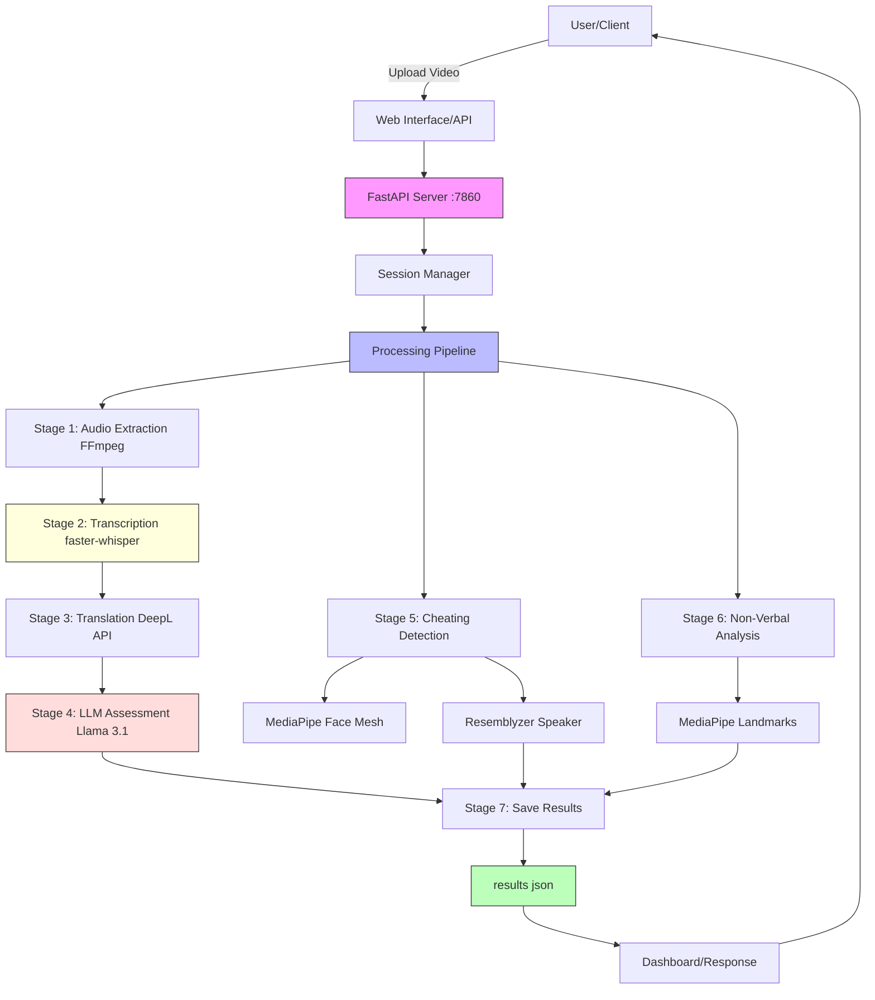
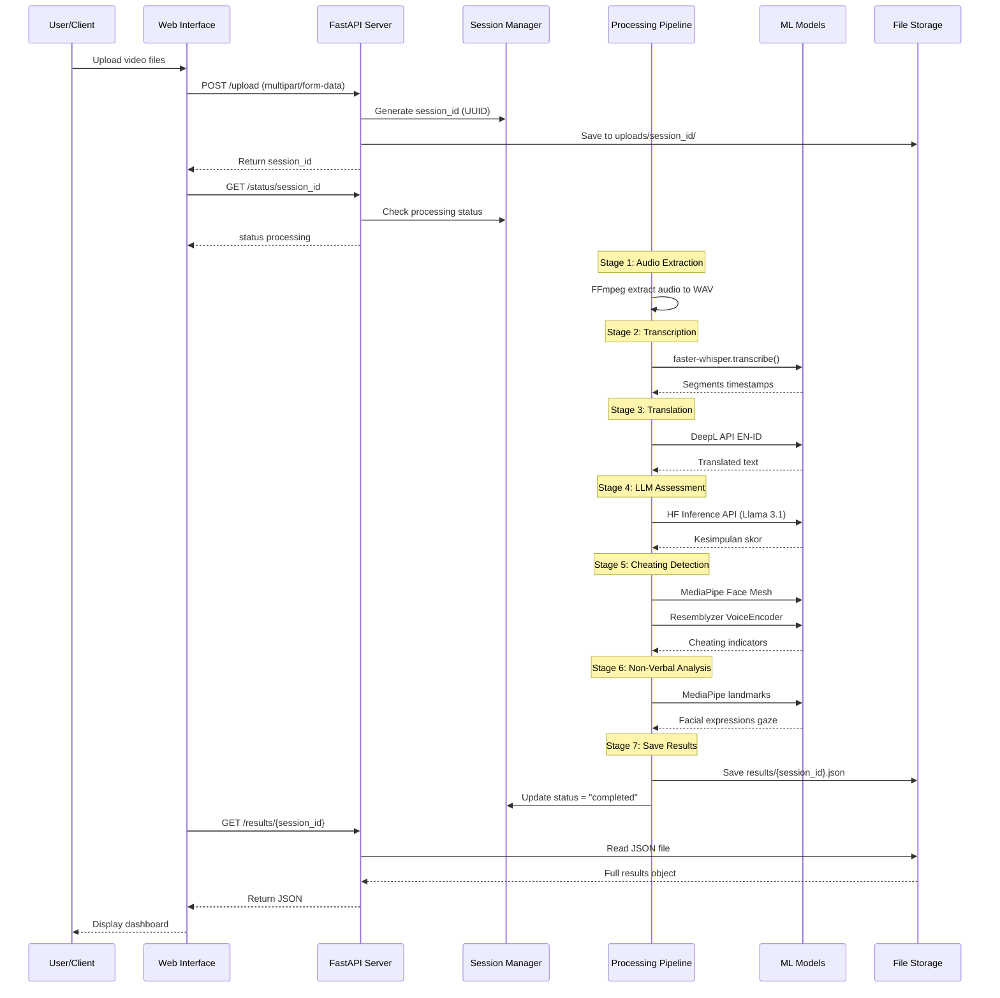
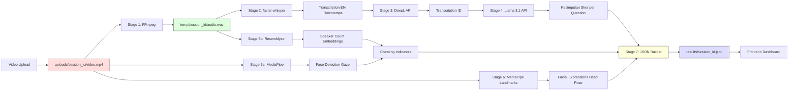
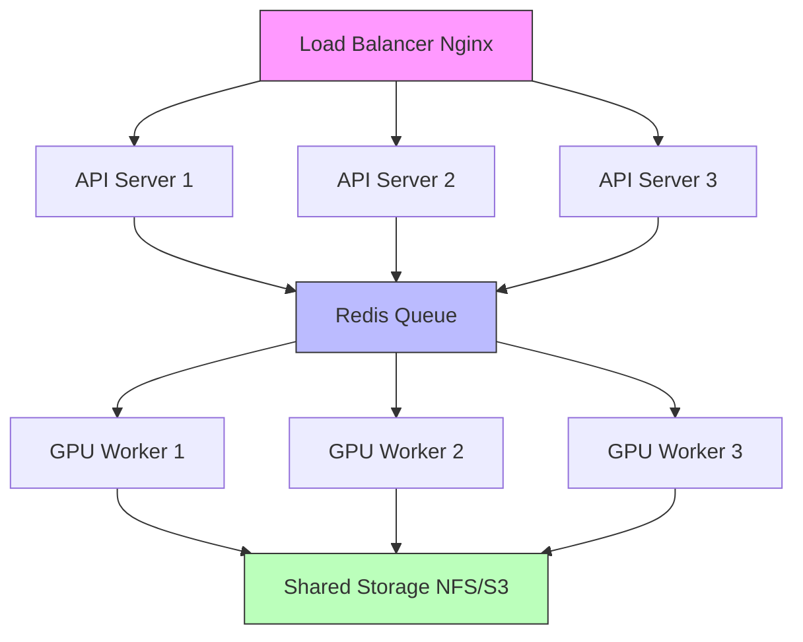

# System Architecture

Arsitektur dan design sistem Interview Assessment.

---

## 🏗️ High-Level Architecture



**Key Points:**

- **Port 7860:** FastAPI Python server
- **Port 8888:** Jupyter Notebook (optional)
- **Sequential Processing:** 7 stages in order
- **GPU Acceleration:** faster-whisper and MediaPipe (optional)
- **External APIs:** DeepL, Hugging Face Inference

---

## 📦 Component Overview

### 1. **Frontend (Web Interface)**

- **Technology:** HTML5, CSS3, Vanilla JavaScript
- **Purpose:** Video upload, dashboard visualization
- **Files:**
  - `frontend/Upload.html` - Video upload interface
  - `frontend/Upload.js` - Upload logic (multipart/form-data)
  - `frontend/Halaman_dasboard.html` - Results dashboard
  - `frontend/Halaman_dasboard.js` - Dashboard logic
  - `frontend/Assest/` - Static assets
- **Features:**
  - Drag-and-drop upload
  - Multiple file selection
  - Session ID tracking
  - JSON results display

### 2. **Backend (FastAPI Server)**

- **Technology:** FastAPI 0.104+, Python 3.11, Uvicorn
- **Purpose:** API endpoints, processing orchestration
- **Location:** `backend/Python/`
- **Key Files:**
  - `main.py` - Entry point
  - `app/server.py` - FastAPI app initialization
  - `app/routes.py` - API endpoints (upload, status, results)
  - `app/config.py` - Configuration (ports, paths)
  - `app/state.py` - Session state management
- **Key Features:**
  - RESTful API (POST /upload, GET /status, GET /results)
  - Async file handling
  - UUID session management
  - CORS enabled for frontend
  - Error handling with HTTPException

### 3. **Processing Pipeline**

- **Technology:** Python modules + Jupyter Notebook
- **Purpose:** Core video processing (7 sequential stages)
- **Location:** `backend/Python/app/`
- **Modules:**
  - `utils/transcription.py` - Audio extraction + faster-whisper
  - `utils/translation.py` - DeepL translation
  - `utils/llm_evaluator.py` - Llama 3.1 assessment
  - `utils/cheating_detection.py` - MediaPipe + Resemblyzer
  - `utils/non_verbal.py` - Facial expression analysis
  - `utils/json_builder.py` - Result JSON construction
  - `services/whisper_service.py` - Whisper model wrapper
  - `services/deepl_service.py` - DeepL API wrapper
  - `services/diarization.py` - Speaker diarization
- **Notebook:** `interview_assessment_system.ipynb` - End-to-end demo

### 4. **Storage Layer**

- **Technology:** Local filesystem (no database)
- **Folders:**
  - `uploads/{session_id}/` - Uploaded videos (MP4, AVI, MOV, etc.)
  - `temp/{session_id}/` - Temporary audio files (WAV)
  - `results/` - JSON results (`{session_id}.json`)
  - `logs/` - Application logs (optional)
- **Optional:** Google Drive backup via API

### 5. **ML Models**

- **faster-whisper:** CTranslate2-optimized Whisper (local)
- **Llama 3.1-8B-Instruct:** Via Hugging Face Inference API (remote)
- **MediaPipe Face Mesh:** 468 facial landmarks (local)
- **Resemblyzer:** Voice embeddings for diarization (local, CPU-only)

---

## 🔄 Processing Flow



**Processing Time (5-min video):**

- **GPU (RTX 3060):** 2-3 minutes total
- **CPU (i7):** 5-8 minutes total

**Error Handling:**

- Each stage wrapped in try-except
- Errors logged with stage name
- Session status updated to "failed" on error

---

## 🧩 Detailed Component Architecture

### Backend Folder Structure (Actual)

```
backend/Python/
├── main.py                      # Entry point (runs server)
├── requirements.txt             # Python dependencies
├── Dockerfile                   # Docker configuration
├── README.md                    # Backend documentation
├── install_dependencies.py      # Dependency installer
├── app/
│   ├── __init__.py
│   ├── server.py               # FastAPI app instance
│   ├── routes.py               # API endpoints
│   │                           # - POST /upload
│   │                           # - GET /status/{session_id}
│   │                           # - GET /results/{session_id}
│   ├── config.py               # Configuration (ports, paths)
│   ├── state.py                # Session state management
│   ├── env.example             # Environment variables template
│   ├── services/
│   │   ├── __init__.py
│   │   ├── whisper_service.py  # WhisperModel wrapper
│   │   ├── deepl_service.py    # DeepL API client
│   │   └── diarization.py      # Resemblyzer diarization
│   └── utils/
│       ├── __init__.py
│       ├── transcription.py    # Audio extraction + transcription
│       ├── translation.py      # EN↔ID translation
│       ├── llm_evaluator.py    # Llama 3.1 assessment
│       ├── cheating_detection.py # MediaPipe + speaker detection
│       ├── non_verbal.py       # Facial expression analysis
│       ├── json_builder.py     # Result JSON construction
│       └── gd_json_download.py # Google Drive utils (optional)
├── results/                     # JSON results storage
│   ├── {session_id}.json       # Result files
│   └── ...
├── uploads/                     # Uploaded videos (created at runtime)
│   └── {session_id}/
│       └── video.mp4
└── temp/                        # Temporary audio files (created at runtime)
    └── {session_id}/
        └── audio.wav
```

### Frontend Folder Structure (Actual)

```
frontend/
├── Upload.html                  # Upload interface
├── Upload.js                    # Upload logic
├── Upload.css                   # Upload styles
├── Halaman_dasboard.html        # Dashboard interface
├── Halaman_dasboard.js          # Dashboard logic
├── Halaman_dasboard.css         # Dashboard styles
├── vercel.json                  # Vercel deployment config
└── Assest/                      # Static assets
    └── (images, icons, etc.)
```

### API Endpoints (routes.py)

```python
from fastapi import APIRouter, UploadFile, File
from typing import List

router = APIRouter()

@router.post("/upload")
async def upload_videos(
    files: List[UploadFile] = File(...),
    jumlah_pertanyaan: int = 3,
    language: str = "id"
):
    """Upload and process interview videos."""
    session_id = str(uuid.uuid4())
    # Save files to uploads/{session_id}/
    # Start processing pipeline
    return {"session_id": session_id}

@router.get("/status/{session_id}")
async def get_status(session_id: str):
    """Check processing status."""
    # Check if results/{session_id}.json exists
    return {"status": "completed" | "processing" | "failed"}

@router.get("/results/{session_id}")
async def get_results(session_id: str):
    """Get processing results."""
    # Read and return results/{session_id}.json
    return {...}  # Full JSON object
```

---

## 🤖 ML Model Integration

### 1. faster-whisper (Speech-to-Text)

**Library:** CTranslate2-optimized Whisper (NOT transformers)

```python
from faster_whisper import WhisperModel
import torch

class WhisperTranscriber:
    def __init__(self):
        # Auto-detect device
        device = "cuda" if torch.cuda.is_available() else "cpu"
        compute_type = "float16" if device == "cuda" else "int8"

        # Load model (large-v3 by default)
        self.model = WhisperModel(
            "large-v3",
            device=device,
            compute_type=compute_type,
            num_workers=4
        )

    def transcribe(self, audio_path: str, language: str = "en"):
        """Transcribe audio with timestamps."""
        segments, info = self.model.transcribe(
            audio_path,
            language=language,
            beam_size=10,  # Dynamic based on duration
            best_of=5,
            temperature=0.0,
            vad_filter=True,  # Voice Activity Detection
            vad_parameters={
                "threshold": 0.3,
                "min_speech_duration_ms": 200
            }
        )

        # Combine segments
        full_text = ""
        for segment in segments:
            full_text += segment.text + " "

        return full_text.strip(), info
```

**Performance:**

- GPU (RTX 3060): 45-60s per 5-min video
- CPU (i7): 3-5 min per 5-min video

**Memory:** 6-8 GB VRAM (GPU) or 4 GB RAM (CPU)

---

### 2. Llama 3.1-8B-Instruct (LLM Assessment)

**API:** Hugging Face Inference API (FREE tier)

```python
from huggingface_hub import InferenceClient
import os

class LlamaAssessor:
    def __init__(self):
        self.client = InferenceClient(
            api_key=os.getenv("HF_TOKEN")
        )
        self.model = "meta-llama/Llama-3.1-8B-Instruct"

    def assess(self, transcription: str, question: str, language: str = "id"):
        """Assess interview answer using LLM."""
        prompt = self.build_prompt(transcription, question, language)

        try:
            response = self.client.text_generation(
                model=self.model,
                prompt=prompt,
                max_new_tokens=500,
                temperature=0.3,
                top_p=0.9,
                do_sample=True
            )

            return self.parse_response(response)

        except Exception as e:
            print(f"LLM API Error: {e}")
            return self.fallback_assessment(transcription)

    def build_prompt(self, transcription, question, language):
        """Build assessment prompt."""
        if language == "id":
            return f"""
Anda adalah seorang interviewer profesional. Analisis jawaban kandidat berikut:

Pertanyaan: {question}
Jawaban: {transcription}

Berikan penilaian dalam format:
1. Kesimpulan (2-3 kalimat)
2. Kualitas Jawaban (skor 1-10)
3. Poin Kuat (2-3 poin)
4. Area Improvement (2-3 poin)
"""
        else:
            return f"""
You are a professional interviewer. Analyze the following candidate answer:

Question: {question}
Answer: {transcription}

Provide assessment in this format:
1. Summary (2-3 sentences)
2. Answer Quality (score 1-10)
3. Strengths (2-3 points)
4. Areas for Improvement (2-3 points)
"""
```

**Performance:**

- API call: 15-30s per question
- Rate limit: ~1000 requests/day (FREE tier)

---

### 3. MediaPipe Face Mesh (Visual Analysis)

**Library:** MediaPipe Solutions

```python
import mediapipe as mp
import cv2
import numpy as np

class VisualAnalyzer:
    def __init__(self):
        self.mp_face_mesh = mp.solutions.face_mesh
        self.face_mesh = self.mp_face_mesh.FaceMesh(
            min_detection_confidence=0.6,
            min_tracking_confidence=0.6,
            refine_landmarks=True,  # Include iris (468 landmarks)
            max_num_faces=2  # Detect multiple people
        )

        # Frame processing settings
        self.FRAME_SKIP = 5  # Process every 5th frame
        self.MAX_FRAMES = 300  # Max frames to process
        self.CALIBRATION_FRAMES = 60  # Baseline frames

    def analyze_video(self, video_path: str):
        """Analyze video for cheating detection."""
        cap = cv2.VideoCapture(video_path)

        results = {
            "multiple_faces": [],
            "no_face_frames": 0,
            "looking_away": [],
            "face_landmarks": []
        }

        frame_count = 0
        processed_count = 0

        while cap.isOpened() and processed_count < self.MAX_FRAMES:
            ret, frame = cap.read()
            if not ret:
                break

            # Skip frames
            if frame_count % self.FRAME_SKIP != 0:
                frame_count += 1
                continue

            # Convert BGR to RGB
            rgb_frame = cv2.cvtColor(frame, cv2.COLOR_BGR2RGB)

            # Process frame
            mesh_results = self.face_mesh.process(rgb_frame)

            if mesh_results.multi_face_landmarks:
                num_faces = len(mesh_results.multi_face_landmarks)

                # Multiple faces detected
                if num_faces > 1:
                    results["multiple_faces"].append(frame_count)

                # Analyze first face
                landmarks = mesh_results.multi_face_landmarks[0]

                # Calculate head pose (gaze direction)
                gaze_direction = self.calculate_gaze(landmarks)
                if abs(gaze_direction) > 0.3:  # Looking away threshold
                    results["looking_away"].append(frame_count)

                # Store landmarks for non-verbal analysis
                results["face_landmarks"].append(
                    self.extract_landmarks(landmarks)
                )
            else:
                # No face detected
                results["no_face_frames"] += 1

            processed_count += 1
            frame_count += 1

        cap.release()
        return results

    def calculate_gaze(self, landmarks):
        """Calculate head pose angle."""
        # Using specific landmarks for head orientation
        # (simplified - actual implementation more complex)
        nose = landmarks.landmark[1]
        left_eye = landmarks.landmark[33]
        right_eye = landmarks.landmark[263]

        # Calculate angle (simplified)
        eye_center_x = (left_eye.x + right_eye.x) / 2
        horizontal_offset = nose.x - eye_center_x

        return horizontal_offset
```

**Performance:**

- GPU: 30-45s per 5-min video
- CPU: 60-90s per 5-min video

**Landmarks:** 468 facial points (including iris)

---

### 4. Resemblyzer (Speaker Diarization)

**Library:** Resemblyzer (CPU-only)

```python
from resemblyzer import VoiceEncoder, preprocess_wav
import torch
import numpy as np

class SpeakerDiarization:
    def __init__(self):
        # Force CPU (Resemblyzer doesn't support GPU with cuDNN)
        torch.set_num_threads(4)
        self.encoder = VoiceEncoder(device='cpu')

    def analyze_speakers(self, audio_path: str):
        """Detect multiple speakers."""
        # Load and preprocess audio
        wav = preprocess_wav(audio_path)

        # Extract embeddings for segments
        segment_duration = 0.5  # 500ms segments
        embeddings = []

        for i in range(0, len(wav), int(16000 * segment_duration)):
            segment = wav[i:i + int(16000 * segment_duration)]
            if len(segment) < 8000:  # Min segment length
                continue

            embedding = self.encoder.embed_utterance(segment)
            embeddings.append(embedding)

        # Cluster embeddings to identify speakers
        embeddings = np.array(embeddings)
        num_speakers = self.estimate_speakers(embeddings)

        return {
            "total_speakers": num_speakers,
            "embeddings": embeddings.tolist()
        }

    def estimate_speakers(self, embeddings):
        """Estimate number of unique speakers."""
        from sklearn.cluster import DBSCAN

        clustering = DBSCAN(eps=0.3, min_samples=10)
        labels = clustering.fit_predict(embeddings)

        num_speakers = len(set(labels)) - (1 if -1 in labels else 0)
        return max(1, num_speakers)  # At least 1 speaker
```

**Performance:**

- CPU only: 30-60s per 5-min video
- No GPU acceleration available

---

## 💾 Data Flow Architecture



**File Paths:**

- **Input:** `uploads/{session_id}/video_0.mp4`, `video_1.mp4`, ...
- **Temp:** `temp/{session_id}/audio_0.wav`, `audio_1.wav`, ...
- **Output:** `results/{session_id}.json` (single file with all results)

**Data Transformations:**

| Stage | Input         | Output            | Format         |
| ----- | ------------- | ----------------- | -------------- |
| 1     | MP4 video     | WAV audio         | 16kHz mono PCM |
| 2     | WAV audio     | Text + timestamps | String         |
| 3     | EN text       | ID text           | String         |
| 4     | Transcription | Assessment        | Dict           |
| 5     | Video + audio | Cheating flags    | Dict           |
| 6     | Video frames  | Facial data       | Dict           |
| 7     | All results   | JSON              | File           |

**Result JSON Structure:**

```json
{
  "session_id": "uuid",
  "video_count": 3,
  "processing_time": 185.4,
  "results": [
    {
      "video_file": "video_0.mp4",
      "pertanyaan": "...",
      "transkripsi_en": "...",
      "transkripsi_id": "...",
      "kesimpulan_llm": "...",
      "kualitas_jawaban": 8,
      "cheating_detection": {...},
      "non_verbal_analysis": {...}
    },
    ...
  ]
}
```

---

## 🔐 Security Architecture

### Current Implementation

**No Authentication (Development Mode):**

- Currently no API key or user authentication
- All endpoints are public
- Session IDs provide minimal access control

**Input Validation:**

```python
from fastapi import HTTPException, UploadFile
from typing import List

# File validation
def validate_video_files(files: List[UploadFile]):
    """Validate uploaded video files."""
    ALLOWED_EXTENSIONS = [".mp4", ".avi", ".mov", ".mkv", ".webm"]
    MAX_FILE_SIZE = 100 * 1024 * 1024  # 100 MB

    for file in files:
        # Check extension
        ext = os.path.splitext(file.filename)[1].lower()
        if ext not in ALLOWED_EXTENSIONS:
            raise HTTPException(
                status_code=400,
                detail=f"Invalid file type: {ext}. Allowed: {ALLOWED_EXTENSIONS}"
            )

        # Check file size (if available)
        if hasattr(file, 'size') and file.size > MAX_FILE_SIZE:
            raise HTTPException(
                status_code=400,
                detail=f"File too large: {file.size / 1024 / 1024:.1f} MB. Max: 100 MB"
            )

# Parameter validation
def validate_language(language: str):
    """Validate language code."""
    if language not in ["en", "id"]:
        raise HTTPException(
            status_code=400,
            detail=f"Invalid language: {language}. Allowed: en, id"
        )

# Session ID validation
import uuid

def validate_session_id(session_id: str):
    """Validate UUID format."""
    try:
        uuid.UUID(session_id)
    except ValueError:
        raise HTTPException(
            status_code=400,
            detail="Invalid session ID format"
        )
```

### CORS Configuration

```python
from fastapi.middleware.cors import CORSMiddleware

# In server.py
app.add_middleware(
    CORSMiddleware,
    allow_origins=["*"],  # Development: allow all origins
    # Production: specify allowed domains
    # allow_origins=["https://yourdomain.com"],
    allow_credentials=True,
    allow_methods=["*"],
    allow_headers=["*"],
)
```

### Environment Variables (Secrets)

```bash
# app/.env
HF_TOKEN=hf_your_token_here
DEEPL_API_KEY=your_key_here:fx

# Don't commit .env to git!
# Use .env.example as template
```

### Future Security Enhancements

**1. API Key Authentication:**

```python
from fastapi import Security, HTTPException
from fastapi.security import APIKeyHeader

api_key_header = APIKeyHeader(name="X-API-Key", auto_error=False)

async def validate_api_key(api_key: str = Security(api_key_header)):
    if api_key not in valid_api_keys:
        raise HTTPException(
            status_code=403,
            detail="Invalid or missing API Key"
        )
    return api_key

@app.post("/upload")
async def upload(api_key: str = Depends(validate_api_key)):
    # Protected endpoint
    pass
```

**2. Rate Limiting:**

```python
from slowapi import Limiter, _rate_limit_exceeded_handler
from slowapi.util import get_remote_address

limiter = Limiter(key_func=get_remote_address)
app.state.limiter = limiter
app.add_exception_handler(RateLimitExceeded, _rate_limit_exceeded_handler)

@app.post("/upload")
@limiter.limit("10/hour")  # 10 uploads per hour per IP
async def upload(request: Request):
    pass
```

**3. File Sanitization:**

```python
import magic

def verify_file_type(file_path: str):
    """Verify actual file type (not just extension)."""
    mime = magic.from_file(file_path, mime=True)
    if not mime.startswith('video/'):
        raise HTTPException(
            status_code=400,
            detail=f"File is not a video: {mime}"
        )
```

**4. Session Expiration:**

```python
import time
from datetime import datetime, timedelta

def cleanup_old_sessions():
    """Delete sessions older than 7 days."""
    expiry_time = datetime.now() - timedelta(days=7)

    for folder in ["uploads", "temp", "results"]:
        for session_dir in os.listdir(folder):
            path = os.path.join(folder, session_dir)
            if os.path.isdir(path):
                created_time = datetime.fromtimestamp(os.path.getctime(path))
                if created_time < expiry_time:
                    shutil.rmtree(path)
                    print(f"Deleted expired session: {session_dir}")
```

---

## ⚡ Performance Architecture

### ModelManager Singleton Pattern

**Load models once, reuse across requests:**

```python
class ModelManager:
    """Singleton pattern for model loading."""
    _instance = None
    _models_loaded = False

    def __new__(cls):
        if cls._instance is None:
            cls._instance = super().__new__(cls)
        return cls._instance

    def load_models(self):
        """Load all ML models once."""
        if not self._models_loaded:
            print("🔄 Loading models...")

            # Whisper
            from faster_whisper import WhisperModel
            self.whisper_model = WhisperModel(
                "large-v3",
                device=self.device,
                compute_type=self.compute_type
            )

            # Hugging Face client
            from huggingface_hub import InferenceClient
            self.hf_client = InferenceClient(api_key=HF_TOKEN)

            # MediaPipe
            import mediapipe as mp
            self.face_mesh = mp.solutions.face_mesh.FaceMesh(
                min_detection_confidence=0.6,
                min_tracking_confidence=0.6,
                refine_landmarks=True
            )

            # Resemblyzer
            from resemblyzer import VoiceEncoder
            self.voice_encoder = VoiceEncoder(device='cpu')

            self._models_loaded = True
            print("✅ Models loaded")
        else:
            print("⚡ Models already loaded (using cache)")

# Usage
manager = ModelManager()
manager.load_models()  # First call: loads models
manager.load_models()  # Subsequent calls: instant (cached)
```

**Benefits:**

- Load models once on server startup
- Avoid 30-60s loading time per request
- Reuse across multiple video processing requests

### Result Caching

```python
import json
from pathlib import Path

def get_cached_result(session_id: str):
    """Check if result already exists."""
    result_file = f"results/{session_id}.json"

    if Path(result_file).exists():
        with open(result_file, 'r', encoding='utf-8') as f:
            return json.load(f)

    return None

def save_result(session_id: str, result: dict):
    """Save result for future retrieval."""
    result_file = f"results/{session_id}.json"

    Path("results").mkdir(exist_ok=True)
    with open(result_file, 'w', encoding='utf-8') as f:
        json.dump(result, f, indent=2, ensure_ascii=False)

    print(f"✅ Result cached: {result_file}")
```

### Sequential Processing (GPU Memory Management)

**Process videos one at a time to avoid OOM:**

```python
def process_multiple_videos(video_paths: list):
    """Process videos sequentially to avoid GPU OOM."""
    results = []

    for i, video_path in enumerate(video_paths, 1):
        print(f"\n🎬 Processing {i}/{len(video_paths)}: {video_path}")

        try:
            # Process single video
            result = process_single_video(video_path)
            results.append(result)

        except Exception as e:
            print(f"❌ Error processing {video_path}: {e}")
            results.append({"error": str(e)})

        finally:
            # Cleanup after each video
            import gc
            import torch

            gc.collect()
            if torch.cuda.is_available():
                torch.cuda.empty_cache()

    return results
```

### Async File Upload (Non-Blocking)

```python
from fastapi import UploadFile
import aiofiles

async def save_uploaded_file(file: UploadFile, save_path: str):
    """Save file asynchronously (non-blocking)."""
    async with aiofiles.open(save_path, 'wb') as f:
        # Read and write in chunks
        while chunk := await file.read(1024 * 1024):  # 1 MB chunks
            await f.write(chunk)

    print(f"✅ File saved: {save_path}")
```

### GPU Memory Optimization

```python
import gc
import torch

def cleanup_gpu_memory():
    """Clear GPU memory after processing."""
    gc.collect()

    if torch.cuda.is_available():
        torch.cuda.empty_cache()
        torch.cuda.ipc_collect()

        # Log memory usage
        allocated = torch.cuda.memory_allocated(0) / 1e9
        total = torch.cuda.get_device_properties(0).total_memory / 1e9
        print(f"📊 GPU Memory: {allocated:.2f} GB / {total:.2f} GB")

# Call after each video
result = process_video(video_path)
cleanup_gpu_memory()
```

### Frame Skipping Optimization

```python
# Process every 5th frame (default)
FRAME_SKIP = 5
MAX_FRAMES = 300

# For faster processing (less accurate)
FRAME_SKIP = 10  # 2x faster
MAX_FRAMES = 200

def process_video_frames(video_path: str):
    """Process video with frame skipping."""
    cap = cv2.VideoCapture(video_path)
    frame_count = 0
    processed_count = 0

    while cap.isOpened() and processed_count < MAX_FRAMES:
        ret, frame = cap.read()
        if not ret:
            break

        # Skip frames
        if frame_count % FRAME_SKIP != 0:
            frame_count += 1
            continue

        # Process frame
        result = analyze_frame(frame)

        processed_count += 1
        frame_count += 1

    cap.release()
```

---

## 📊 Monitoring & Logging

### Logging Implementation

```python
import logging
from datetime import datetime
from pathlib import Path

# Configure logging
log_dir = Path("logs")
log_dir.mkdir(exist_ok=True)

logging.basicConfig(
    level=logging.INFO,
    format='%(asctime)s - %(name)s - %(levelname)s - %(message)s',
    handlers=[
        logging.FileHandler(f'logs/app_{datetime.now():%Y%m%d}.log'),
        logging.StreamHandler()  # Console output
    ]
)

logger = logging.getLogger(__name__)

# Usage in code
logger.info(f"Processing started: {session_id}")
logger.info(f"Stage 1 (Audio Extraction): {duration:.2f}s")
logger.info(f"Stage 2 (Transcription): {duration:.2f}s")
logger.error(f"Error in stage 3: {error}")
logger.info(f"Processing completed: {session_id} in {total_time:.2f}s")
```

**Log Output Example:**

```
2024-12-13 14:23:45 - __main__ - INFO - Processing started: abc-123-def
2024-12-13 14:23:53 - __main__ - INFO - Stage 1 (Audio Extraction): 8.2s
2024-12-13 14:24:51 - __main__ - INFO - Stage 2 (Transcription): 58.4s
2024-12-13 14:24:54 - __main__ - INFO - Stage 3 (Translation): 3.1s
2024-12-13 14:25:13 - __main__ - INFO - Stage 4 (LLM Assessment): 19.3s
2024-12-13 14:25:56 - __main__ - INFO - Stage 5 (Cheating Detection): 42.7s
2024-12-13 14:26:35 - __main__ - INFO - Stage 6 (Non-Verbal): 38.9s
2024-12-13 14:26:52 - __main__ - INFO - Stage 7 (Save Results): 16.8s
2024-12-13 14:26:52 - __main__ - INFO - Processing completed: abc-123-def in 187.4s
```

### Performance Metrics

```python
import time
from contextlib import contextmanager

@contextmanager
def timer(stage_name: str):
    """Time a processing stage."""
    start = time.time()
    yield
    duration = time.time() - start
    logger.info(f"{stage_name}: {duration:.2f}s")
    return duration

# Usage
with timer("Stage 2 (Transcription)"):
    transcription = transcribe_audio(audio_path)
```

### Resource Monitoring

```python
import psutil
import torch

def log_system_resources():
    """Log current system resource usage."""
    # CPU and RAM
    cpu_percent = psutil.cpu_percent(interval=1)
    ram = psutil.virtual_memory()

    logger.info(f"CPU: {cpu_percent}%")
    logger.info(f"RAM: {ram.percent}% ({ram.used / 1e9:.1f} GB / {ram.total / 1e9:.1f} GB)")

    # GPU (if available)
    if torch.cuda.is_available():
        gpu_mem_allocated = torch.cuda.memory_allocated(0) / 1e9
        gpu_mem_total = torch.cuda.get_device_properties(0).total_memory / 1e9
        gpu_percent = (gpu_mem_allocated / gpu_mem_total) * 100

        logger.info(f"GPU: {gpu_percent:.1f}% ({gpu_mem_allocated:.2f} GB / {gpu_mem_total:.2f} GB)")

# Call periodically or on errors
log_system_resources()
```

### Error Tracking

```python
from fastapi import HTTPException
import traceback

def handle_processing_error(session_id: str, stage: str, error: Exception):
    """Log and handle processing errors."""
    # Log full error
    logger.error(f"Error in {stage} for session {session_id}")
    logger.error(f"Error type: {type(error).__name__}")
    logger.error(f"Error message: {str(error)}")
    logger.error(f"Traceback:\n{traceback.format_exc()}")

    # Save error to results
    error_result = {
        "session_id": session_id,
        "status": "failed",
        "error": {
            "stage": stage,
            "type": type(error).__name__,
            "message": str(error)
        }
    }

    save_result(session_id, error_result)

    # Return HTTP error
    raise HTTPException(
        status_code=500,
        detail=f"Processing failed at {stage}: {str(error)}"
    )
```

---

## 🔄 Scalability Considerations

### Current Limitations (Single Server)

**Single GPU Server Capacity:**

- **Concurrent users:** 10-20 (limited by GPU memory)
- **Processing mode:** Sequential (one video at a time on GPU)
- **Throughput:** ~200-400 videos/day (GPU), ~100-150 videos/day (CPU)
- **Bottleneck:** GPU memory for Whisper large-v3

**Recommendations:**

1. **Process videos sequentially on GPU** (current implementation)

   - Avoids out-of-memory errors
   - More reliable than parallel processing

2. **Use queue system for >10 concurrent uploads**
   - Store uploads in queue
   - Process one at a time
   - Return status via polling

### Future: Horizontal Scaling



**Components:**

1. **Load Balancer:** Nginx (distribute API requests)
2. **API Servers:** FastAPI instances (handle uploads, serve results)
3. **Job Queue:** Redis + RQ/Celery (queue video processing jobs)
4. **GPU Workers:** Separate machines with GPUs (process videos)
5. **Shared Storage:** NFS or S3 (centralized file storage)

**Example: Redis Queue Integration**

```python
from redis import Redis
from rq import Queue

# Setup queue
redis_conn = Redis(host='localhost', port=6379)
queue = Queue('video-processing', connection=redis_conn)

# Add job to queue
@app.post("/upload")
async def upload(files: List[UploadFile]):
    session_id = save_files(files)

    # Enqueue processing job
    job = queue.enqueue(
        process_video,
        session_id,
        job_timeout='30m'  # 30 minute timeout
    )

    return {
        "session_id": session_id,
        "job_id": job.id,
        "status": "queued"
    }

# Worker process (run on GPU machine)
from rq import Worker

worker = Worker(['video-processing'], connection=redis_conn)
worker.work()
```

**Expected Capacity (Multi-Server):**

- **3 GPU servers:** 600-1200 videos/day
- **10 GPU servers:** 2000-4000 videos/day

---

## 🚀 Deployment Architecture

### Current Setup (Single Server)

**Development:**

```bash
# Run directly
python main.py

# Or with uvicorn
uvicorn app.server:app --host 0.0.0.0 --port 7860 --reload
```

**Production (Recommended):**

```bash
# Install Gunicorn
pip install gunicorn

# Run with multiple workers
gunicorn app.server:app \
  --workers 2 \
  --worker-class uvicorn.workers.UvicornWorker \
  --bind 0.0.0.0:7860 \
  --timeout 600 \
  --log-level info
```

### Systemd Service (Linux)

```ini
# /etc/systemd/system/interview-api.service
[Unit]
Description=Interview Assessment API
After=network.target

[Service]
Type=simple
User=your-user
WorkingDirectory=/path/to/Interview_Assesment_System/backend/Python
Environment="PATH=/usr/bin:/usr/local/bin"
EnvironmentFile=/path/to/Interview_Assesment_System/backend/Python/app/.env
ExecStart=/usr/local/bin/gunicorn app.server:app \
  --workers 2 \
  --worker-class uvicorn.workers.UvicornWorker \
  --bind 0.0.0.0:7860 \
  --timeout 600
Restart=always
RestartSec=10

[Install]
WantedBy=multi-user.target
```

**Commands:**

```bash
# Enable service
sudo systemctl enable interview-api

# Start service
sudo systemctl start interview-api

# Check status
sudo systemctl status interview-api

# View logs
sudo journalctl -u interview-api -f
```

### Nginx Reverse Proxy

```nginx
# /etc/nginx/sites-available/interview-api
server {
    listen 80;
    server_name your-domain.com;

    # Max upload size
    client_max_body_size 100M;

    location / {
        proxy_pass http://localhost:7860;
        proxy_http_version 1.1;
        proxy_set_header Upgrade $http_upgrade;
        proxy_set_header Connection 'upgrade';
        proxy_set_header Host $host;
        proxy_set_header X-Real-IP $remote_addr;
        proxy_set_header X-Forwarded-For $proxy_add_x_forwarded_for;
        proxy_cache_bypass $http_upgrade;

        # Timeout for long processing
        proxy_read_timeout 600s;
        proxy_connect_timeout 600s;
        proxy_send_timeout 600s;
    }

    # Static files (if serving frontend)
    location /static {
        alias /path/to/frontend;
    }
}
```

**Enable site:**

```bash
sudo ln -s /etc/nginx/sites-available/interview-api /etc/nginx/sites-enabled/
sudo nginx -t
sudo systemctl restart nginx
```

### Docker Deployment (Optional)

**Current Dockerfile:**

```dockerfile
# backend/Python/Dockerfile
FROM python:3.11-slim

# Install system dependencies
RUN apt-get update && apt-get install -y \
    ffmpeg \
    && rm -rf /var/lib/apt/lists/*

# Install Python dependencies
WORKDIR /app
COPY requirements.txt .
RUN pip install --no-cache-dir -r requirements.txt

# Install PyTorch with CUDA (if GPU available)
RUN pip install torch torchvision torchaudio \
    --index-url https://download.pytorch.org/whl/cu118

# Copy application
COPY . .

# Expose port
EXPOSE 7860

# Run application
CMD ["uvicorn", "app.server:app", "--host", "0.0.0.0", "--port", "7860"]
```

**Build and run:**

```bash
# Build image
docker build -t interview-api .

# Run container (GPU)
docker run --gpus all -p 7860:7860 \
  -v $(pwd)/uploads:/app/uploads \
  -v $(pwd)/results:/app/results \
  -v $(pwd)/temp:/app/temp \
  -e HF_TOKEN=your_token \
  -e DEEPL_API_KEY=your_key \
  interview-api

# Run container (CPU only)
docker run -p 7860:7860 \
  -v $(pwd)/uploads:/app/uploads \
  -v $(pwd)/results:/app/results \
  -v $(pwd)/temp:/app/temp \
  -e HF_TOKEN=your_token \
  -e DEEPL_API_KEY=your_key \
  interview-api
```

---

## 📚 Technology Stack Summary

| Layer          | Technologies                                      | Version/Details              |
| -------------- | ------------------------------------------------- | ---------------------------- |
| **Frontend**   | HTML5, CSS3, Vanilla JavaScript                   | No framework                 |
| **Backend**    | FastAPI, Python, Uvicorn                          | Python 3.11+, FastAPI 0.104+ |
| **ML Models**  | faster-whisper, Llama 3.1, MediaPipe, Resemblyzer | See details below            |
| **Storage**    | Local filesystem                                  | No database (file-based)     |
| **Processing** | FFmpeg, PyTorch, OpenCV (cv2)                     | FFmpeg 4.4+, PyTorch 2.0+    |
| **APIs**       | Hugging Face Inference, DeepL                     | FREE tier                    |
| **Server**     | Gunicorn (production), Uvicorn (dev)              | ASGI server                  |
| **Deployment** | systemd, Nginx, Docker (optional)                 | Linux recommended            |

**ML Models Details:**

| Model                 | Library          | Size        | Device   | Purpose                        |
| --------------------- | ---------------- | ----------- | -------- | ------------------------------ |
| Whisper large-v3      | faster-whisper   | 6-8 GB VRAM | GPU/CPU  | Speech-to-text                 |
| Llama 3.1-8B-Instruct | HF Inference API | Remote      | API      | LLM assessment                 |
| MediaPipe Face Mesh   | mediapipe        | ~20 MB      | GPU/CPU  | Face detection (468 landmarks) |
| Resemblyzer           | resemblyzer      | ~50 MB      | CPU only | Speaker diarization            |

**Dependencies (requirements.txt):**

```txt
fastapi>=0.104.0
uvicorn[standard]>=0.24.0
python-multipart>=0.0.6
aiofiles>=23.2.1
faster-whisper>=0.10.0
huggingface-hub>=0.19.0
deepl>=1.16.0
mediapipe>=0.10.0
resemblyzer>=0.1.1
torch>=2.0.0
torchvision>=0.15.0
torchaudio>=2.0.0
opencv-python>=4.8.0
numpy>=1.24.0
scikit-learn>=1.3.0
```

---

## 🔮 Future Architecture Improvements

### Phase 1: Enhanced Reliability (3-6 months)

1. **Job Queue System (Redis + RQ)**

   - Decouple API from processing
   - Better handling of concurrent requests
   - Retry failed jobs automatically

2. **PostgreSQL Database**

   - Store user accounts
   - Track processing history
   - Better session management

3. **Real-time Status Updates (WebSockets)**

   - Live progress updates during processing
   - No need for polling

4. **API Authentication**
   - API key-based auth
   - Rate limiting per user
   - Usage tracking

### Phase 2: Scalability (6-12 months)

5. **Microservices Architecture**

   - Separate services: Upload, Transcription, LLM, Analysis
   - Independent scaling
   - Better fault isolation

6. **Kubernetes Deployment**

   - Auto-scaling based on load
   - Better resource management
   - High availability

7. **CDN for Static Assets**

   - Faster frontend delivery
   - Reduced server load

8. **S3/Cloud Storage**
   - Centralized file storage
   - Better backup and recovery
   - Multi-region support

### Phase 3: Advanced Features (12+ months)

9. **Model Fine-tuning**

   - Custom Whisper for Indonesian
   - Domain-specific LLM
   - Better accuracy

10. **Video Streaming Upload**

    - Start processing before upload complete
    - Reduced latency

11. **Multi-language Support**

    - Support 10+ languages
    - Auto language detection

12. **Advanced Analytics**
    - Aggregate statistics
    - Trend analysis
    - Candidate comparison

**Priority Order:**

1. Job Queue (most impactful for reliability)
2. PostgreSQL (better data management)
3. WebSockets (better UX)
4. API Authentication (security)
5. Microservices (scalability)

---

## 📚 See Also

- [Contributing Guide](contributing.md) - How to contribute to the project
- [API Documentation](../api/endpoints.md) - Complete API reference
- [Configuration Guide](../configuration/advanced.md) - Advanced configuration
- [Performance Tuning](../troubleshooting/performance.md) - Optimization tips
- [Common Issues](../troubleshooting/common-issues.md) - Troubleshooting guide
