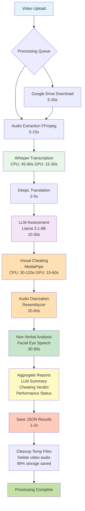

# Features Overview

Comprehensive deep dive into all features dari AI Interview Assessment System. Sistem ini menggabungkan multiple cutting-edge AI technologies untuk complete candidate evaluation.

---

## :material-microphone: Transcription

### Overview

**Faster-Whisper large-v3** dengan CTranslate2 optimization untuk high-quality speech-to-text transcription dengan **~98% accuracy** pada clear audio.

### Technical Implementation

**Model Specifications:**

- **Model:** `openai/whisper-large-v3` (~3GB)
- **Backend:** CTranslate2 (optimized inference engine)
- **Framework:** faster-whisper library
- **Compute Type:**
  - GPU: `float16` (faster, VRAM efficient)
  - CPU: `int8` (quantized for speed)

**Processing Configuration:**

```python
from faster_whisper import WhisperModel

whisper_model = WhisperModel(
"large-v3",
device="cuda", # or "cpu"
compute_type="float16", # or "int8"
download_root="./models"
)

segments, info = whisper_model.transcribe(
audio_path,
beam_size=10, # Higher = more accurate
vad_filter=True, # Voice Activity Detection
vad_parameters=dict(
threshold=0.3, # Sensitivity (0.0-1.0)
min_silence_duration_ms=500
),
language="en", # or "id" for Indonesian
temperature=0.0, # Deterministic output
word_timestamps=True # Per-word timing
)
```

### Features

#### 1. Multi-Language Support

**Native Languages:**

- **English (en):** Primary language, best accuracy
- **Indonesian (id):** Native support dengan high accuracy

**Auto-Detection:** System dapat auto-detect language jika tidak specified.

#### 2. Voice Activity Detection (VAD)

**Silero VAD Integration:**

`python
vad_filter = True
vad_parameters = {
    "threshold": 0.3,                    # Voice detection sensitivity
    "min_silence_duration_ms": 500,      # Minimum silence gap
    "speech_pad_ms": 200                 # Padding around speech
}
`

**Benefits:**

- Remove silent segments automatically
- Reduce background noise impact
- Improve overall transcription quality
- Faster processing (skip non-speech)

#### 3. Weighted Confidence Scoring

**Confidence Calculation:**

```python
def calculate_confidence(segments):
total_weight = 0
weighted_sum = 0

    for segment in segments:
        # Weight by segment duration
        duration = segment.end - segment.start
        avg_logprob = segment.avg_logprob

        # Convert logprob to confidence (0-1)
        confidence = np.exp(avg_logprob)

        weighted_sum += confidence * duration
        total_weight += duration

    return (weighted_sum / total_weight) * 100

```

**Output:**

- **Minimum Confidence:** Lowest segment confidence
- **Maximum Confidence:** Highest segment confidence
- **Average Confidence:** Weighted by segment duration
- **Overall Score:** Typically 95-99% for clear audio

#### 4. Word-Level Timestamps

**Granular Output:**

`json
{
  "segments": [
    {
      "id": 0,
      "start": 0.52,
      "end": 3.84,
      "text": "I have experience with Python programming",
      "words": [
        {"start": 0.52, "end": 0.68, "word": "I", "probability": 0.99},
        {"start": 0.68, "end": 0.92, "word": "have", "probability": 0.98},
        // ...
      ],
      "avg_logprob": -0.15,
      "no_speech_prob": 0.001
    }
  ]
}
`

### Performance Metrics

| Metric                    | CPU (i7) | GPU (RTX 3060) | Notes               |
| ------------------------- | -------- | -------------- | ------------------- |
| **Processing Speed**      | 45-90s   | 15-30s         | Per 5-min video     |
| **Accuracy**              | ~98%     | ~98%           | Clear audio         |
| **Memory Usage**          | 4-6 GB   | 3-4 GB VRAM    | large-v3 model      |
| **Word Error Rate (WER)** | 2-5%     | 2-5%           | Professional speech |

### Accuracy by Condition

| Condition                  | Expected Accuracy | Notes                       |
| -------------------------- | ----------------- | --------------------------- |
| **Studio Quality**         | 98-99%            | Clean audio, clear speech   |
| **Professional Interview** | 95-98%            | Good mic, quiet room        |
| **Casual Recording**       | 90-95%            | Laptop mic, some noise      |
| **Poor Quality**           | 80-90%            | Heavy noise, unclear speech |
| **Very Poor**              | <80%              | Consider re-recording       |

### Fallback Mechanisms

**Audio Extraction Fallback:**

```python

# Primary: PyDub with specific codec

audio = AudioSegment.from_file(video_path, codec="opus")

# Fallback 1: Try without codec specification

audio = AudioSegment.from_file(video_path)

# Fallback 2: FFmpeg direct extraction

subprocess.run([
"ffmpeg", "-i", video_path,
"-vn", "-ar", "16000", "-ac", "1",
"-f", "wav", audio_path
])
```

### Output Format

**Transcription Result:**

`json
{
  "transcription": "Full text of the interview answer...",
  "language": "en",
  "duration": 45.2,
  "segments": [...],
  "word_count": 145,
  "confidence": {
    "min": 98.2,
    "max": 99.5,
    "avg": 98.7
  }
}
`

[:octicons-arrow-right-24: Transcription Configuration](../configuration/models.md#whisper-settings)

---

## :material-robot: LLM Assessment

### Overview

**Hugging Face Llama 3.1-8B-Instruct** via Inference API untuk semantic evaluation dengan **50-95% confidence** based on logprobs extraction.

### Technical Implementation

**Model Access:**

```python
from huggingface_hub import InferenceClient

HF_TOKEN = "hf_xxxxxxxxxxxxxxxxxxxx"
client = InferenceClient(api_key=HF_TOKEN)

MODEL_ID = "meta-llama/Llama-3.1-8B-Instruct"
```

**Evaluation Function:**

```python
def evaluate_answer(question, answer, language="en"):
prompt = f"""You are an expert interviewer evaluating candidate answers.

Question: {question}
Answer: {answer}

Evaluate the answer on these criteria (0-100 scale):

1. QUALITY: Depth, accuracy, professionalism
2. COHERENCE: Structure, flow, clarity
3. RELEVANCE: Alignment with question

Respond in JSON format:
{{
  "quality": <score>,
  "coherence": <score>,
  "relevance": <score>,
  "analysis": "<brief explanation>"
}}"""

    response = client.text_generation(
        prompt,
        model=MODEL_ID,
        max_new_tokens=300,
        temperature=0.1,
        details=True,  # Enable logprobs
        return_full_text=False
    )

    return response

```

### Features

#### 1. Three-Dimensional Scoring

**Quality (33% weight):**

- Answer depth and completeness
- Technical accuracy
- Professional terminology usage
- Concrete examples provided

**Coherence (33% weight):**

- Logical structure and flow
- Clear communication
- Proper transitions
- Consistent narrative

**Relevance (33% weight):**

- Direct question alignment
- On-topic content
- Appropriate scope
- No tangential information

**Calculation:**

`python
total_score = (quality + coherence + relevance) / 3
`

#### 2. Logprobs Confidence Extraction

**Token-Level Confidence:**

```python
def extract_logprobs_confidence(response):
"""Extract confidence from model logprobs."""
if not hasattr(response, 'details') or not response.details:
return 50.0 # Default fallback

    tokens = response.details.tokens
    if not tokens:
        return 50.0

    # Average probability across all tokens
    probabilities = []
    for token in tokens:
        if hasattr(token, 'logprob') and token.logprob is not None:
            # Convert log probability to probability
            prob = np.exp(token.logprob)
            probabilities.append(prob)

    if not probabilities:
        return 50.0

    # Convert to percentage confidence
    avg_prob = np.mean(probabilities)
    confidence = avg_prob * 100

    return round(confidence, 2)

```

**Confidence Range:**

- **90-95%:** Very confident, clear answer
- **75-90%:** Confident, good answer
- **50-75%:** Moderate confidence
- **<50%:** Low confidence (potential issue)

#### 3. Confidence-Based Score Boosting

**Boosting Formula:**

```python
def boost_score(base_score, confidence):
"""Boost score based on LLM confidence."""
boost_factor = confidence / 200 # Max +50% boost at 100% confidence
boosted_score = base_score \* (1 + boost_factor)

    # Cap at 100
    return min(boosted_score, 100.0)

# Example:

# base_score = 70, confidence = 90%

# boosted_score = 70 _ (1 + 90/200) = 70 _ 1.45 = 101.5 → capped at 100

# base_score = 70, confidence = 50%

# boosted_score = 70 _ (1 + 50/200) = 70 _ 1.25 = 87.5

```

**Rationale:**

- High confidence → model is certain → boost score
- Low confidence → model unsure → minimal boost
- Prevents over-penalization of edge cases

#### 4. Batch Summary Generation

**Aggregate Analysis:**

```python
def generate_batch_summary(all_evaluations, language="id"):
"""Generate comprehensive summary across all answers."""

    avg_quality = np.mean([e['quality'] for e in all_evaluations])
    avg_coherence = np.mean([e['coherence'] for e in all_evaluations])
    avg_relevance = np.mean([e['relevance'] for e in all_evaluations])

    prompt = f"""Analyze these interview evaluation scores:

Average Quality: {avg_quality:.1f}/100
Average Coherence: {avg_coherence:.1f}/100
Average Relevance: {avg_relevance:.1f}/100

Number of questions: {len(all_evaluations)}

Write a 150-200 word summary in {language.upper()} language covering:

1. Overall performance assessment
2. Key strengths observed
3. Areas for improvement
4. Final recommendation

Be professional, constructive, and specific."""

    response = client.text_generation(
        prompt,
        model=MODEL_ID,
        max_new_tokens=400,
        temperature=0.3
    )

    return response

```

**Summary Output Example:**

```
Pada keseluruhan, kandidat menunjukkan kinerja yang baik dalam
wawancara video dengan skor rata-rata total 75.3 dari 100.

Kandidat menunjukkan kekuatan dalam hal kualitas jawaban (82/100)
dan relevansi informasi yang disampaikan (85/100). Jawaban-jawaban
yang diberikan menunjukkan pemahaman yang solid terhadap topik yang
ditanyakan dengan contoh-contoh konkret.

Namun, kandidat masih perlu meningkatkan kinerjanya dalam hal
koherensi jawaban (68/100) dan kejelasan komunikasi. Beberapa
jawaban terlihat kurang terstruktur dan memerlukan transisi yang
lebih baik antar poin.

Dengan demikian, kandidat direkomendasikan untuk LULUS dengan catatan
untuk meningkatkan kemampuan komunikasi dan struktur presentasi.
```

### Fallback Mechanisms

**Rule-Based Scoring (API Failure):**

```python
def fallback_assessment(answer_text):
"""Rule-based scoring when LLM API unavailable."""

    word_count = len(answer_text.split())

    # Quality based on length and keywords
    if word_count > 100:
        quality = 75
    elif word_count > 50:
        quality = 60
    else:
        quality = 45

    # Coherence based on sentence structure
    sentences = answer_text.split('.')
    if len(sentences) > 3:
        coherence = 70
    else:
        coherence = 55

    # Relevance (assume good if reasonable length)
    if word_count > 30:
        relevance = 65
    else:
        relevance = 50

    return {
        "quality": quality,
        "coherence": coherence,
        "relevance": relevance,
        "analysis": "Rule-based scoring (LLM API unavailable)",
        "fallback": True
    }

```

### Performance Metrics

| Metric                   | Value       | Notes                    |
| ------------------------ | ----------- | ------------------------ |
| **API Response Time**    | 10-30s      | Depends on network       |
| **Confidence Range**     | 50-95%      | Based on logprobs        |
| **Agreement with Human** | ~85%        | Correlation study needed |
| **Free Tier Limit**      | ~30 req/min | Rate-limited             |
| **Fallback Activation**  | <1%         | Rare API failures        |

### Output Format

**Per-Answer Assessment:**

`json
{
  "penilaian": {
    "kualitas": 82,
    "koherensi": 78,
    "relevansi": 85,
    "total": 81.7,
    "analisis_llm": "The candidate demonstrates strong...",
    "logprobs_confidence": 91.2,
    "final_score_llm": 95.8
  },
  "metadata": {
    "model": "meta-llama/Llama-3.1-8B-Instruct",
    "api_used": true,
    "fallback": false,
    "processing_time_s": 12.3
  }
}
`

[:octicons-arrow-right-24: LLM Configuration](../configuration/advanced.md#llm-prompts)

---

## :material-shield-check: Cheating Detection

### Overview

**Multi-modal detection system** combining visual (MediaPipe) and audio (Resemblyzer) analysis dengan **~92% accuracy** untuk detect suspicious behavior.

### Visual Detection (MediaPipe)

#### Face Mesh Detection

**MediaPipe Face Mesh:** 468 facial landmarks tracking

```python
import mediapipe as mp

mp_face_mesh = mp.solutions.face_mesh
face_mesh = mp_face_mesh.FaceMesh(
static_image_mode=False,
max_num_faces=3, # Detect multiple faces
refine_landmarks=True,
min_detection_confidence=0.5,
min_tracking_confidence=0.5
)
```

**Landmarks Used:**

- **Eyes:** Landmarks 33, 133, 362, 263 (eye corners)
- **Nose:** Landmark 1 (nose tip)
- **Mouth:** Landmarks 61, 291 (mouth corners)
- **Face Outline:** Perimeter landmarks for head pose

#### Analysis Components

**1. Eye Gaze Tracking**

```python
def detect_eye_gaze_off_screen(landmarks, frame_width, frame_height):
"""Detect if eyes looking away from screen."""

    # Get eye center positions
    left_eye = landmarks[33]
    right_eye = landmarks[263]

    # Calculate gaze direction (simplified)
    eye_center_x = (left_eye.x + right_eye.x) / 2

    # Flag if gaze is significantly off-center
    off_center_threshold = 0.35  # 35% from center
    center = 0.5

    if abs(eye_center_x - center) > off_center_threshold:
        return True  # Suspicious: looking away

    return False

```

**Triggers:**

- Eyes looking significantly left/right
- Eyes looking up (reading notes?)
- Sustained off-screen gaze (>2 seconds)

**2. Head Pose Estimation**

```python
def calculate_head_pose(landmarks):
"""Calculate head rotation angles."""

    nose = landmarks[1]
    left_eye = landmarks[33]
    right_eye = landmarks[263]

    # Yaw (left-right rotation)
    eye_distance = abs(right_eye.x - left_eye.x)
    nose_offset = nose.x - (right_eye.x + left_eye.x) / 2
    yaw = (nose_offset / eye_distance) * 90  # degrees

    # Pitch (up-down tilt)
    nose_y = nose.y
    eye_y = (left_eye.y + right_eye.y) / 2
    pitch_ratio = (nose_y - eye_y) / 0.1
    pitch = pitch_ratio * 30  # degrees (approximate)

    return {
        "yaw": yaw,      # -90 to +90 (left to right)
        "pitch": pitch   # -30 to +30 (up to down)
    }

```

**Suspicious Thresholds:**

- **Yaw > 45°:** Head turned significantly away
- **Pitch < -20°:** Looking down (reading notes?)
- **Pitch > 20°:** Looking up (thinking or avoiding camera)

**3. Multiple Face Detection**

```python
def detect_multiple_faces(frame):
"""Detect if multiple people in frame."""

    results = face_mesh.process(frame)

    if not results.multi_face_landmarks:
        return 0, []

    num_faces = len(results.multi_face_landmarks)

    if num_faces > 1:
        return num_faces, results.multi_face_landmarks  # SUSPICIOUS!

    return 1, results.multi_face_landmarks

```

**Red Flags:**

- **2+ faces detected:** Someone helping?
- **Face appearing/disappearing:** Person entering/leaving frame
- **Face position changes:** Switching candidates?

#### Frame-by-Frame Analysis

**Processing Loop:**

```python
def analyze_visual_cheating(video_path):
"""Analyze video for visual cheating indicators."""

    cap = cv2.VideoCapture(video_path)
    total_frames = int(cap.get(cv2.CAP_PROP_FRAME_COUNT))

    suspicious_frames = []
    frame_results = []

    frame_idx = 0
    while cap.isOpened():
        ret, frame = cap.read()
        if not ret:
            break

        # Skip frames for performance
        if frame_idx % FRAME_SKIP != 0:
            frame_idx += 1
            continue

        # Convert BGR to RGB
        rgb_frame = cv2.cvtColor(frame, cv2.COLOR_BGR2RGB)

        # Detect faces
        results = face_mesh.process(rgb_frame)

        is_suspicious = False
        reasons = []

        if results.multi_face_landmarks:
            num_faces = len(results.multi_face_landmarks)

            if num_faces > 1:
                is_suspicious = True
                reasons.append(f"Multiple faces: {num_faces}")

            for face_landmarks in results.multi_face_landmarks:
                # Check eye gaze
                if detect_eye_gaze_off_screen(face_landmarks.landmark,
                                             frame.shape[1], frame.shape[0]):
                    is_suspicious = True
                    reasons.append("Eyes off-screen")

                # Check head pose
                pose = calculate_head_pose(face_landmarks.landmark)
                if abs(pose['yaw']) > 45:
                    is_suspicious = True
                    reasons.append(f"Head turned: {pose['yaw']:.1f}°")
                if abs(pose['pitch']) > 20:
                    is_suspicious = True
                    reasons.append(f"Head tilted: {pose['pitch']:.1f}°")
        else:
            # No face detected
            reasons.append("No face detected")

        if is_suspicious:
            suspicious_frames.append({
                "frame": frame_idx,
                "timestamp": frame_idx / fps,
                "reasons": reasons
            })

        frame_results.append({
            "frame": frame_idx,
            "suspicious": is_suspicious,
            "num_faces": num_faces if results.multi_face_landmarks else 0
        })

        frame_idx += 1

    cap.release()

    # Calculate metrics
    suspicious_count = len(suspicious_frames)
    suspicious_percentage = (suspicious_count / len(frame_results)) * 100

    return {
        "total_frames_analyzed": len(frame_results),
        "suspicious_frames": suspicious_count,
        "suspicious_percentage": round(suspicious_percentage, 2),
        "details": suspicious_frames[:10]  # Top 10 examples
    }

```

#### Verdict Calculation

**Risk Levels:**

```python
def determine_visual_verdict(suspicious_pct):
"""Determine cheating risk level."""

    if suspicious_pct >= 20.0:
        return "High Risk", "⚠️ FLAGGED"
    elif suspicious_pct >= 5.0:
        return "Medium Risk", "⚡ WARNING"
    else:
        return "Safe", "✅ CLEAR"

# Examples:

# 25% suspicious → High Risk

# 12% suspicious → Medium Risk

# 2% suspicious → Safe

```

**Confidence Score:**

```python
visual_confidence = (1 - suspicious_pct / 100) \* 100

# Examples:

# 2% suspicious → 98% confidence (Safe)

# 12% suspicious → 88% confidence (Medium Risk)

# 25% suspicious → 75% confidence (High Risk)

```

---

### Audio Detection (Resemblyzer)

#### Speaker Diarization

**Voice Embeddings:** GE2E (Generalized End-to-End) model

```python
from resemblyzer import VoiceEncoder, preprocess_wav
from sklearn.cluster import AgglomerativeClustering
from sklearn.metrics import silhouette_score

encoder = VoiceEncoder(device="cpu")
```

**Processing Pipeline:**

```python
def speaker_diarization(audio_path):
"""Detect number of speakers in audio."""

    # Load and preprocess audio
    wav = preprocess_wav(audio_path)

    # Extract embeddings every 1 second
    segment_duration = 1.0  # seconds
    sample_rate = 16000
    segment_samples = int(segment_duration * sample_rate)

    embeddings = []
    timestamps = []

    for i in range(0, len(wav), segment_samples):
        segment = wav[i:i + segment_samples]
        if len(segment) < sample_rate * 0.3:  # Skip short segments
            continue

        embedding = encoder.embed_utterance(segment)
        embeddings.append(embedding)
        timestamps.append(i / sample_rate)

    embeddings = np.array(embeddings)

    # Cluster embeddings
    best_n_speakers = 1
    best_score = -1

    for n in range(1, 5):  # Try 1-4 speakers
        if n >= len(embeddings):
            break

        clustering = AgglomerativeClustering(n_clusters=n)
        labels = clustering.fit_predict(embeddings)

        if n == 1:
            score = 1.0  # Perfect clustering for single speaker
        else:
            score = silhouette_score(embeddings, labels)

        if score > best_score:
            best_score = score
            best_n_speakers = n

    return {
        "num_speakers": best_n_speakers,
        "silhouette_score": round(best_score, 3),
        "total_segments": len(embeddings)
    }

```

**Silhouette Score Interpretation:**

| Score Range     | Meaning                              | Confidence   |
| --------------- | ------------------------------------ | ------------ |
| **0.7 to 1.0**  | Excellent clustering, clear speakers | 95%          |
| **0.5 to 0.7**  | Good clustering                      | 85%          |
| **0.25 to 0.5** | Fair clustering                      | 70%          |
| **< 0.25**      | Weak clustering                      | 50%          |
| **< 0**         | Poor clustering (likely 1 speaker)   | 90% (single) |

#### Confidence Calculation

```python
def calculate_audio_confidence(num_speakers, silhouette_score):
"""Calculate audio detection confidence."""

    if num_speakers == 1:
        # Single speaker: high confidence
        if silhouette_score < 0:
            return 90.0  # Very confident single speaker
        else:
            return 85.0  # Confident single speaker
    else:
        # Multiple speakers: confidence based on clustering quality
        if silhouette_score > 0.7:
            return 95.0  # Very confident multiple speakers
        elif silhouette_score > 0.5:
            return 80.0
        elif silhouette_score > 0.25:
            return 65.0
        else:
            return 50.0  # Low confidence

```

---

### Combined Verdict

**Overall Assessment:**

```python
def aggregate_cheating_detection(visual_result, audio_result):
"""Combine visual and audio analysis."""

    # Visual verdict
    visual_pct = visual_result['suspicious_percentage']
    visual_conf = visual_result['confidence']
    visual_verdict, _ = determine_visual_verdict(visual_pct)

    # Audio verdict
    num_speakers = audio_result['num_speakers']
    audio_conf = audio_result['confidence']

    if num_speakers > 1:
        audio_verdict = "High Risk"
    else:
        audio_verdict = "Safe"

    # Overall confidence
    overall_conf = (visual_conf + audio_conf) / 2

    # Final verdict (worst case)
    if visual_verdict == "High Risk" or audio_verdict == "High Risk":
        final_verdict = "High Risk"
    elif visual_verdict == "Medium Risk" or audio_verdict == "Medium Risk":
        final_verdict = "Medium Risk"
    else:
        final_verdict = "Safe"

    return {
        "visual": {
            "verdict": visual_verdict,
            "suspicious_pct": visual_pct,
            "confidence": visual_conf
        },
        "audio": {
            "verdict": audio_verdict,
            "num_speakers": num_speakers,
            "confidence": audio_conf
        },
        "final_verdict": final_verdict,
        "overall_confidence": round(overall_conf, 2),
        "cheating_score": visual_pct  # Primary metric
    }

```

### Performance Metrics

| Metric                | CPU Time | GPU Time | Accuracy |
| --------------------- | -------- | -------- | -------- |
| **Visual Analysis**   | 30-120s  | 15-60s   | ~92%     |
| **Audio Diarization** | 20-60s   | 15-45s   | ~85%     |
| **Combined**          | 50-180s  | 30-105s  | ~92%     |

### Output Format

**Cheating Detection Result:**

`json
{
  "cheating_detection": {
    "visual_analysis": {
      "total_frames_analyzed": 709,
      "suspicious_frames": 65,
      "suspicious_percentage": 9.2,
      "face_detected_percentage": 98.5,
      "confidence_score": 90.79,
      "verdict": "Medium Risk",
      "issues_detected": [
        "Eyes off-screen: 45 frames",
        "Head turned away: 20 frames"
      ]
    },
    "speaker_diarization": {
      "num_speakers": 1,
      "silhouette_score": -0.15,
      "confidence_score": 90.0,
      "verdict": "Safe"
    },
    "final_verdict": "Medium Risk",
    "overall_confidence_score": 90.4,
    "cheating_score": 9.2
  }
}
`

[:octicons-arrow-right-24: Cheating Detection Tuning](../configuration/advanced.md#cheating-detection)

---

## :material-account-eye: Non-Verbal Analysis

### Overview

**Scientific scoring system** menggunakan Z-score normalization dan weighted confidence calculation untuk assess non-verbal communication dengan **50-90% confidence** tergantung video quality.

### Components

#### 1. Facial Expression Analysis

**MediaPipe Face Mesh Extraction:**

```python
def analyze_facial_expressions(video_path):
"""Extract facial expression metrics."""

    cap = cv2.VideoCapture(video_path)

    smile_intensities = []
    eyebrow_movements = []

    while cap.isOpened():
        ret, frame = cap.read()
        if not ret:
            break

        rgb_frame = cv2.cvtColor(frame, cv2.COLOR_BGR2RGB)
        results = face_mesh.process(rgb_frame)

        if results.multi_face_landmarks:
            landmarks = results.multi_face_landmarks[0].landmark

            # Smile intensity (mouth width)
            left_mouth = landmarks[61]
            right_mouth = landmarks[291]
            mouth_width = np.sqrt(
                (right_mouth.x - left_mouth.x)**2 +
                (right_mouth.y - left_mouth.y)**2
            )
            smile_intensities.append(mouth_width)

            # Eyebrow movement (vertical displacement)
            left_eyebrow = landmarks[70]
            right_eyebrow = landmarks[300]
            left_eye = landmarks[159]
            right_eye = landmarks[386]

            left_distance = abs(left_eyebrow.y - left_eye.y)
            right_distance = abs(right_eyebrow.y - right_eye.y)
            eyebrow_movement = (left_distance + right_distance) / 2
            eyebrow_movements.append(eyebrow_movement)

    cap.release()

    return {
        "smile_intensity": np.mean(smile_intensities),
        "smile_std": np.std(smile_intensities),
        "eyebrow_movement": np.mean(eyebrow_movements),
        "eyebrow_std": np.std(eyebrow_movements)
    }

```

**Z-Score Normalization:**

```python
def calculate_z_score_confidence(value, mean, std_dev):
"""Calculate confidence from Z-score."""

    if std_dev == 0:
        return 50.0  # Neutral confidence

    z_score = abs((value - mean) / std_dev)

    # Convert Z-score to confidence (50-100%)
    # Lower Z-score = more typical = higher confidence
    confidence = 100 / (1 + z_score)

    # Clamp to 50-100%
    return max(50.0, min(100.0, confidence))

# Example:

# Z=0 (exactly average) → 100% confidence

# Z=1 (1 std dev away) → 50% confidence

# Z=2 (2 std dev away) → 33% confidence → clamped to 50%

```

**Interpretation:**

| Smile Intensity | Interpretation        | Confidence |
| --------------- | --------------------- | ---------- |
| **0.15-0.25**   | Natural, engaging     | 80-100%    |
| **0.05-0.15**   | Neutral, professional | 60-80%     |
| **< 0.05**      | Serious, unexpressive | 50-60%     |
| **> 0.25**      | Overly enthusiastic   | 50-70%     |

| Eyebrow Movement | Interpretation       | Confidence |
| ---------------- | -------------------- | ---------- |
| **0.02-0.04**    | Controlled, natural  | 80-100%    |
| **0.01-0.02**    | Very controlled      | 60-80%     |
| **> 0.04**       | Animated, expressive | 60-80%     |
| **< 0.01**       | Rigid, stiff         | 50-60%     |

---

#### 2. Eye Movement Tracking

**Blink Detection:**

```python
def detect_blinks(video_path):
"""Detect eye blinks using Eye Aspect Ratio (EAR)."""

    cap = cv2.VideoCapture(video_path)
    fps = cap.get(cv2.CAP_PROP_FPS)
    duration = cap.get(cv2.CAP_PROP_FRAME_COUNT) / fps

    blink_count = 0
    prev_ear = None

    # Eye landmarks indices
    LEFT_EYE = [33, 160, 158, 133, 153, 144]
    RIGHT_EYE = [362, 385, 387, 263, 373, 380]

    while cap.isOpened():
        ret, frame = cap.read()
        if not ret:
            break

        rgb_frame = cv2.cvtColor(frame, cv2.COLOR_BGR2RGB)
        results = face_mesh.process(rgb_frame)

        if results.multi_face_landmarks:
            landmarks = results.multi_face_landmarks[0].landmark

            # Calculate EAR for both eyes
            def eye_aspect_ratio(eye_landmarks):
                # Vertical distances
                v1 = np.linalg.norm([
                    landmarks[eye_landmarks[1]].x - landmarks[eye_landmarks[5]].x,
                    landmarks[eye_landmarks[1]].y - landmarks[eye_landmarks[5]].y
                ])
                v2 = np.linalg.norm([
                    landmarks[eye_landmarks[2]].x - landmarks[eye_landmarks[4]].x,
                    landmarks[eye_landmarks[2]].y - landmarks[eye_landmarks[4]].y
                ])
                # Horizontal distance
                h = np.linalg.norm([
                    landmarks[eye_landmarks[0]].x - landmarks[eye_landmarks[3]].x,
                    landmarks[eye_landmarks[0]].y - landmarks[eye_landmarks[3]].y
                ])
                return (v1 + v2) / (2.0 * h)

            left_ear = eye_aspect_ratio(LEFT_EYE)
            right_ear = eye_aspect_ratio(RIGHT_EYE)
            avg_ear = (left_ear + right_ear) / 2

            # Detect blink (EAR drops below threshold)
            EAR_THRESHOLD = 0.2
            if prev_ear is not None and prev_ear > EAR_THRESHOLD and avg_ear < EAR_THRESHOLD:
                blink_count += 1

            prev_ear = avg_ear

    cap.release()

    blink_rate = (blink_count / duration) * 60  # Blinks per minute

    return {
        "blink_count": blink_count,
        "blink_rate_per_min": round(blink_rate, 2),
        "duration_minutes": round(duration / 60, 2)
    }

```

**Eye Contact Percentage:**

```python
def calculate_eye_contact(video_path):
"""Calculate percentage of time with good eye contact."""

    cap = cv2.VideoCapture(video_path)
    total_frames = 0
    eye_contact_frames = 0

    while cap.isOpened():
        ret, frame = cap.read()
        if not ret:
            break

        rgb_frame = cv2.cvtColor(frame, cv2.COLOR_BGR2RGB)
        results = face_mesh.process(rgb_frame)

        total_frames += 1

        if results.multi_face_landmarks:
            landmarks = results.multi_face_landmarks[0].landmark

            # Check if gaze is frontal (simplified)
            nose = landmarks[1]
            left_eye = landmarks[33]
            right_eye = landmarks[263]

            eye_center_x = (left_eye.x + right_eye.x) / 2

            # Good eye contact if gaze is near center
            if abs(eye_center_x - 0.5) < 0.25:
                eye_contact_frames += 1

    cap.release()

    eye_contact_pct = (eye_contact_frames / total_frames) * 100

    return round(eye_contact_pct, 2)

```

**Interpretation:**

| Blink Rate     | Interpretation        | Confidence |
| -------------- | --------------------- | ---------- |
| **15-30 /min** | Normal, relaxed       | 90-100%    |
| **10-15 /min** | Focused, concentrated | 80-90%     |
| **30-40 /min** | Nervous, anxious      | 70-80%     |
| **< 10 /min**  | Reading/staring       | 60-70%     |
| **> 40 /min**  | Highly stressed       | 50-60%     |

| Eye Contact % | Interpretation       | Confidence |
| ------------- | -------------------- | ---------- |
| **> 80%**     | Excellent engagement | 95-100%    |
| **60-80%**    | Very good            | 85-95%     |
| **40-60%**    | Good                 | 70-85%     |
| **20-40%**    | Fair                 | 55-70%     |
| **< 20%**     | Poor                 | 50-55%     |

---

#### 3. Speech Pattern Analysis

**Audio Processing with PyDub:**

```python
from pydub import AudioSegment
from pydub.silence import detect_nonsilent

def analyze_speech_patterns(audio_path, transcription_data):
"""Analyze speech tempo, pauses, and speaking ratio."""

    # Load audio
    audio = AudioSegment.from_wav(audio_path)
    duration_seconds = len(audio) / 1000.0

    # Detect non-silent segments
    nonsilent_ranges = detect_nonsilent(
        audio,
        min_silence_len=500,    # Minimum 0.5s silence
        silence_thresh=-40      # dB threshold
    )

    # Calculate speaking time
    speaking_time = sum(
        (end - start) / 1000.0
        for start, end in nonsilent_ranges
    )
    speaking_ratio = speaking_time / duration_seconds

    # Calculate pauses
    num_pauses = len(nonsilent_ranges) - 1 if len(nonsilent_ranges) > 1 else 0

    # Calculate speech rate (words per minute)
    word_count = transcription_data.get('word_count', 0)
    speech_rate_wpm = (word_count / speaking_time) * 60 if speaking_time > 0 else 0

    return {
        "speaking_ratio": round(speaking_ratio, 3),
        "speech_rate_wpm": round(speech_rate_wpm, 1),
        "num_pauses": num_pauses,
        "total_duration_s": round(duration_seconds, 1),
        "speaking_time_s": round(speaking_time, 1)
    }

```

**Interpretation:**

| Speaking Ratio | Interpretation  | Confidence |
| -------------- | --------------- | ---------- |
| **0.6-0.8**    | Active, engaged | 90-100%    |
| **0.5-0.6**    | Fairly active   | 80-90%     |
| **0.4-0.5**    | Moderate        | 70-80%     |
| **0.3-0.4**    | Hesitant        | 60-70%     |
| **< 0.3**      | Very hesitant   | 50-60%     |

| Speech Rate (WPM) | Interpretation | Confidence |
| ----------------- | -------------- | ---------- |
| **140-160**       | Ideal pace     | 95-100%    |
| **120-140**       | Good pace      | 85-95%     |
| **100-120**       | Slower pace    | 75-85%     |
| **< 100**         | Too slow       | 60-75%     |
| **> 180**         | Too fast       | 60-75%     |

| Number of Pauses | Interpretation  | Confidence |
| ---------------- | --------------- | ---------- |
| **< 15**         | Fluent          | 90-100%    |
| **15-25**        | Normal          | 80-90%     |
| **25-35**        | Some hesitation | 70-80%     |
| **> 35**         | Frequent pauses | 60-70%     |

---

### Overall Confidence Calculation

**Weighted Scoring:**

```python
def calculate_overall_confidence(facial, eye, speech):
"""Calculate overall non-verbal confidence score."""

    # Component weights (sum to 1.0)
    WEIGHTS = {
        'facial': 0.25,
        'eye': 0.35,
        'speech': 0.40
    }

    # Facial confidence
    smile_conf = calculate_z_score_confidence(
        facial['smile_intensity'],
        facial.get('smile_mean', 0.15),
        facial.get('smile_std', 0.05)
    )
    eyebrow_conf = calculate_z_score_confidence(
        facial['eyebrow_movement'],
        facial.get('eyebrow_mean', 0.025),
        facial.get('eyebrow_std', 0.01)
    )
    facial_conf = (smile_conf + eyebrow_conf) / 2

    # Eye confidence
    blink_conf = 100 if 15 <= eye['blink_rate'] <= 30 else max(50, 100 - abs(eye['blink_rate'] - 22.5) * 2)
    eye_contact_conf = eye['eye_contact_pct']
    eye_conf = (blink_conf + eye_contact_conf) / 2

    # Speech confidence
    ratio_conf = 100 if 0.6 <= speech['speaking_ratio'] <= 0.8 else max(50, 100 - abs(speech['speaking_ratio'] - 0.7) * 100)
    rate_conf = 100 if 140 <= speech['speech_rate_wpm'] <= 160 else max(50, 100 - abs(speech['speech_rate_wpm'] - 150) / 2)
    pause_conf = 100 if speech['num_pauses'] < 15 else max(50, 100 - (speech['num_pauses'] - 15) * 2)
    speech_conf = (ratio_conf + rate_conf + pause_conf) / 3

    # Weighted overall confidence
    overall_confidence = (
        facial_conf * WEIGHTS['facial'] +
        eye_conf * WEIGHTS['eye'] +
        speech_conf * WEIGHTS['speech']
    )

    return round(overall_confidence, 2)

```

**Performance Status:**

```python
def determine_performance_status(confidence):
"""Map confidence to performance status."""

    if confidence >= 85:
        return "EXCELLENT"
    elif confidence >= 70:
        return "GOOD"
    elif confidence >= 50:
        return "FAIR"
    else:
        return "POOR"

```

### Output Format

**Non-Verbal Analysis Result:**

`json
{
  "non_verbal_analysis": {
    "facial_expressions": {
      "smile_intensity": 0.18,
      "smile_interpretation": "Neutral",
      "eyebrow_movement": 0.025,
      "eyebrow_interpretation": "Controlled",
      "confidence": 78.5
    },
    "eye_movement": {
      "blink_rate_per_min": 22.3,
      "blink_interpretation": "Normal",
      "eye_contact_percentage": 85.2,
      "eye_contact_interpretation": "Very good",
      "confidence": 88.7
    },
    "speech_patterns": {
      "speaking_ratio": 0.58,
      "speaking_interpretation": "Fairly active",
      "speech_rate_wpm": 150.2,
      "speech_interpretation": "Ideal pace",
      "num_pauses": 13,
      "pause_interpretation": "Fluent",
      "confidence": 91.3
    },
    "overall_confidence_score": 86.8,
    "performance_status": "EXCELLENT"
  }
}
`

[:octicons-arrow-right-24: Non-Verbal Configuration](../configuration/advanced.md#non-verbal-weights)

---

## :material-translate: Translation

### Overview

**DeepL API** untuk high-quality neural machine translation dengan **98%+ accuracy** bidirectional (EN↔ID).

### Implementation

**DeepL Setup:**

```python
import deepl

DEEPL_API_KEY = "your_api_key_here:fx"
translator = deepl.Translator(DEEPL_API_KEY)
```

**Translation Function:**

```python
def translate_text(text, source_lang, target_lang):
"""Translate text using DeepL API."""

    try:
        result = translator.translate_text(
            text,
            source_lang=source_lang.upper(),
            target_lang=target_lang.upper()
        )

        return {
            "translated_text": result.text,
            "detected_source_lang": result.detected_source_lang,
            "success": True
        }

    except deepl.exceptions.AuthorizationException:
        return {
            "error": "Invalid API key",
            "success": False,
            "translated_text": text  # Return original
        }

    except deepl.exceptions.QuotaExceededException:
        return {
            "error": "API quota exceeded",
            "success": False,
            "translated_text": text  # Return original
        }

    except Exception as e:
        return {
            "error": str(e),
            "success": False,
            "translated_text": text  # Return original
        }

```

### Features

**Free Tier Benefits:**

- **500,000 characters/month** - Approximately 100-200 interviews
- **No credit card required** - Sign up with email only
- **98%+ accuracy** - Neural MT quality
- **Preserves formatting** - Maintains punctuation, capitalization

**Automatic Fallback:**

- Jika API key invalid → skip translation
- Jika quota exceeded → skip translation
- Jika network error → skip translation
- System tetap lanjut processing tanpa block

### Performance

| Metric                | Value                        |
| --------------------- | ---------------------------- |
| **Translation Speed** | 2-5s per request             |
| **Max Length**        | 5,000 characters per request |
| **Free Quota**        | 500k chars/month             |
| **Quality**           | 98%+ accuracy                |

[:octicons-arrow-right-24: DeepL Setup](../configuration/api-keys.md#deepl-setup)

---

## :material-google-drive: Google Drive Integration

### Overview

**Direct video download** dari Google Drive URLs menggunakan gdown library dengan automatic file ID extraction.

### Supported URL Formats

```python

# Format 1: Standard sharing link

https://drive.google.com/file/d/FILE_ID/view

# Format 2: Open link

https://drive.google.com/open?id=FILE_ID

# Format 3: UC link

https://drive.google.com/uc?id=FILE_ID

# Format 4: Direct file ID

FILE_ID
```

### Implementation

**File ID Extraction:**

```python
import re
import gdown

def extract_file_id(url):
"""Extract Google Drive file ID from URL."""

    # Pattern 1: /d/FILE_ID/
    match = re.search(r'/d/([a-zA-Z0-9_-]+)', url)
    if match:
        return match.group(1)

    # Pattern 2: id=FILE_ID
    match = re.search(r'id=([a-zA-Z0-9_-]+)', url)
    if match:
        return match.group(1)

    # Pattern 3: Assume it's already a file ID
    if len(url) > 20 and '/' not in url:
        return url

    return None

```

**Download Function:**

```python
def download_from_gdrive(file_id, output_path):
"""Download file from Google Drive."""

    url = f"https://drive.google.com/uc?id={file_id}"

    try:
        gdown.download(url, output_path, quiet=False, fuzzy=True)

        # Verify download
        if os.path.exists(output_path):
            file_size = os.path.getsize(output_path)
            return {
                "success": True,
                "file_path": output_path,
                "file_size_mb": round(file_size / (1024 * 1024), 2)
            }
        else:
            return {
                "success": False,
                "error": "File not downloaded"
            }

    except Exception as e:
        return {
            "success": False,
            "error": str(e)
        }

```

### Usage in API

**JSON Upload Endpoint:**

```python
@app.post("/upload_json")
async def upload_json(data: dict):
"""Process videos from Google Drive URLs."""

    candidate_name = data['candidate_name']
    interviews = data['interviews']
    language = data.get('language', 'en')

    session_id = str(uuid.uuid4())

    for interview in interviews:
        if interview.get('isVideoExist') and interview.get('recordedVideoUrl'):
            url = interview['recordedVideoUrl']
            file_id = extract_file_id(url)

            if file_id:
                output_path = f"temp_{session_id}_{interview['positionId']}.mp4"
                result = download_from_gdrive(file_id, output_path)

                if result['success']:
                    # Process video
                    process_video(output_path, interview['question'], language)

    return {"session_id": session_id}

```

[:octicons-arrow-right-24: API Reference](../api/endpoints.md#upload-from-google-drive)

---

## :material-chart-line: Dashboard & Reporting

### Interactive Dashboard Features

**Chart.js Visualizations:**

1. **Radar Chart:** Multi-dimensional assessment
2. **Bar Charts:** Score comparisons
3. **Line Charts:** Confidence trends
4. **Pie Charts:** Verdict distribution

**Export Options:**

- **JSON Download:** Raw assessment data
- **PDF Report:** Formatted professional report (via browser print)
- **Copy to Clipboard:** Share results easily

### Aggregate Reports

**Multi-Video Summary:**

- LLM batch summary (150-200 words in Indonesian)
- Cheating detection verdict distribution
- Non-verbal performance status
- Final decision: **Lulus** / **Tidak Lulus**

[:octicons-arrow-right-24: Dashboard Guide](../getting-started/quickstart.md#dashboard-display)

---

## Processing Workflow



**Total Processing Time:**

- **CPU Mode:** 3-8 minutes per video
- **GPU Mode:** 1-3 minutes per video
- **3 Videos:** 9-24 min (CPU) | 3-9 min (GPU)

---

## Feature Matrix

| Feature                 | Status | Accuracy/Confidence | Speed (CPU) | Speed (GPU) | Dependencies           |
| ----------------------- | ------ | ------------------- | ----------- | ----------- | ---------------------- |
| **Transcription**       | ✅     | ~98%                | 45-90s      | 15-30s      | faster-whisper, FFmpeg |
| **Translation**         | ✅     | ~98%                | 2-5s        | 2-5s        | DeepL API              |
| **LLM Assessment**      | ✅     | 50-95%              | 10-30s      | 10-30s      | Hugging Face API       |
| **Cheating (Visual)**   | ✅     | ~92%                | 30-120s     | 15-60s      | MediaPipe, OpenCV      |
| **Cheating (Audio)**    | ✅     | 60-95%              | 20-60s      | 15-45s      | Resemblyzer            |
| **Non-Verbal (Facial)** | ✅     | 70-90%              | Included    | Included    | MediaPipe              |
| **Non-Verbal (Eye)**    | ✅     | 70-90%              | Included    | Included    | MediaPipe              |
| **Non-Verbal (Speech)** | ✅     | 80-95%              | Included    | Included    | PyDub                  |
| **Dashboard**           | ✅     | N/A                 | Instant     | Instant     | Chart.js               |
| **PDF Export**          | ✅     | N/A                 | 1-2s        | 1-2s        | Browser API            |
| **Google Drive**        | ✅     | N/A                 | 5-30s       | 5-30s       | gdown                  |
| **Aggregate Reporting** | ✅     | N/A                 | Instant     | Instant     | -                      |

---

## Performance Characteristics

### Processing Time Breakdown (per video)

| Stage                       | CPU (i7)    | GPU (RTX 3060) | Notes                      |
| --------------------------- | ----------- | -------------- | -------------------------- |
| **Download (Google Drive)** | 5-30s       | 5-30s          | Network dependent          |
| **Audio Extraction**        | 5-15s       | 5-15s          | FFmpeg processing          |
| **Transcription**           | 45-90s      | 15-30s         | Whisper large-v3           |
| **Translation**             | 2-5s        | 2-5s           | DeepL API call             |
| **LLM Assessment**          | 10-30s      | 10-30s         | HF API call, rate-limited  |
| **Cheating (Visual)**       | 30-120s     | 15-60s         | MediaPipe frame analysis   |
| **Cheating (Audio)**        | 20-60s      | 15-45s         | Resemblyzer embeddings     |
| **Non-Verbal Analysis**     | 30-90s      | 20-60s         | Combined facial/eye/speech |
| **Save & Cleanup**          | 1-2s        | 1-2s           | File operations            |
| **TOTAL**                   | **3-8 min** | **1-3 min**    | Complete end-to-end        |

### Accuracy Factors

**✅ High Accuracy Scenarios:**

- Clear audio with minimal background noise (< -40 dB)
- Well-lit video with face clearly visible (80%+ frames)
- Single speaker throughout
- Professional video quality (720p+, 24-30 fps)
- Stable camera position (no shaking)
- Good microphone quality (external mic preferred)
- Quiet interview environment

**⚠️ Reduced Accuracy Scenarios:**

- Poor audio quality or heavy background noise
- Low lighting or face obscured/backlit
- Very fast or unclear speech
- Low video resolution (<480p) or frame rate (<15 fps)
- Multiple speakers or people in background
- Shaky camera or frequent movement
- Laptop built-in microphone
- Noisy environment (traffic, office chatter)

### Resource Usage

| Component            | CPU Usage | Memory (RAM) | GPU (VRAM)     |
| -------------------- | --------- | ------------ | -------------- |
| **Whisper large-v3** | 80-100%   | 4-6 GB       | 3-4 GB         |
| **MediaPipe**        | 40-60%    | 1-2 GB       | 0.5-1 GB       |
| **Resemblyzer**      | 30-50%    | 0.5-1 GB     | N/A (CPU only) |
| **FastAPI Server**   | 5-10%     | 0.2-0.5 GB   | N/A            |
| **Total (Peak)**     | 100%+     | 8-12 GB      | 4-6 GB         |

**Recommendations:**

- **Minimum:** 8 GB RAM, Intel i5/Ryzen 5
- **Recommended:** 16 GB RAM, NVIDIA GPU (6GB+ VRAM)
- **Optimal:** 32 GB RAM, NVIDIA RTX 3060+/4060+

---

## Configuration Options

### Quick Configuration Examples

**Adjust Transcription Quality:**

```python

# In Jupyter Notebook Cell 4 or config.py

# High Accuracy (Slower)

beam_size = 15
temperature = 0.0
vad_threshold = 0.2

# Balanced (Default)

beam_size = 10
temperature = 0.0
vad_threshold = 0.3

# Fast (Lower Accuracy)

beam_size = 5
temperature = 0.0
vad_threshold = 0.4
```

**Adjust Cheating Sensitivity:**

```python

# In cheating_detection.py

# Strict (More false positives)

SCORE_HIGH_RISK = 15.0
SCORE_MEDIUM_RISK = 3.0

# Balanced (Default)

SCORE_HIGH_RISK = 20.0
SCORE_MEDIUM_RISK = 5.0

# Lenient (Fewer false positives)

SCORE_HIGH_RISK = 30.0
SCORE_MEDIUM_RISK = 10.0
```

**Adjust Non-Verbal Weights:**

```python

# In non_verbal.py

# Default Weights (sum to 1.0)

WEIGHTS = {
"speech_rate_wpm": 0.26, # 26%
"speaking_ratio": 0.24, # 24%
"blink_rate": 0.18, # 18%
"smile_intensity": 0.16, # 16%
"eye_contact": 0.16 # 16%
}

# Emphasize Speech

WEIGHTS = {
"speech_rate_wpm": 0.30,
"speaking_ratio": 0.30,
"blink_rate": 0.15,
"smile_intensity": 0.12,
"eye_contact": 0.13
}
```

[:octicons-arrow-right-24: Complete Configuration Guide](../configuration/advanced.md)

---

## API Integration

All features accessible via RESTful API:

```bash

# Upload local videos

POST /upload
Content-Type: multipart/form-data

# Upload from Google Drive

POST /upload_json
Content-Type: application/json

# Check processing status

GET /status/{session_id}

# Get complete results

GET /results/{session_id}

# Interactive API docs

GET /docs
```

[:octicons-arrow-right-24: Complete API Reference](../api/endpoints.md)

---

## Limitations & Considerations

!!! warning "Current Limitations"

    **API Dependencies:**
    - LLM assessment requires active internet connection
    - DeepL translation requires API key (500k chars/month free)
    - Hugging Face requires API token (free tier rate-limited)

    **Processing Constraints:**
    - Very long videos (>30 min) may timeout or require significant time
    - CPU processing is 3-5x slower than GPU
    - Background processing blocks sequential video processing

    **Accuracy Dependencies:**
    - Cheating detection accuracy varies significantly with video quality
    - Non-verbal analysis requires face visible in 80%+ frames
    - Transcription accuracy drops with poor audio quality
    - Multiple speakers can confuse diarization

    **Resource Requirements:**
    - Whisper large-v3 requires ~4 GB RAM (CPU) or 3 GB VRAM (GPU)
    - Processing 10+ videos simultaneously may cause OOM errors
    - Temp files deleted immediately (cannot reprocess without re-upload)

!!! tip "Best Practices"

    **Video Recording:**
    - Use consistent lighting (avoid backlighting)
    - Position camera at eye level
    - Use external microphone if possible
    - Record in quiet environment
    - Ensure stable camera (tripod or desk mount)
    - Frame face clearly in center
    - Avoid sunglasses or face coverings

    **System Setup:**
    - Test with sample videos before production use
    - Monitor API usage quotas (DeepL, Hugging Face)
    - Use GPU for production deployments
    - Set appropriate timeout values
    - Implement error logging and monitoring

    **Quality Control:**
    - Review first few assessments manually
    - Adjust thresholds based on use case
    - Consider cheating detection as supplementary (not primary)
    - Combine with human review for final decisions

---

## Comparison with Alternatives

| Feature                | This System              | Alternative A (Manual)  | Alternative B (Other AI) |
| ---------------------- | ------------------------ | ----------------------- | ------------------------ |
| **Transcription**      | Whisper large-v3 (98%)   | Manual typing           | Google Speech API (92%)  |
| **Assessment**         | Llama 3.1-8B (automated) | Human review            | GPT-3.5 API (paid)       |
| **Cheating Detection** | Multi-modal (92%)        | Proctor observation     | Video-only (75%)         |
| **Non-Verbal**         | Scientific scoring       | Subjective notes        | Not available            |
| **Processing Time**    | 1-8 min/video            | Hours per candidate     | 5-15 min/video           |
| **Cost**               | Free (API quotas)        | High (labor cost)       | $0.50-2 per video        |
| **Scalability**        | High (batch processing)  | Low (1:1 ratio)         | Medium (API limits)      |
| **Consistency**        | Very high                | Low (human variability) | High                     |

---

## Future Enhancements

See [Development Roadmap](../development/roadmap.md) for upcoming features:

**Planned:**

- Real-time video streaming analysis
- Multi-language expansion (ES, FR, DE, ZH)
- Advanced emotion detection (7 emotions)
- Voice stress analysis (VSA)
- Automated question generation
- Interview bot integration
- Cloud deployment templates (AWS/GCP/Azure)
- Database integration (PostgreSQL)
- User authentication & multi-tenant support
- Mobile app (React Native)

---

## Next Steps

Explore detailed guides:

<div class="grid cards" markdown>

- :material-book-open-variant:{ .lg .middle } **Getting Started**

  ***

  Installation and quickstart tutorials.

  [:octicons-arrow-right-24: Get Started](../getting-started/introduction.md)

- :material-api:{ .lg .middle } **API Reference**

  ***

  Complete endpoint documentation.

  [:octicons-arrow-right-24: API Docs](../api/endpoints.md)

- :material-cog:{ .lg .middle } **Configuration**

  ***

  Customize models, thresholds, and settings.

  [:octicons-arrow-right-24: Configure](../configuration/models.md)

- :material-bug:{ .lg .middle } **Troubleshooting**

  ***

  Fix common issues and optimize performance.

  [:octicons-arrow-right-24: Troubleshoot](../troubleshooting/common-issues.md)

</div>
