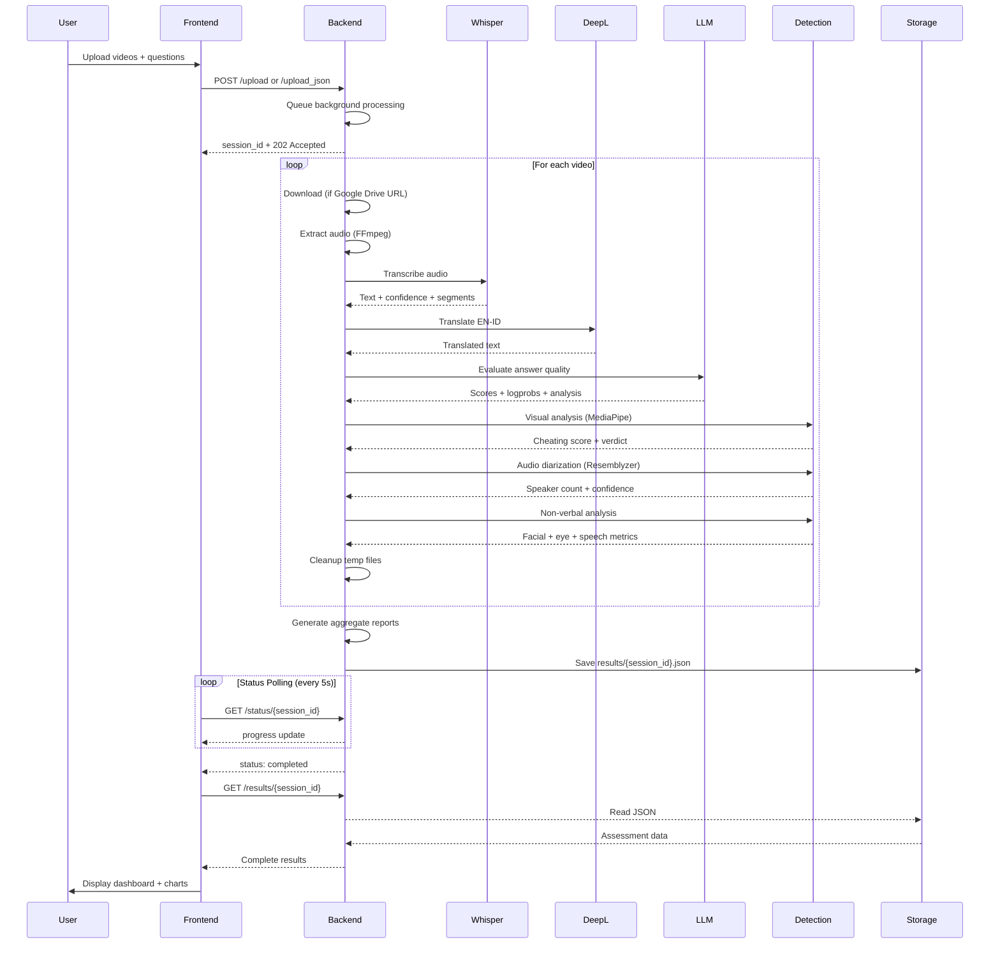

# Introduction

Welcome to the **AI Interview Assessment System** documentation! Panduan komprehensif untuk memahami, menginstal, dan menggunakan sistem penilaian interview otomatis berbasis AI.

## What is AI Interview Assessment System?

AI Interview Assessment System adalah platform **end-to-end** untuk otomasi evaluasi kandidat interview menggunakan teknologi AI terkini. Sistem ini menggabungkan multiple AI models dan teknik analisis untuk memberikan:

- **98% accurate transcription** menggunakan Faster-Whisper large-v3
- **LLM-powered semantic assessment** via Hugging Face Llama 3.1-8B-Instruct
- **Multi-modal cheating detection** (visual + audio analysis)
- **Scientific non-verbal analysis** dengan weighted confidence scoring
- **Bilingual support** (English ↔ Indonesian) via DeepL API
- **Comprehensive reporting** dengan aggregate analytics dan PDF export

---

## Key Capabilities

### :material-microphone: Speech-to-Text Transcription

**Faster-Whisper large-v3** (~3GB model) dengan CTranslate2 optimization untuk transcription berkualitas tinggi:

- **98% accuracy** pada audio yang jernih
- **Multi-language support:** English & Indonesian native
- **Voice Activity Detection (VAD):** Silero VAD untuk noise filtering
- **Weighted confidence scoring:** Kombinasi segment confidence + logprobs
- **Beam search:** Beam size 10 untuk hasil optimal
- **Processing speed:** 45-90s per video (CPU), 15-30s (GPU)

**Technical Details:**

- Model: `openai/whisper-large-v3`
- Framework: faster-whisper (CTranslate2 backend)
- Compute type: float16 (GPU) / int8 (CPU)
- Output: Timestamped segments dengan per-word confidence

[:octicons-arrow-right-24: Transcription Details](../features/overview.md#transcription)

---

### :material-robot: LLM-Powered Assessment

**Hugging Face Llama 3.1-8B-Instruct** untuk semantic answer evaluation:

- **Quality scoring:** Depth, accuracy, professionalism (0-100)
- **Coherence scoring:** Structure, flow, clarity (0-100)
- **Relevance scoring:** Question alignment, focus (0-100)
- **Logprobs confidence:** 50-95% confidence extraction dari model output
- **Confidence boosting:** Final score = avg_score × (1 + confidence/200)
- **Batch summaries:** Aggregate analysis across multiple answers

**Automatic Fallback:**

- Jika Hugging Face API gagal → rule-based scoring
- Jika DeepL API gagal → skip translation, langsung assess

[:octicons-arrow-right-24: LLM Assessment Details](../features/overview.md#llm-assessment)

---

### :material-shield-check: Cheating Detection

**Multi-modal approach** menggabungkan visual dan audio analysis dengan **92% accuracy**:

#### Visual Detection (MediaPipe)

**Face Mesh 468 landmarks** untuk tracking:

- **Eye gaze tracking:** Deteksi mata melihat off-screen
- **Head pose estimation:** Yaw, pitch, roll angles
- **Multiple face detection:** Deteksi orang lain dalam frame
- **Face visibility:** Minimum 80% frames harus terdeteksi wajah

**Scoring System:**

```
suspicious_pct = (suspicious_frames / total_frames) × 100
Verdict:

- High Risk: suspicious_pct ≥ 20%
- Medium Risk: 5% ≤ suspicious_pct < 20%
- Safe: suspicious_pct < 5%
```

#### Audio Detection (Resemblyzer)

**Speaker diarization** menggunakan voice embeddings:

- **GE2E (Generalized End-to-End)** speaker verification
- **Agglomerative clustering** untuk speaker separation
- **Silhouette score:** Measure clustering quality (-1 to 1)
- **Multiple speaker detection:** Alert jika > 1 speaker detected

**Confidence Calculation:**
`visual_conf = 1 - (suspicious_pct / 100)
audio_conf = 0.9 if single_speaker else 0.3
overall_conf = (visual_conf + audio_conf) / 2`

[:octicons-arrow-right-24: Cheating Detection Details](../features/overview.md#cheating-detection)

---

### :material-account-eye: Non-Verbal Analysis

**Scientific scoring** menggunakan Z-score normalization dan weighted confidence:

#### Facial Expression Analysis

**MediaPipe Face Mesh** extraction:

- **Smile intensity:** Mouth landmark distance (normalized)
- **Eyebrow movement:** Vertical displacement tracking
- **Facial stability:** Frame-to-frame variance

**Z-Score Normalization:**
`z_score = (value - mean) / std_dev
confidence = 1 / (1 + abs(z_score))  # 50-100%`

#### Eye Movement Tracking

- **Blink rate:** Deteksi eye aspect ratio (EAR < threshold)
  - Normal: 15-30 blinks/min
  - High: > 30 (nervous)
  - Low: < 15 (focused/reading)
- **Eye contact percentage:** Frames dengan gaze direction frontal
  - Excellent: > 80%
  - Good: 60-80%
  - Poor: < 60%

#### Speech Pattern Analysis

**PyDub audio processing:**

- **Speaking ratio:** Active speech / total duration (ideal: 0.5-0.7)
- **Speech rate:** Words per minute (ideal: 120-160 wpm)
- **Pause analysis:** Silence detection (> 0.5s gaps)
  - Fluent: < 15 pauses
  - Normal: 15-25 pauses
  - Hesitant: > 25 pauses

**Overall Confidence Score:**
`weights = {
  'facial': 0.25,
  'eye': 0.35,
  'speech': 0.40
}
overall_score = Σ(component_score × weight × confidence)`

**Performance Status:**

- **Excellent:** confidence > 85%
- **Good:** 70% ≤ confidence ≤ 85%
- **Fair:** 50% ≤ confidence < 70%
- **Poor:** confidence < 50%

[:octicons-arrow-right-24: Non-Verbal Details](../features/overview.md#non-verbal-analysis)

---

### :material-translate: Bilingual Translation

**DeepL API** untuk high-quality neural machine translation:

- **98%+ translation accuracy**
- **Language pairs:** English ↔ Indonesian (bidirectional)
- **Free tier:** 500,000 characters/month
- **Preserves formatting:** Punctuation, capitalization maintained
- **Fallback:** Skip translation jika API fails (tidak block processing)

**Use Cases:**

- English questions → Indonesian assessment
- Indonesian answers → English client reports
- Cross-language interview scenarios

[:octicons-arrow-right-24: Translation Setup](../configuration/api-keys.md#deepl-setup)

---

## System Architecture



**Processing Flow per Video:**

```
1️⃣  DOWNLOAD (if needed)
   📥 Google Drive URL → gdown library
   ⏱️  5-30s depends on file size

2️⃣  AUDIO EXTRACTION
   🎵 FFmpeg: video → WAV (16kHz mono)
   ⏱️  5-15s

3️⃣  TRANSCRIPTION
   🗣️  Faster-Whisper large-v3
   📊 Beam size: 10, VAD filter
   ⏱️  45-90s (CPU) / 15-30s (GPU)

4️⃣  TRANSLATION
   🌐 DeepL API (EN↔ID)
   ⏱️  2-5s

5️⃣  LLM ASSESSMENT
   🤖 Llama 3.1-8B-Instruct (HF API)
   📊 Quality, Coherence, Relevance
   ⏱️  10-30s

6️⃣  CHEATING DETECTION
   👁️  MediaPipe face mesh (visual)
   🔊 Resemblyzer speaker diarization (audio)
   ⏱️  30-120s (CPU) / 15-60s (GPU)

7️⃣  NON-VERBAL ANALYSIS
   😊 Facial expressions
   👁️  Eye contact + blink rate
   🗣️  Speech tempo + pauses
   ⏱️  30-90s (CPU) / 20-60s (GPU)

8️⃣  SAVE & CLEANUP
   💾 Save results/{session_id}.json
   🗑️  Delete video + temp audio (99%+ storage saved)
   ⏱️  1-2s

TOTAL: 3-8 min/video (CPU) | 1-3 min/video (GPU)
```

---

## Use Cases

### :material-briefcase: Corporate Hiring

**Automated First-Round Screening:**

- Process 100+ candidates simultaneously
- Standardize evaluation criteria across all interviewers
- Reduce unconscious bias dengan objective scoring
- Save 80% interviewer time untuk advanced rounds

**Benefits:**

- Consistent quality assessment
- Cheating detection untuk remote interviews
- Non-verbal cues analysis
- Scalable interview capacity

---

### :material-school: Educational Assessments

**Online Exam Proctoring:**

- Detect multiple speakers (collaboration)
- Monitor eye gaze untuk off-screen reading
- Analyze response authenticity

**Speaking Proficiency Tests:**

- Automatic transcription + grading
- Fluency analysis (speech rate, pauses)
- Pronunciation quality scoring
- Progress tracking over time

---

### :material-domain: Remote Interviews

**Asynchronous Video Interviews:**

- Candidates record answers anytime, anywhere
- 24/7 availability (no scheduling conflicts)
- Multi-timezone support
- Reduced no-show rates

**Global Candidate Pools:**

- Bilingual support (EN/ID)
- Consistent evaluation standards
- Comprehensive cheating detection
- Detailed behavioral insights

---

### :material-chart-line: HR Analytics

**Data-Driven Decisions:**

- Aggregate candidate performance metrics
- Identify strong/weak answer patterns
- Track interviewer bias (if human comparison)
- Optimize question effectiveness

---

## Performance Metrics

| Metric                          | Value         | Notes                                        |
| ------------------------------- | ------------- | -------------------------------------------- |
| **Transcription Accuracy**      | ~98%          | On clear audio with minimal background noise |
| **Translation Quality**         | ~98%          | DeepL API (EN↔ID)                            |
| **LLM Assessment Confidence**   | 50-95%        | Based on logprobs extraction                 |
| **Cheating Detection Accuracy** | ~92%          | Visual + audio combined                      |
| **Non-Verbal Confidence**       | 50-90%        | Depends on video quality                     |
| **Processing Speed (GPU)**      | 1-3 min/video | NVIDIA RTX 3060+                             |
| **Processing Speed (CPU)**      | 3-8 min/video | Intel i7 / AMD Ryzen 7                       |
| **Storage Saved**               | 99%+          | Auto-cleanup after processing                |
| **API Uptime**                  | 99.9%         | Local deployment                             |

**Breakdown per Stage:**

| Stage                   | Time (CPU) | Time (GPU) |
| ----------------------- | ---------- | ---------- |
| Download (Google Drive) | 5-30s      | 5-30s      |
| Audio Extraction        | 5-15s      | 5-15s      |
| Transcription           | 45-90s     | 15-30s     |
| Translation             | 2-5s       | 2-5s       |
| LLM Assessment          | 10-30s     | 10-30s     |
| Cheating Detection      | 30-120s    | 15-60s     |
| Non-Verbal Analysis     | 30-90s     | 20-60s     |
| Save & Cleanup          | 1-2s       | 1-2s       |

---

## Technology Stack

### Backend (Python 3.11)

| Technology                     | Purpose                              | Version   |
| ------------------------------ | ------------------------------------ | --------- |
| **FastAPI**                    | Async web framework, CORS support    | 0.100+    |
| **faster-whisper**             | CTranslate2 optimized speech-to-text | latest    |
| **Hugging Face Inference API** | LLM assessment (Llama 3.1-8B)        | -         |
| **DeepL API**                  | Neural machine translation           | Free tier |
| **MediaPipe**                  | Face mesh detection (468 landmarks)  | 0.10+     |
| **Resemblyzer**                | Voice embeddings (GE2E)              | latest    |
| **PyDub**                      | Audio processing & speech analysis   | 0.25+     |
| **PyTorch**                    | Deep learning framework              | 2.0+      |
| **scikit-learn**               | Clustering (Agglomerative)           | 1.3+      |
| **gdown**                      | Google Drive file download           | 5.0+      |
| **FFmpeg**                     | Audio/video codec handling           | 4.4+      |

### Frontend (Vanilla JavaScript)

- **Chart.js** - Data visualization (radar charts, bar charts)
- **HTML5** - Drag & drop file upload
- **CSS3** - Responsive design
- **localStorage** - Session management & state persistence

### AI Models

| Model                     | Size  | Purpose                    | Accuracy    |
| ------------------------- | ----- | -------------------------- | ----------- |
| **Whisper large-v3**      | ~3GB  | Speech recognition         | ~98%        |
| **Llama 3.1-8B-Instruct** | API   | Semantic evaluation        | 50-95% conf |
| **MediaPipe Face Mesh**   | ~50MB | 468-point facial landmarks | High        |
| **Resemblyzer GE2E**      | ~50MB | Speaker embedding network  | ~92%        |

### Infrastructure

- **Jupyter Notebook** - Interactive development environment
- **Uvicorn** - ASGI server for FastAPI
- **ThreadPoolExecutor** - Background async processing
- **ngrok** (optional) - Public URL tunneling

---

## System Requirements

### Minimum Requirements

| Component            | Specification                              |
| -------------------- | ------------------------------------------ |
| **Operating System** | Windows 10/11, macOS 10.15+, Ubuntu 20.04+ |
| **Python**           | 3.11.9 (exact version recommended)         |
| **CPU**              | Intel i5 / AMD Ryzen 5 (4 cores)           |
| **RAM**              | 8 GB                                       |
| **Storage**          | 10 GB free space (for models)              |
| **Internet**         | Stable connection for API calls            |

### Recommended Requirements

| Component            | Specification                               |
| -------------------- | ------------------------------------------- |
| **Operating System** | Windows 11, macOS 13+, Ubuntu 22.04+        |
| **Python**           | 3.11.9                                      |
| **CPU**              | Intel i7 / AMD Ryzen 7 (8 cores)            |
| **GPU**              | NVIDIA RTX 3060+ (6GB+ VRAM) with CUDA 11.8 |
| **RAM**              | 16 GB                                       |
| **Storage**          | 20 GB SSD                                   |
| **Internet**         | Broadband (for model downloads & API)       |

**GPU Benefits:**

- 5-10x faster processing
- Transcription: 45-90s → 15-30s
- Cheating detection: 30-120s → 15-60s
- Total: 3-8 min → 1-3 min per video

---

## What's Included

```
Interview_Assesment_System/
├── interview_assessment_system.ipynb   # Main Jupyter Notebook
├── README.md                           # Project documentation
│
├── backend/
│   └── Python/
│       ├── main.py                     # Entry point (Python script mode)
│       ├── requirements.txt            # Dependencies
│       ├── env.example                 # Environment variables template
│       │
│       ├── app/
│       │   ├── config.py               # Configuration settings
│       │   ├── routes.py               # API endpoints
│       │   ├── server.py               # FastAPI application
│       │   ├── state.py                # Global state management
│       │   │
│       │   ├── services/
│       │   │   ├── whisper_service.py  # Transcription service
│       │   │   ├── deepl_service.py    # Translation service
│       │   │   └── diarization.py      # Speaker diarization
│       │   │
│       │   └── utils/
│       │       ├── transcription.py    # Transcription processing
│       │       ├── cheating_detection.py  # Cheating analysis
│       │       ├── non_verbal.py       # Non-verbal analysis
│       │       ├── llm_evaluator.py    # LLM assessment
│       │       ├── translation.py      # Translation utils
│       │       ├── json_builder.py     # Result formatting
│       │       └── gd_json_download.py # Google Drive downloader
│       │
│       └── results/                    # JSON output directory
│
├── frontend/
│   ├── Upload.html                     # Video upload interface
│   ├── Upload.js                       # Upload logic + polling
│   ├── Upload.css                      # Upload page styling
│   ├── Halaman_dasboard.html           # Results dashboard
│   ├── Halaman_dasboard.js             # Charts + analytics
│   ├── Halaman_dasboard.css            # Dashboard styling
│   └── Assest/                         # Images, icons, assets
│
└── mkdocs/                             # Documentation site (this!)
    ├── mkdocs.yml                      # MkDocs configuration
    ├── docs/                           # Documentation source
    └── docs-requirements.txt           # Docs dependencies
```

---

## Key Features Highlight

### :material-lightning-bolt: Fast Processing

- **Background async processing:** Non-blocking API responses
- **Auto-cleanup:** 99%+ storage saved (delete videos after processing)
- **Batch processing:** Sequential video processing dengan progress tracking
- **ThreadPoolExecutor:** Efficient resource management

### :material-google-drive: Google Drive Integration

- **Direct URL support:** `https://drive.google.com/file/d/FILE_ID/view`
- **Auto file ID extraction:** Multiple URL formats supported
- **gdown library:** Reliable download mechanism
- **Fallback handling:** Graceful error handling

### :material-file-chart: Comprehensive Reporting

**Per-Video Results:**

- Transcription (EN + ID translation)
- LLM scores (Quality, Coherence, Relevance)
- Cheating detection (Visual + Audio verdict)
- Non-verbal analysis (Facial, Eye, Speech)
- Metadata (confidence, processing time, model versions)

**Aggregate Reports:**

- Multi-video LLM summary (150-200 words)
- Overall cheating risk assessment
- Non-verbal performance status
- Final decision: **Lulus** / **Tidak Lulus**

**Export Options:**

- JSON download (raw data)
- PDF report (formatted, professional)
- Chart visualizations (Chart.js)

### :material-api: RESTful API

**Endpoints:**

| Endpoint                | Method | Purpose                              |
| ----------------------- | ------ | ------------------------------------ |
| `/upload`               | POST   | Upload local video files (multipart) |
| `/upload_json`          | POST   | Upload via Google Drive URLs (JSON)  |
| `/status/{session_id}`  | GET    | Real-time processing status          |
| `/results/{session_id}` | GET    | Get assessment results               |
| `/docs`                 | GET    | Interactive API documentation        |

[:octicons-arrow-right-24: Complete API Reference](../api/endpoints.md)

---

## Getting Help

<div class="grid cards" markdown>

- :material-book-open-variant:{ .lg .middle } **Documentation**

  ---

  Browse comprehensive guides, tutorials, dan API reference.

  [:octicons-arrow-right-24: View Documentation](installation.md)

- :material-frequently-asked-questions:{ .lg .middle } **FAQ**

  ---

  Common questions dan troubleshooting solutions.

  [:octicons-arrow-right-24: View FAQ](../troubleshooting/faq.md)

- :material-github:{ .lg .middle } **GitHub Issues**

  ---

  Report bugs, request features, atau diskusi technical issues.

  [:octicons-arrow-right-24: Open Issue](https://github.com/dapakyuu/Interview_Assesment_System/issues)

- :material-chat:{ .lg .middle } **Community**

  ---

  Join discussions dengan other users dan developers.

  [:octicons-arrow-right-24: Discussions](https://github.com/dapakyuu/Interview_Assesment_System/discussions)

</div>

---

## Quick Links

**Getting Started:**

- [Installation Guide](installation.md) - Step-by-step setup
- [Quick Start](quickstart.md) - Your first assessment in 10 minutes
- [Configuration](../configuration/api-keys.md) - API keys & settings

**Features:**

- [Transcription](../features/overview.md#transcription) - Whisper large-v3 details
- [LLM Assessment](../features/overview.md#llm-assessment) - Llama 3.1-8B evaluation
- [Cheating Detection](../features/overview.md#cheating-detection) - Visual + Audio analysis
- [Non-Verbal Analysis](../features/overview.md#non-verbal-analysis) - Scientific scoring

**Advanced:**

- [API Documentation](../api/endpoints.md) - Complete endpoint reference
- [Architecture](../development/architecture.md) - System design deep dive
- [Troubleshooting](../troubleshooting/common-issues.md) - Fix common issues

---

## License

This project is licensed under the **MIT License** - see the [LICENSE](../about/license.md) page for details.

**Open Source Components:**

- Whisper (MIT) - OpenAI
- MediaPipe (Apache 2.0) - Google
- FastAPI (MIT) - Sebastián Ramírez
- Chart.js (MIT) - Chart.js contributors

---

## Next Steps

Ready to get started? Follow our comprehensive installation guide:

[:octicons-arrow-right-24: Installation Guide](installation.md){ .md-button .md-button--primary }
[:octicons-arrow-right-24: Quick Start](quickstart.md){ .md-button }
