# Quick Start Guide

Panduan cepat untuk mulai menggunakan AI Interview Assessment System dalam hitungan menit!

## Prerequisites Checklist

Pastikan sudah menyelesaikan setup:

- [x] System installed ([Installation Guide](installation.md))
- [x] Backend server running (port 8888 via Jupyter atau port 7860 via Python)
- [x] Frontend server running (port 5500)
- [x] API keys configured (DeepL + Hugging Face)
- [x] FFmpeg installed dan di PATH

---

## Your First Assessment

### Step 1: Start Backend Server

=== "Via Jupyter Notebook"

    ```bash
    # Launch Jupyter Notebook
    jupyter notebook interview_assessment_system.ipynb

    # Execute all cells (Run All)
    # Server akan running di http://localhost:8888
    ```

=== "Via Python Script"

    ```bash
    # Navigate to backend/Python
    cd backend/Python

    # Start server
    python main.py

    # Server akan running di http://localhost:7860
    ```

Tunggu sampai melihat:

`INFO:     Uvicorn running on http://0.0.0.0:8888
INFO:     Application startup complete.`

---

### Step 2: Open Upload Interface

Navigate to `http://localhost:5500/Upload.html` dalam browser.

!!! tip "Live Server"
Gunakan VS Code Live Server extension untuk auto-reload saat edit frontend.

---

### Step 3: Upload Videos

Ada dua metode upload:

=== "Multipart Upload (Local Files)"

    **Di Upload.html:**

    1. **Enter Candidate Name:**
       ```
       Candidate Name: John Doe
       ```

    2. **Select Source Language:**
       - English (```en```)
       - Indonesian (```id```)

    3. **Upload Videos:**
       - Click "Choose Files" atau drag & drop
       - Select 1-5 video files
       - Supported formats: ```.mp4```, ```.webm```, ```.avi```, ```.mov```

    4. **Add Questions:**
       - System akan prompt untuk input pertanyaan per video
       - Example: "Tell me about your experience with Python"

    5. **Click "Kirim Video"**

    **Response:**
    ```json
    {
      "success": true,
      "session_id": "abc123...",
      "uploaded_videos": 3
    }
    ```

=== "JSON Upload (Google Drive URLs)"

    **Via API Request:**

    ```bash
    curl -X POST http://localhost:8888/upload_json \
      -H "Content-Type: application/json" \
      -d '{
        "candidate_name": "John Doe",
        "interviews": [
          {
            "positionId": 1,
            "question": "Tell me about yourself",
            "isVideoExist": true,
            "recordedVideoUrl": "https://drive.google.com/file/d/FILE_ID/view"
          },
          {
            "positionId": 2,
            "question": "Why this position?",
            "isVideoExist": true,
            "recordedVideoUrl": "https://drive.google.com/file/d/FILE_ID2/view"
          }
        ],
        "language": "en"
      }'
    ```

    **Google Drive URL Formats Supported:**
    - ```https://drive.google.com/file/d/FILE_ID/view```
    - ```https://drive.google.com/open?id=FILE_ID```
    - ```https://drive.google.com/uc?id=FILE_ID```

    **Response:**
    ```json
    {
      "success": true,
      "session_id": "def456...",
      "uploaded_videos": 2,
      "message": "Videos are being downloaded and processed in background"
    }
    ```

**Supported Video Formats:**

| Format | Container | Codec          | Notes            |
| ------ | --------- | -------------- | ---------------- |
| MP4    | MPEG-4    | H.264, H.265   | ✅ Recommended   |
| WebM   | WebM      | VP8, VP9, Opus | ✅ Web native    |
| AVI    | AVI       | Various        | ✅ Supported     |
| MOV    | QuickTime | H.264          | ✅ Apple devices |

**Size Recommendations:**

- **Per video:** < 100MB (optimal)
- **Max size:** 500MB (slow upload)
- **Duration:** 30 seconds - 10 minutes

---

### Step 4: Monitor Processing

Frontend otomatis polling `/status/{session_id}` setiap **5 detik**.

**Loading Overlay akan menampilkan:**

`Processing video 2/3...
Transcribing audio...`

**Console logs (optional check):**

```bash

# Check status manually

curl http://localhost:8888/status/abc123...

# Response (processing):

{
"status": "processing",
"progress": "2/3",
"message": "Transcribing video 2/3...",
"current_video": 2
}
```

---

## Processing Pipeline Detail

Setiap video melalui **7 tahapan processing**:

```mermaid
graph LR
A["1. Upload/Download"] --> B["2. Audio Extraction"]
B --> C["3. Transcription"]
C --> D["4. Translation"]
D --> E["5. LLM Assessment"]
E --> F["6. Cheating Detection"]
F --> G["7. Non-Verbal Analysis"]
G --> H["Save & Cleanup"]

    style A fill:#e3f2fd
    style C fill:#e8f5e9
    style E fill:#f3e5f5
    style F fill:#ffe0b2
    style G fill:#c8e6c9
    style H fill:#ffccbc

```



### Processing Timeline

**Expected Duration per Video:**

| Stage                      | Description                              | CPU Time    | GPU Time    |
| -------------------------- | ---------------------------------------- | ----------- | ----------- |
| **1. Upload/Download**     | File transfer + Google Drive download    | 5-30s       | 5-30s       |
| **2. Audio Extraction**    | FFmpeg extraction to WAV                 | 5-15s       | 5-15s       |
| **3. Transcription**       | Faster-Whisper large-v3                  | 45-90s      | 15-30s      |
| **4. Translation**         | DeepL API (EN↔ID)                        | 2-5s        | 2-5s        |
| **5. LLM Assessment**      | Llama 3.1-8B evaluation                  | 10-30s      | 10-30s      |
| **6. Cheating Detection**  | Visual (MediaPipe) + Audio (Resemblyzer) | 30-120s     | 15-60s      |
| **7. Non-Verbal Analysis** | Facial expressions, eye tracking, speech | 30-90s      | 20-60s      |
| **TOTAL**                  | Complete processing                      | **3-8 min** | **1-3 min** |

!!! info "Multiple Videos"
Processing adalah **sequential** (satu per satu). Untuk 3 video:

    - **CPU:** 9-24 menit total
    - **GPU:** 3-9 menit total

---

## View Results

### Auto-Redirect to Dashboard

Setelah processing selesai, frontend akan **auto-redirect** ke:

`http://localhost:5500/halaman_dasboard.html?session=abc123...`

!!! success "Processing Complete"
Dashboard akan menampilkan comprehensive assessment results untuk semua video.

---

### Dashboard Components

#### 1. **Overview Section**

**Candidate Information:**

- Name: John Doe
- Session ID: abc123...
- Processed At: 2025-12-13 10:30:45 UTC
- Total Videos: 3
- Successful: 3

**Final Decision:**

- **Lulus** (Pass) / **Tidak Lulus** (Fail)
- Based on aggregate scores

---

#### 2. **Aggregate Scores Card**

**LLM Assessment Summary:**

`json
{
  "avg_total_llm": 75.3,
  "avg_logprobs_confidence": 89.2,
  "final_score_llm": 85.5,
  "kesimpulan_llm": "Kandidat menunjukkan pemahaman yang baik..."
}
`

**Display:**

- Average Total Score: **75.3/100**
- LLM Confidence: **89.2%**
- Final Boosted Score: **85.5/100**

---

**Non-Verbal Analysis Summary:**

`json
{
  "overall_performance_status": "GOOD",
  "overall_confidence_score": 77.5,
  "summary": "speaking ratio 0.58 (fairly active), speech rate 150 wpm (ideal)..."
}
`

**Display:**

- Performance Status: **GOOD** (Excellent/Good/Fair/Poor)
- Confidence Score: **77.5%**
- Summary interpretation

---

**Cheating Detection Summary:**

`json
{
  "final_aggregate_verdict": "Safe",
  "avg_cheating_score": 2.3,
  "avg_overall_confidence": 88.4,
  "verdict_distribution": {
    "Safe": 2,
    "Medium Risk": 1,
    "High Risk": 0
  }
}
`

**Display:**

- Verdict: **Safe** / Medium Risk / High Risk
- Average Cheating Score: **2.3%**
- Confidence: **88.4%**
- Distribution chart

---

#### 3. **Per-Video Details**

Untuk setiap video, terdapat **tabs**:

=== "📝 Transcription"

    **English Transcription:**
    ```
    This is a professional interview in English. The candidate
    discusses their experience with Python programming and
    demonstrates strong technical knowledge...
    ```

    **Indonesian Translation:**
    ```
    Ini adalah wawancara profesional dalam bahasa Inggris.
    Kandidat membahas pengalaman mereka dengan pemrograman
    Python dan menunjukkan pengetahuan teknis yang kuat...
    ```

    **Metrics:**
    - Word Count: 145
    - Confidence: **98.7%** (Min: 98.2%, Max: 99.1%)
    - Source Language: English

=== "🤖 LLM Assessment"

    **Scores:**

    | Metric | Score | Weight |
    |--------|-------|--------|
    | Quality | 82/100 | 33% |
    | Coherence | 78/100 | 33% |
    | Relevance | 85/100 | 33% |
    | **Total** | **81.7/100** | - |

    **Confidence Metrics:**
    - Logprobs Confidence: **91.2%**
    - Model Certainty: High

    **LLM Analysis:**
    ```
    The candidate demonstrates strong understanding of Python
    fundamentals. Answer is well-structured with concrete examples.
    However, could improve depth in discussing advanced topics.
    ```

    **Metadata:**
    - Model: meta-llama/Llama-3.1-8B-Instruct
    - Logprobs Available: ✅ Yes
    - Processing Time: 12.3s

=== "🛡️ Cheating Detection"

    **Visual Analysis:**

    - **Cheating Score:** 3.2% (Low)
    - **Suspicious Frames:** 18/650 (2.8%)
    - **Face Detected:** 98.5% of frames
    - **Confidence:** 92.3%

    **Issues Detected:**
    - Eye gaze off-screen: 12 frames
    - Head turned away: 6 frames
    - Multiple faces: 0 frames

    **Audio Analysis:**

    - **Number of Speakers:** 1
    - **Confidence:** 85%
    - **Silhouette Score:** -0.5 (good clustering)

    **Final Verdict:**

    ✅ **Safe** - Single speaker, minimal suspicious activity

    **All Indicators:**
    - Low suspicious activity (3.2%)

=== "😊 Non-Verbal Analysis"

    **Speech Analysis:**

    | Metric | Value | Interpretation |
    |--------|-------|----------------|
    | Speaking Ratio | 0.58 | Fairly active |
    | Speech Rate | 150 wpm | Ideal pace |
    | Pauses | 13 | Fluent |
    | Total Duration | 45.2s | - |

    **Facial Expression:**

    | Metric | Value | Interpretation |
    |--------|-------|----------------|
    | Smile Intensity | 0.18 | Neutral |
    | Eyebrow Movement | 0.025 | Controlled |
    | Face Detection | 99.2% | Excellent |

    **Eye Movement:**

    | Metric | Value | Interpretation |
    |--------|-------|----------------|
    | Blink Rate | 22/min | Normal |
    | Eye Contact | 85% | Very good |
    | Gaze Stability | 0.021 | Stable |

    **Overall Confidence Score:** **78.4%** (Good)

---

#### 4. **Aggregate Reports**

**Comprehensive LLM Summary** (150-200 words):

```
Pada keseluruhan, kandidat menunjukkan kinerja yang baik dalam
wawancara video dengan skor rata-rata total 75.3 dari 100.

Kandidat menunjukkan kekuatan dalam hal kualitas jawaban (82/100)
dan relevansi informasi yang disampaikan (85/100). Jawaban-jawaban
yang diberikan menunjukkan pemahaman yang solid terhadap topik yang
ditanyakan dengan contoh-contoh konkret.

Namun, kandidat masih perlu meningkatkan kinerjanya dalam hal
koherensi jawaban (78/100) dan kejelasan komunikasi. Beberapa
jawaban terlihat kurang terstruktur dan memerlukan transisi yang
lebih baik antar poin.

Dengan demikian, kandidat perlu meningkatkan kemampuan komunikasi
dan keterampilan berpikir kritis untuk meningkatkan kinerjanya
ke level yang lebih tinggi.
```

**Cheating Detection Report:**

```
Analyzed 3 question(s) for cheating detection. Average cheating
score: 2.3%. Overall confidence: 88.4%.

✅ 2 question(s) flagged as SAFE
⚠️ 1 question(s) flagged as MEDIUM RISK

Total of 1 cheating indicator(s) detected:

- Question 2: Medium suspicious activity (5.8%)
```

**Non-Verbal Report:**

```
Overall Performance: GOOD
Confidence Score: 77.5%

Summary: speaking ratio 0.58 (fairly active), pauses 13 (fluent),
speech rate 150 wpm (ideal), smile intensity 0.18 (neutral),
eyebrow movement 0.025 (controlled), eye contact 85% (very good),
blink rate 22/min (normal)
```

---

#### 5. **Export Options**

**Download Results:**

1. **Download JSON:**

   - Click "Download JSON" button
   - File: `results_abc123.json`
   - Contains raw assessment data

2. **Download PDF Report:**
   - Click "Download PDF" button
   - File: `assessment_report_abc123.pdf`
   - Formatted professional report

**JSON Structure Preview:**

`json
{
  "success": true,
  "name": "John Doe",
  "session": "abc123...",
  "llm_results": { ... },
  "aggregate_cheating_detection": { ... },
  "aggregate_non_verbal_analysis": { ... },
  "content": [
    {
      "id": 1,
      "question": "Tell me about yourself",
      "result": {
        "penilaian": { ... },
        "non_verbal_analysis": { ... },
        "cheating_detection": { ... },
        "transkripsi_en": "...",
        "transkripsi_id": "...",
        "metadata": { ... }
      }
    }
  ],
  "metadata": {
    "total_videos": 3,
    "successful_videos": 3,
    "processed_at": "2025-12-13T10:35:22.123456+00:00",
    "model": "faster-whisper large-v3",
    "llm_model": "meta-llama/Llama-3.1-8B-Instruct"
  }
}
`

---

## Example Complete Workflow

### Scenario: Hiring Python Developer

**Setup:**

```bash

# 1. Start backend

jupyter notebook interview_assessment_system.ipynb

# 2. Start frontend (separate terminal)

cd frontend
python -m http.server 5500
```

---

**Prepare Interview Questions:**

1. "Tell me about your Python experience and projects"
2. "Explain the difference between async and sync programming"
3. "How would you optimize a slow database query?"

---

**Candidate Records Answers:**

- Video 1: 3 minutes (Python experience)
- Video 2: 2.5 minutes (Async explanation)
- Video 3: 4 minutes (Database optimization)

---

**Upload to System:**

`javascript
// Via Upload.html
Candidate Name: Jane Smith
Source Language: English
Videos: [video1.mp4, video2.mp4, video3.mp4]
Questions: ["Q1", "Q2", "Q3"]
`

---

**Processing (Background):**

`[10:30:00] Upload completed - Session: xyz789
[10:30:05] Processing video 1/3...
[10:32:15] Processing video 2/3...
[10:34:20] Processing video 3/3...
[10:36:30] All videos processed successfully`

**Total Time:** ~6.5 minutes (CPU mode)

---

**Review Results:**

**LLM Scores:**

- Q1: Quality 88, Coherence 85, Relevance 90 → **87.7/100**
- Q2: Quality 92, Coherence 88, Relevance 95 → **91.7/100**
- Q3: Quality 78, Coherence 80, Relevance 82 → **80.0/100**
- **Average:** **86.5/100** ✅

**Cheating Detection:**

- All videos: **Safe** verdict
- Average cheating score: **1.8%**
- Single speaker confirmed

**Non-Verbal:**

- Performance: **Excellent**
- Confidence: **82.3%**
- Good eye contact, natural speech patterns

**Decision:** **LULUS** - Strong technical candidate

---

## Tips for Best Results

### 📹 Video Quality

!!! success "Optimal Settings" - **Resolution:** 720p or higher - **Frame Rate:** 24-30 fps - **Bitrate:** 2-5 Mbps - **Format:** MP4 (H.264) - **Duration:** 2-5 minutes per answer

### 🎤 Audio Quality

!!! success "Best Practices" - Use external microphone (not laptop mic) - Record in quiet environment - Minimize background noise - Clear enunciation - Consistent volume

### 💡 Lighting & Framing

!!! success "Setup Recommendations" - Face should be well-lit (front lighting) - Avoid backlighting (window behind) - Face visible in 80%+ of frames - Eye level camera positioning - Neutral background

### ❓ Question Design

**Good Questions:**

- "Describe your experience with X technology"
- "How would you approach Y problem?"
- "Explain the difference between A and B"

**Avoid:**

- Yes/No questions
- Too vague ("Tell me everything about X")
- Too narrow (can be answered in 1 sentence)

### 🌐 Language Selection

| Scenario                  | Recommended Setting  |
| ------------------------- | -------------------- |
| English native speaker    | `language: "en"`     |
| Indonesian native speaker | `language: "id"`     |
| Bilingual candidate       | Use primary language |

!!! tip "Translation Quality"
English → Indonesian translation is slightly more accurate than
Indonesian → English due to DeepL training data.

---

## Troubleshooting

### ❌ Upload Fails

**Error:** "File upload failed"

**Solutions:**

- Check file size (< 100MB recommended)
- Verify video format is supported
- Check internet connection
- Try different browser (Chrome/Firefox)

---

### ❌ Processing Stuck

**Error:** Video stuck at "Processing 1/3..."

**Check Jupyter Logs:**

```

# Look for errors in notebook output

[ERROR] FFmpeg not found
[ERROR] API key invalid
[ERROR] Out of memory
```

**Solutions:**

1. Verify FFmpeg installed: `ffmpeg -version`
2. Check API keys in notebook cells
3. Restart kernel and re-run cells
4. Reduce video size/duration

---

### ❌ Low Transcription Confidence

**Issue:** Confidence < 80%

**Causes:**

- Background noise
- Poor audio quality
- Unclear speech
- Wrong language selected

**Solutions:**

- Re-record with better microphone
- Remove background noise in post-processing
- Verify language setting matches actual speech
- Use Audacity to clean audio

---

### ❌ Cheating Detection False Positives

**Issue:** Safe interview flagged as "High Risk"

**Causes:**

- Poor lighting (face not detected)
- Looking at notes off-screen
- Multiple people in background
- Low video quality

**Solutions:**

- Improve lighting setup
- Clear background before recording
- Adjust thresholds in config (advanced)
- Review specific flagged frames

---

### ❌ Dashboard Not Loading

**Error:** "Session not found" or blank dashboard

**Solutions:**

```javascript
// Clear localStorage
localStorage.removeItem("video_processing_session");

// Check session ID in URL
http://localhost:5500/halaman_dasboard.html?session=VALID_SESSION_ID

// Verify backend is running
curl http://localhost:8888/results/SESSION_ID
```

---

## API Integration Examples

### Check Status Programmatically

```python
import requests
import time

session_id = "abc123..."
url = f"http://localhost:8888/status/{session_id}"

while True:
response = requests.get(url)
data = response.json()

    print(f"Status: {data['status']} - {data.get('message', '')}")

    if data['status'] == 'completed':
        print("Processing done!")
        break
    elif data['status'] == 'error':
        print(f"Error: {data.get('error')}")
        break

    time.sleep(5)  # Poll every 5 seconds

```

---

### Fetch Results via API

```python
import requests
import json

session_id = "abc123..."
url = f"http://localhost:8888/results/{session_id}"

response = requests.get(url)
results = response.json()

# Extract scores

llm_score = results['llm_results']['final_score_llm']
cheating_verdict = results['aggregate_cheating_detection']['final_aggregate_verdict']
nonverbal_score = results['aggregate_non_verbal_analysis']['overall_confidence_score']

print(f"LLM Score: {llm_score}")
print(f"Cheating: {cheating_verdict}")
print(f"Non-Verbal: {nonverbal_score}")

# Save to file

with open(f'results\_{session_id}.json', 'w') as f:
json.dump(results, f, indent=2)
```

---

## Next Steps

Selamat! Anda sudah menyelesaikan first assessment. Selanjutnya:

**Learn More:**

- [Features Overview](../features/overview.md) - Deep dive semua fitur
- [API Reference](../api/endpoints.md) - Complete endpoint documentation
- [Configuration](../configuration/models.md) - Customize settings

**Advanced Usage:**

- [Cheating Detection Tuning](../configuration/advanced.md#cheating-detection)
- [Non-Verbal Weights](../configuration/advanced.md#non-verbal-scoring)
- [LLM Prompt Engineering](../configuration/advanced.md#llm-prompts)

[:octicons-arrow-right-24: Explore Features](../features/overview.md){ .md-button .md-button--primary }
[:octicons-arrow-right-24: API Documentation](../api/endpoints.md){ .md-button }
