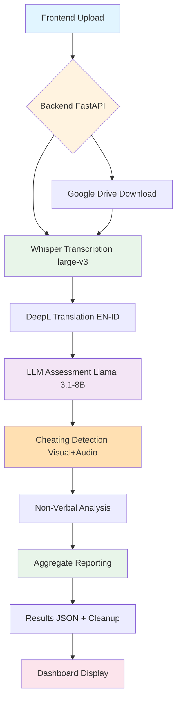

# 🎙️ AI Interview Assessment System

**Sistem AI untuk otomasi penilaian interview kandidat dengan speech-to-text transcription, cheating detection, dan analisis non-verbal mendalam.**

[](https://www.python.org/downloads/)
[](https://fastapi.tiangolo.com/)
[](https://github.com/openai/whisper)
[](https://opensource.org/licenses/MIT)

---

## ✨ Key Features

<div class="grid cards" markdown>

- :material-microphone:{ .lg .middle } **98% Accurate Transcription**

  ***

  Faster-Whisper large-v3 dengan confidence dari logprobs untuk hasil transcription berkualitas tinggi pada audio yang jernih.

  [:octicons-arrow-right-24: Learn more](getting-started/introduction.md)

- :material-robot:{ .lg .middle } **LLM Assessment**

  ***

  Hugging Face Llama 3.1-8B-Instruct untuk semantic answer evaluation dengan confidence scoring dan logprobs analysis.

  [:octicons-arrow-right-24: Learn more](features/overview.md#llm-powered-assessment)

- :material-shield-check:{ .lg .middle } **Cheating Detection**

  ***

  Multi-modal detection: Visual (MediaPipe face mesh 468 landmarks, eye/head tracking) + Audio (Resemblyzer speaker diarization).

  [:octicons-arrow-right-24: Learn more](features/overview.md#cheating-detection)

- :material-account-eye:{ .lg .middle } **Non-Verbal Analysis**

  ***

  Scientific scoring untuk facial expressions, eye contact, blink rate, speech patterns dengan weighted confidence calculation.

  [:octicons-arrow-right-24: Learn more](features/overview.md#non-verbal-analysis)

- :material-translate:{ .lg .middle } **Bilingual Support**

  ***

  English ↔ Indonesian translation via DeepL API dengan 98%+ accuracy (500k chars/month free tier).

  [:octicons-arrow-right-24: Learn more](configuration/api-keys.md#deepl-setup)

- :material-chart-line:{ .lg .middle } **Dashboard Analytics**

  ***

  Interactive charts (Chart.js), aggregate reporting, comprehensive JSON results, dan PDF export capability.

  [:octicons-arrow-right-24: Learn more](getting-started/quickstart.md#dashboard-display)

- :material-google-drive:{ .lg .middle } **Google Drive Support**

  ***

  Direct video download dari Google Drive URLs dengan auto file ID extraction menggunakan gdown library.

  [:octicons-arrow-right-24: Learn more](api/endpoints.md#upload-from-google-drive)

- :material-lightning-bolt:{ .lg .middle } **Fast Processing**

  ***

  Background async processing: 1-3 min/video (GPU) atau 3-8 min/video (CPU) dengan auto-cleanup untuk hemat storage 99%+.

  [:octicons-arrow-right-24: Learn more](troubleshooting/performance.md)

</div>

---

## :material-rocket-launch: Quick Start

=== "Via Jupyter Notebook (Recommended)"

    ```bash
    # 1. Clone & setup
    git clone <repo>
    cd Interview_Assesment_System/backend/Python
    python -m venv .venv && .venv\Scripts\activate

    # 2. Install dependencies
    pip install jupyter
    jupyter notebook interview_assessment_system.ipynb

    # 3. Execute cells in order dan configure API keys
    # See Installation Guide for details

    # 4. Open frontend
    # http://localhost:5500/Upload.html (via Live Server)
    ```

=== "Via Python Script"

    ```bash
    # 1. Setup
    cd Interview_Assesment_System/backend/Python
    python -m venv .venv
    .venv\Scripts\activate

    # 2. Install & configure
    pip install -r requirements.txt
    # Rename env.example to .env and add API keys

    # 3. Start server
    python main.py
    # Server starts on http://localhost:7860
    ```

[:octicons-arrow-right-24: Detailed Installation Guide](getting-started/installation.md){ .md-button .md-button--primary }

---

## :material-speedometer: Performance Metrics

| Metric                      | Value                      |
| --------------------------- | -------------------------- |
| Transcription Accuracy      | ~98% (clear audio)         |
| Translation Quality         | ~98% (DeepL API)           |
| LLM Assessment Confidence   | 50-95% (logprobs-based)    |
| Cheating Detection Accuracy | ~92% (visual + audio)      |
| Non-Verbal Confidence       | 50-90% (video quality dep) |
| Processing Speed (GPU)      | 1-3 min/video              |
| Processing Speed (CPU)      | 3-8 min/video              |
| Storage Saved               | 99%+ (auto-cleanup)        |

[:octicons-arrow-right-24: Performance Details](troubleshooting/performance.md)

---

## :material-chart-box: System Architecture



[:octicons-arrow-right-24: Architecture Details](development/architecture.md)

---

## :material-tools: Technology Stack

=== "Backend"

    - **FastAPI** - Modern async web framework dengan CORS support
    - **faster-whisper** (large-v3) - CTranslate2 optimized speech-to-text
    - **Hugging Face Inference API** - LLM assessment (Llama 3.1-8B-Instruct)
    - **DeepL API** - Neural machine translation (500k chars/month free)
    - **MediaPipe** - Face mesh detection (468 landmarks)
    - **Resemblyzer** - Voice embeddings (GE2E speaker diarization)
    - **PyDub** - Audio processing & speech analysis
    - **PyTorch** - Deep learning framework

=== "Frontend"

    - **Vanilla JavaScript** - No framework overhead
    - **Chart.js** - Data visualization (radar charts)
    - **HTML5** - Drag & drop file upload
    - **CSS3** - Responsive design

=== "AI Models"

    - **Whisper large-v3** (~3GB) - OpenAI's SOTA speech recognition
    - **Llama 3.1-8B-Instruct** - Meta's LLM for semantic evaluation
    - **MediaPipe Face Mesh** - 468-point facial landmarks
    - **Resemblyzer GE2E** - Speaker embedding network (~50MB)

---

## :material-format-list-checks: What's Next?

<div class="grid cards" markdown>

- :material-download:{ .lg .middle } **Installation**

  ***

  Complete step-by-step installation guide including FFmpeg setup dan virtual environment.

  [:octicons-arrow-right-24: Installation Guide](getting-started/installation.md)

- :material-book-open-variant:{ .lg .middle } **Features**

  ***

  Deep dive into semua fitur: transcription, cheating detection, non-verbal analysis, dan LLM assessment.

  [:octicons-arrow-right-24: Features Overview](features/overview.md)

- :material-api:{ .lg .middle } **API Documentation**

  ***

  Complete API reference dengan request/response examples dan error handling.

  [:octicons-arrow-right-24: API Docs](api/endpoints.md)

- :material-wrench:{ .lg .middle } **Configuration**

  ***

  Customize models, thresholds, API keys, dan advanced settings.

  [:octicons-arrow-right-24: Configuration](configuration/models.md)

</div>

---

## :material-help-circle: Support

<div class="grid cards" markdown>

- :material-github:{ .lg .middle } **GitHub Issues**

  ***

  Report bugs atau request features.

  [:octicons-arrow-right-24: Open Issue](https://github.com/dapakyuu/Interview_Assesment_System/issues)

- :material-book-open:{ .lg .middle } **Documentation**

  ***

  Browse comprehensive guides dan tutorials.

  [:octicons-arrow-right-24: View Docs](getting-started/introduction.md)

- :material-frequently-asked-questions:{ .lg .middle } **FAQ**

  ***

  Common questions dan troubleshooting.

  [:octicons-arrow-right-24: View FAQ](troubleshooting/faq.md)

</div>

---

## :material-license: License

This project is licensed under the **MIT License** - see the [LICENSE](about/license.md) page for details.

---

**Built with ❤️ using FastAPI, Whisper, DeepL, and modern web technologies.**
