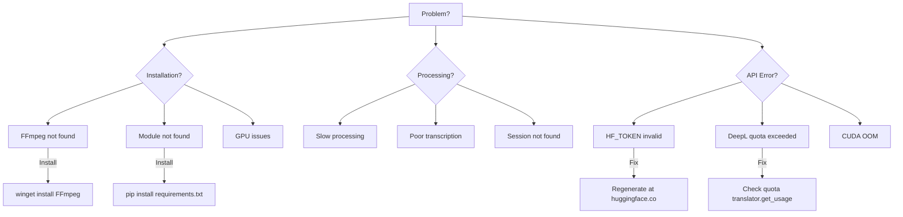

# Common Issues & Solutions

Solusi untuk masalah-masalah yang sering terjadi.

---

## 🔴 Installation Issues

### Issue: pip install fails

**Symptoms:**

```
ERROR: Could not find a version that satisfies the requirement...
```

**Solutions:**

```bash
# Update pip
python -m pip install --upgrade pip

# Use specific version
pip install torch==2.0.1

# Install with no cache
pip install --no-cache-dir package_name
```

---

### Issue: Virtual environment not working

**Symptoms:**

```
'python' is not recognized as an internal or external command
```

**Solutions:**

```powershell
# Recreate virtual environment
Remove-Item -Recurse -Force .venv
py -3.11 -m venv .venv

# Activate without script execution
.venv\Scripts\python.exe -m pip install --upgrade pip

# Run commands with full path
.venv\Scripts\python.exe your_script.py
```

---

### Issue: FFmpeg not found

**Symptoms:**

```
FileNotFoundError: [WinError 2] The system cannot find the file specified
FFmpeg error: ffmpeg not found
```

**Solutions:**

**Windows:**

```powershell
# Method 1: Using winget (recommended)
winget install FFmpeg

# Method 2: Using Chocolatey
choco install ffmpeg

# Method 3: Manual installation
# 1. Download from https://github.com/BtbN/FFmpeg-Builds/releases
# 2. Extract to C:\ffmpeg
# 3. Add to PATH: C:\ffmpeg\bin
```

**Verify installation:**

```bash
ffmpeg -version
# Should output: ffmpeg version N-...
```

**If still not found after installation:**

```powershell
# Restart terminal/PowerShell
# Or restart VS Code/Jupyter

# Check PATH
$env:PATH -split ';' | Select-String ffmpeg
```

**macOS:**

```bash
brew install ffmpeg
```

**Linux:**

```bash
sudo apt-get update
sudo apt-get install ffmpeg
```

---

## 🎙️ Audio/Video Issues

### Issue: Video upload fails

**Symptoms:**

```
422 Unprocessable Entity: {"detail": "No videos uploaded"}
{"detail": "Number of questions (5) must match number of videos (3)"}
```

**Solutions:**

1. **Check file format (supported formats):**

   ```python
   from pathlib import Path

   file_path = "interview.mp4"
   extension = Path(file_path).suffix.lower()

   # Supported: .mp4, .avi, .mov, .mkv, .webm, .flv, .wmv, .mpeg, .mpg
   ALLOWED_EXTENSIONS = {'.mp4', '.avi', '.mov', '.mkv', '.webm', '.flv', '.wmv', '.mpeg', '.mpg'}

   if extension in ALLOWED_EXTENSIONS:
       print(f"✅ Format supported: {extension}")
   else:
       print(f"❌ Unsupported format: {extension}")
   ```

2. **Convert to H.264 MP4 (recommended):**

   ```bash
   # Convert any format to compatible MP4
   ffmpeg -i input.avi -c:v libx264 -c:a aac -preset medium output.mp4

   # For WebM
   ffmpeg -i input.webm -c:v libx264 -c:a aac output.mp4
   ```

3. **Check file size (max 500 MB):**

   ```python
   import os

   file_path = "video.mp4"
   size_bytes = os.path.getsize(file_path)
   size_mb = size_bytes / (1024 * 1024)

   print(f"Size: {size_mb:.2f} MB")

   if size_mb > 500:
       print("❌ File too large! Max: 500 MB")
   else:
       print("✅ File size OK")
   ```

4. **Compress large videos:**

   ```bash
   # Reduce file size (maintain quality)
   ffmpeg -i large.mp4 -c:v libx264 -crf 28 -preset medium -c:a aac -b:a 128k compressed.mp4

   # Reduce resolution to 720p
   ffmpeg -i large.mp4 -vf scale=-2:720 -c:v libx264 -crf 23 output.mp4
   ```

5. **Match question count with video count:**

   ```python
   # If 3 questions, upload exactly 3 videos
   questions = [
       "Tell me about yourself",
       "Why do you want this job?",
       "What are your strengths?"
   ]

   videos = [
       "answer1.mp4",
       "answer2.mp4",
       "answer3.mp4"
   ]

   assert len(questions) == len(videos), "Question count must match video count!"
   ```

---

### Issue: No audio in transcription

**Symptoms:**

```
Transcription returns empty text
```

**Solutions:**

1. **Check audio track:**

   ```bash
   ffmpeg -i video.mp4
   # Look for: "Audio: aac" or "Audio: mp3"
   ```

2. **Extract audio manually:**

   ```bash
   ffmpeg -i video.mp4 -vn -acodec copy audio.aac
   ```

3. **Test audio quality:**
   ```python
   import librosa
   y, sr = librosa.load("audio.wav", sr=16000)
   print(f"Duration: {len(y)/sr:.2f}s")
   print(f"Sample rate: {sr}")
   ```

---

### Issue: Poor transcription quality

**Symptoms:**

```
Transcription has many errors, wrong words, or gibberish
```

**Solutions:**

1. **Increase beam size (better accuracy):**

   ```python
   # In notebook - Cell: Transcribe Video
   beam_size = 15  # Increase from default 10

   segments, info = whisper_model.transcribe(
       audio_path,
       language="en",
       beam_size=beam_size,  # Higher = more accurate (slower)
       best_of=10
   )
   ```

2. **Lower VAD threshold (detect more speech):**

   ```python
   segments, info = whisper_model.transcribe(
       audio_path,
       vad_filter=True,
       vad_parameters={
           "threshold": 0.2,  # Lower = more sensitive (default: 0.3)
           "min_speech_duration_ms": 100,
           "min_silence_duration_ms": 1500
       }
   )
   ```

3. **Add context prompt:**

   ```python
   # Provide context for better recognition
   initial_prompt = "This is a professional job interview discussing Python programming, software development, and technical skills."

   segments, info = whisper_model.transcribe(
       audio_path,
       initial_prompt=initial_prompt
   )
   ```

4. **Use larger model:**

   ```python
   # Current: large-v3 (best accuracy)
   # If using smaller model, upgrade:
   from faster_whisper import WhisperModel

   whisper_model = WhisperModel(
       "large-v3",  # Instead of "medium" or "small"
       device=device,
       compute_type=compute_type
   )
   ```

5. **Improve audio quality (pre-processing):**

   ```bash
   # Reduce background noise
   ffmpeg -i noisy.mp4 -af "highpass=f=200, lowpass=f=3000" clean.mp4

   # Normalize volume
   ffmpeg -i quiet.mp4 -af "loudnorm=I=-16:LRA=11:TP=-1.5" normalized.mp4

   # Combine both
   ffmpeg -i input.mp4 -af "highpass=f=200, lowpass=f=3000, loudnorm=I=-16" output.mp4
   ```

6. **Check audio quality:**

   ```bash
   # Inspect audio track
   ffmpeg -i video.mp4 2>&1 | grep Audio
   # Should show: Audio: aac, 48000 Hz or similar

   # Extract and test audio separately
   ffmpeg -i video.mp4 -vn -acodec pcm_s16le -ar 16000 -ac 1 test_audio.wav
   ```

---

## 🤖 Model & API Issues

### Issue: Hugging Face API token invalid

**Symptoms:**

```
401 Unauthorized: Invalid authentication credentials
Hugging Face API error: Token is invalid
```

**Solutions:**

1. **Verify token in .env file:**

   ```python
   import os
   from dotenv import load_dotenv

   load_dotenv()
   token = os.getenv('HF_TOKEN')  # Note: HF_TOKEN not HUGGINGFACE_API_KEY

   if not token:
       print("❌ HF_TOKEN not found in .env")
   elif not token.startswith('hf_'):
       print("❌ Invalid token format (must start with 'hf_')")
   elif len(token) < 30:
       print("❌ Token too short (should be ~37 characters)")
   else:
       print(f"✅ Token format OK: {token[:10]}...{token[-4:]}")
   ```

2. **Test token validity:**

   ```python
   import requests

   token = os.getenv('HF_TOKEN')
   headers = {"Authorization": f"Bearer {token}"}

   response = requests.get(
       "https://huggingface.co/api/whoami-v2",
       headers=headers
   )

   if response.status_code == 200:
       data = response.json()
       print(f"✅ Token valid for user: {data.get('name')}")
   else:
       print(f"❌ Token invalid: {response.status_code} - {response.text}")
   ```

   **Or use curl:**

   ```bash
   curl https://huggingface.co/api/whoami-v2 -H "Authorization: Bearer hf_your_token_here"
   ```

3. **Regenerate token:**

   - Go to https://huggingface.co/settings/tokens
   - Revoke old token (if compromised)
   - Click **New token**
   - Name: `interview-assessment-system`
   - Type: **Read**
   - Click **Generate token**
   - Copy token immediately (starts with `hf_`)
   - Update `.env` file:
     ```env
     HF_TOKEN=hf_your_new_token_here
     ```

4. **Common mistakes:**

   ```bash
   # ❌ Wrong variable name in .env
   HUGGINGFACE_API_KEY=hf_...  # Don't use this

   # ✅ Correct variable name
   HF_TOKEN=hf_...
   ```

5. **Reload environment:**

   ```python
   # If you updated .env, reload it
   from dotenv import load_dotenv
   load_dotenv(override=True)  # Force reload

   # Or restart Jupyter kernel
   # Kernel > Restart Kernel
   ```

---

### Issue: DeepL translation fails

**Symptoms:**

```
403 Forbidden: Authorization failed
456 Quota exceeded: Character limit reached
deeplException: Authentication failed
```

**Solutions:**

1. **Check API key format:**

   ```python
   import os
   from dotenv import load_dotenv

   load_dotenv()
   key = os.getenv('DEEPL_API_KEY')

   if not key:
       print("❌ DEEPL_API_KEY not found in .env")
   elif not key.endswith(':fx'):
       print("⚠️ Key should end with ':fx' for free tier")
       print(f"Current key ends with: ...{key[-5:]}")
   else:
       print(f"✅ Key format OK")
   ```

2. **Verify quota usage:**

   ```python
   import deepl

   translator = deepl.Translator(os.getenv('DEEPL_API_KEY'))

   try:
       usage = translator.get_usage()
       print(f"Character count: {usage.character.count:,}")
       print(f"Character limit: {usage.character.limit:,}")
       print(f"Remaining: {usage.character.limit - usage.character.count:,}")

       percentage = (usage.character.count / usage.character.limit) * 100
       print(f"Usage: {percentage:.2f}%")

       if percentage > 80:
           print("⚠️ Warning: Approaching quota limit!")
   except Exception as e:
       print(f"❌ Error checking quota: {e}")
   ```

   **Or use curl:**

   ```bash
   curl https://api-free.deepl.com/v2/usage -H "Authorization: DeepL-Auth-Key YOUR_KEY_HERE"
   ```

3. **Test translation:**

   ```python
   import deepl

   translator = deepl.Translator(os.getenv('DEEPL_API_KEY'))

   try:
       result = translator.translate_text("Hello", target_lang="ID")
       print(f"✅ Translation works: {result.text}")
   except deepl.exceptions.AuthorizationException:
       print("❌ Invalid API key - regenerate at https://www.deepl.com/account/summary")
   except deepl.exceptions.QuotaExceededException:
       print("❌ Quota exceeded - wait for next month or upgrade to Pro")
   except Exception as e:
       print(f"❌ Error: {e}")
   ```

4. **If quota exceeded:**

   - **Wait**: Quota resets monthly
   - **Upgrade**: DeepL Pro ($5.99/month for unlimited)
   - **Temporary fallback**: Skip translation, return English text as-is
     ```python
     def safe_translate(text, target_lang):
         try:
             result = translator.translate_text(text, target_lang=target_lang)
             return result.text
         except deepl.exceptions.QuotaExceededException:
             print("⚠️ DeepL quota exceeded, returning original text")
             return text  # Return English as fallback
     ```

5. **Regenerate API key:**
   - Go to https://www.deepl.com/account/summary
   - Scroll to **Authentication Key for DeepL API**
   - Copy the key (format: `xxxxxxxx-xxxx-xxxx-xxxx-xxxxxxxxxxxx:fx`)
   - Update `.env`:
     ```env
     DEEPL_API_KEY=your_new_key_here:fx
     ```

---

### Issue: GPU out of memory

**Symptoms:**

```
RuntimeError: CUDA out of memory. Tried to allocate X.XX GiB
torch.cuda.OutOfMemoryError
```

**Solutions:**

1. **Clear GPU cache:**

   ```python
   import torch
   import gc

   # Clear GPU memory
   gc.collect()
   torch.cuda.empty_cache()
   torch.cuda.ipc_collect()

   # Check available memory
   if torch.cuda.is_available():
       total_memory = torch.cuda.get_device_properties(0).total_memory / 1e9
       allocated = torch.cuda.memory_allocated(0) / 1e9
       cached = torch.cuda.memory_reserved(0) / 1e9

       print(f"Total GPU Memory: {total_memory:.2f} GB")
       print(f"Allocated: {allocated:.2f} GB")
       print(f"Cached: {cached:.2f} GB")
       print(f"Free: {total_memory - allocated:.2f} GB")
   ```

2. **Use smaller Whisper model:**

   ```python
   from faster_whisper import WhisperModel

   # large-v3: ~6-8 GB VRAM
   # medium: ~3-4 GB VRAM (← try this)
   # small: ~1-2 GB VRAM

   whisper_model = WhisperModel(
       "medium",  # Instead of "large-v3"
       device="cuda",
       compute_type="float16"  # Use FP16 for less memory
   )
   ```

3. **Use int8 quantization:**

   ```python
   # Reduces memory usage by ~50%
   whisper_model = WhisperModel(
       "large-v3",
       device="cuda",
       compute_type="int8"  # Instead of "float16"
   )
   ```

4. **Force CPU mode:**

   ```python
   # Use CPU if GPU has insufficient memory
   device = "cpu"
   compute_type = "int8"

   whisper_model = WhisperModel(
       "large-v3",
       device=device,
       compute_type=compute_type
   )

   print("⚠️ Running on CPU - processing will be slower")
   ```

5. **Close other GPU applications:**

   ```powershell
   # Check GPU usage (Windows)
   nvidia-smi

   # List processes using GPU
   nvidia-smi --query-compute-apps=pid,process_name,used_memory --format=csv

   # Kill specific process
   taskkill /PID <PID> /F
   ```

6. **Process videos sequentially (not in batch):**

   ```python
   # Don't load multiple videos at once
   for video in videos:
       result = process_video(video)

       # Clean up after each video
       gc.collect()
       torch.cuda.empty_cache()
   ```

7. **Reduce MediaPipe frames:**
   ```python
   # Process fewer frames to save memory
   FRAME_SKIP = 10  # Increase from 5
   MAX_FRAMES = 150  # Reduce from 300
   ```

---

## 🌐 Server Issues

### Issue: Port already in use

**Symptoms:**

```
OSError: [Errno 98] Address already in use
OSError: [WinError 10048] Only one usage of each socket address is normally permitted
Port 8888 is already in use (Jupyter)
Port 7860 is already in use (Python server)
```

**Solutions:**

1. **Find and kill process using port:**

   **Windows (PowerShell):**

   ```powershell
   # Find process on port 8888 (Jupyter)
   netstat -ano | findstr :8888

   # Output: TCP 0.0.0.0:8888 0.0.0.0:0 LISTENING 12345
   # PID is the last number (12345)

   # Kill process by PID
   taskkill /PID 12345 /F

   # Or for port 7860 (Python server)
   netstat -ano | findstr :7860
   taskkill /PID <PID> /F
   ```

   **Alternative (PowerShell):**

   ```powershell
   # Kill all Python processes
   Get-Process python | Stop-Process -Force

   # Or just Jupyter
   Get-Process jupyter* | Stop-Process -Force
   ```

2. **Use different port:**

   **For Jupyter Notebook:**

   ```python
   import uvicorn
   from app.server import app

   # Change from 8888 to 8889
   uvicorn.run(app, host="0.0.0.0", port=8889)
   ```

   **For Python server:**

   ```python
   # In backend/Python/main.py
   if __name__ == "__main__":
       uvicorn.run(app, host="0.0.0.0", port=7861)  # Change from 7860
   ```

3. **Restart Jupyter kernel:**

   - In Jupyter: **Kernel** → **Restart Kernel**
   - Or close and reopen notebook

4. **Check if another instance is running:**

   ```powershell
   # List all running Python processes
   Get-Process python

   # List all Jupyter processes
   Get-Process jupyter*
   ```

---

### Issue: Cannot access server remotely

**Symptoms:**

```
Connection refused when accessing from another device
```

**Solutions:**

1. **Bind to 0.0.0.0:**

   ```python
   uvicorn.run("main:app", host="0.0.0.0", port=8000)
   ```

2. **Check firewall:**

   ```powershell
   # Windows: Allow port 8000
   netsh advfirewall firewall add rule name="FastAPI" dir=in action=allow protocol=TCP localport=8000
   ```

3. **Use ngrok:**
   ```bash
   ngrok http 8000
   # Access via: https://xxxxx.ngrok.io
   ```

---

### Issue: Slow processing (takes too long)

**Symptoms:**

```
Processing takes > 10 minutes for 5-minute video
Transcription very slow
Cheating detection stuck
```

**Expected Processing Times:**

- **GPU**: 2-3 minutes per 5-min video
- **CPU**: 5-8 minutes per 5-min video

**Solutions:**

1. **Verify GPU is being used:**

   ```python
   import torch

   print(f"CUDA available: {torch.cuda.is_available()}")

   if torch.cuda.is_available():
       print(f"GPU: {torch.cuda.get_device_name(0)}")
       print(f"CUDA Version: {torch.version.cuda}")
       print("✅ Using GPU")
   else:
       print("⚠️ Using CPU - will be slower")
       print("Install CUDA-enabled PyTorch for faster processing")
   ```

2. **Install GPU-enabled PyTorch:**

   ```bash
   # Check current PyTorch version
   python -c "import torch; print(f'PyTorch: {torch.__version__}, CUDA: {torch.version.cuda}')"

   # Install CUDA 11.8 version (most compatible)
   pip uninstall torch torchvision torchaudio
   pip install torch torchvision torchaudio --index-url https://download.pytorch.org/whl/cu118

   # Or CUDA 12.1 (newer)
   pip install torch torchvision torchaudio --index-url https://download.pytorch.org/whl/cu121

   # Verify installation
   python -c "import torch; print('CUDA available:', torch.cuda.is_available())"
   ```

3. **Use smaller/faster Whisper model:**

   ```python
   from faster_whisper import WhisperModel

   # large-v3: 98% accuracy, 45-60s GPU
   # medium: 95% accuracy, 30-40s GPU (← good balance)
   # small: 90% accuracy, 20-30s GPU

   whisper_model = WhisperModel("medium", device=device, compute_type=compute_type)
   ```

4. **Reduce beam size:**

   ```python
   # Default: beam_size=10 (best accuracy)
   beam_size = 5  # Faster, still good accuracy

   segments, info = whisper_model.transcribe(
       audio_path,
       beam_size=beam_size
   )
   ```

5. **Increase frame skip (cheating detection):**

   ```python
   # Default: Process every 5th frame
   FRAME_SKIP = 10  # Process every 10th frame (2x faster)
   MAX_FRAMES = 200  # Reduce from 300
   ```

6. **Disable iris tracking (MediaPipe):**

   ```python
   import mediapipe as mp

   mp_face_mesh = mp.solutions.face_mesh
   face_mesh = mp_face_mesh.FaceMesh(
       refine_landmarks=False  # Disable iris (faster)
   )
   ```

7. **Compress video before processing:**

   ```bash
   # Reduce resolution to 720p
   ffmpeg -i large.mp4 -vf scale=-2:720 -c:v libx264 -crf 23 output.mp4

   # Reduce frame rate to 30fps
   ffmpeg -i input.mp4 -r 30 -c:v libx264 -crf 23 output.mp4

   # Both optimizations
   ffmpeg -i input.mp4 -vf scale=-2:720 -r 30 -c:v libx264 -crf 23 optimized.mp4
   ```

8. **Monitor GPU usage during processing:**

   ```bash
   # Watch GPU usage in real-time (Windows)
   nvidia-smi -l 1

   # Check if GPU is actually being used
   # GPU-Util should be > 0% during transcription
   ```

9. **Close other GPU applications:**
   - Close games, video editors, Chrome (if using hardware acceleration)
   - Check Task Manager → GPU usage

---

## 📂 File & Path Issues

### Issue: FileNotFoundError

**Symptoms:**

```
FileNotFoundError: [Errno 2] No such file or directory
```

**Solutions:**

1. **Use absolute paths:**

   ```python
   from pathlib import Path

   base_path = Path(__file__).parent
   file_path = base_path / "results" / "output.json"
   ```

2. **Create directories:**

   ```python
   import os
   os.makedirs("results", exist_ok=True)
   ```

3. **Check path separators:**
   ```python
   # Use Path for cross-platform compatibility
   from pathlib import Path
   path = Path("d:/Interview_Assesment_System-main/backend/Python/results")
   ```

---

### Issue: Permission denied

**Symptoms:**

```
PermissionError: [Errno 13] Permission denied
```

**Solutions:**

1. **Run as Administrator** (Windows)

2. **Check file permissions:**

   ```powershell
   # Windows
   icacls file.txt

   # Grant full control
   icacls file.txt /grant Everyone:F
   ```

3. **Close file handles:**
   ```python
   with open(file_path, 'w') as f:
       f.write(content)
   # File automatically closed after 'with' block
   ```

---

## 🔄 Processing Issues

### Issue: Session not found

**Symptoms:**

```
404 Not Found: Session ID does not exist
```

**Solutions:**

1. **Check session ID:**

   ```python
   # List all sessions
   sessions = os.listdir("results/")
   print("Available sessions:", sessions)
   ```

2. **Wait for processing:**

   ```python
   import time
   while True:
       status = get_status(session_id)
       if status == "completed":
           break
       time.sleep(5)
   ```

3. **Check session expiry:**
   ```python
   # Sessions expire after 7 days
   from datetime import datetime, timedelta
   expiry = datetime.now() - timedelta(days=7)
   ```

---

### Issue: Results incomplete

**Symptoms:**

```
Some fields missing in results JSON
```

**Solutions:**

1. **Wait for completion:**

   ```python
   status = get_status(session_id)
   print(f"Progress: {status['progress']['percentage']}%")
   ```

2. **Check for errors:**

   ```python
   if "error" in results:
       print(f"Error: {results['error']}")
   ```

3. **Retry processing:**
   ```python
   # Delete and re-upload
   delete_session(session_id)
   new_session = upload_video(video_path)
   ```

---

## 💻 Environment Issues

### Issue: Module not found

**Symptoms:**

```
ModuleNotFoundError: No module named 'faster_whisper'
ModuleNotFoundError: No module named 'deepl'
ModuleNotFoundError: No module named 'resemblyzer'
```

**Solutions:**

1. **Install missing module:**

   ```bash
   # Install specific module
   pip install faster-whisper
   pip install deepl
   pip install resemblyzer
   pip install mediapipe
   pip install huggingface-hub
   ```

2. **Install all dependencies:**

   ```bash
   # From requirements.txt
   cd backend/Python
   pip install -r requirements.txt
   ```

3. **Check if in correct environment:**

   ```powershell
   # Verify Python location
   where python
   # Should show: .venv\Scripts\python.exe

   # List installed packages
   pip list

   # Check specific package
   pip show faster-whisper
   ```

4. **Activate virtual environment:**

   ```powershell
   # Windows PowerShell
   .venv\Scripts\Activate.ps1

   # Or
   .venv\Scripts\python.exe -m pip install <package>
   ```

5. **Reinstall package:**

   ```bash
   # Uninstall and reinstall
   pip uninstall faster-whisper
   pip install faster-whisper==1.0.3

   # Clear cache and reinstall
   pip cache purge
   pip install --no-cache-dir faster-whisper
   ```

6. **For Jupyter Notebook - install in correct kernel:**

   ```python
   # In notebook cell
   import sys
   print(f"Python executable: {sys.executable}")

   # Install package in current kernel
   !{sys.executable} -m pip install faster-whisper
   ```

---

### Issue: Python version mismatch

**Symptoms:**

```
SyntaxError: invalid syntax (Python 3.9 required)
```

**Solutions:**

1. **Check Python version:**

   ```bash
   python --version
   # Must be 3.11+
   ```

2. **Use py launcher:**

   ```bash
   py -3.11 --version
   ```

3. **Recreate venv with correct version:**
   ```bash
   py -3.11 -m venv .venv
   ```

---

## 🎯 Quick Diagnosis

**Use this flowchart to identify your issue:**



---

## 📚 Additional Resources

- [API Error Codes](../api/errors.md) - Complete error reference
- [Performance Tuning](performance.md) - Optimization tips
- [FAQ](faq.md) - Frequently asked questions
- [Model Configuration](../configuration/models.md) - Model settings
- [API Keys Setup](../configuration/api-keys.md) - HF Token & DeepL setup

---

## 🆘 Still Having Issues?

**Before creating an issue:**

1. **Enable debug logging:**

   ```python
   import logging
   logging.basicConfig(level=logging.DEBUG)
   ```

2. **Check system info:**

   ```python
   import sys, torch, platform

   print(f"Python: {sys.version}")
   print(f"OS: {platform.system()} {platform.release()}")
   print(f"PyTorch: {torch.__version__}")
   print(f"CUDA available: {torch.cuda.is_available()}")
   if torch.cuda.is_available():
       print(f"GPU: {torch.cuda.get_device_name(0)}")
   ```

3. **Collect error details:**

   - Full error message with traceback
   - Steps to reproduce
   - System info (OS, Python version, GPU)
   - Relevant logs

4. **Test with minimal example:**
   ```python
   # Test Whisper only
   from faster_whisper import WhisperModel
   model = WhisperModel("small", device="cpu")
   segments, info = model.transcribe("test.wav")
   print(list(segments))
   ```

**Need Help?**

- 📧 Email: daffaalfathir31@gmail.com

---

**👍 Found this helpful?** Star the repo and share with others!
